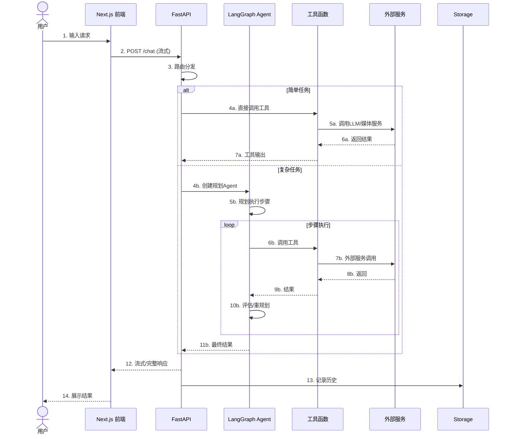
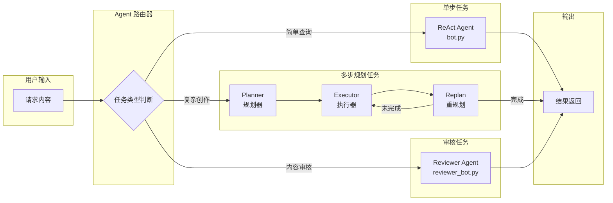
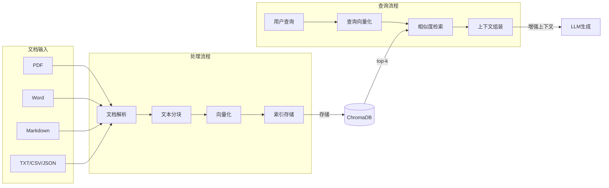
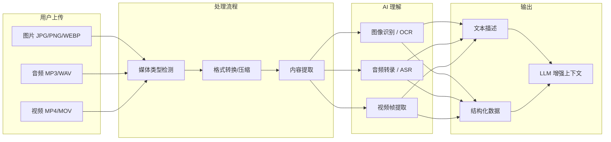
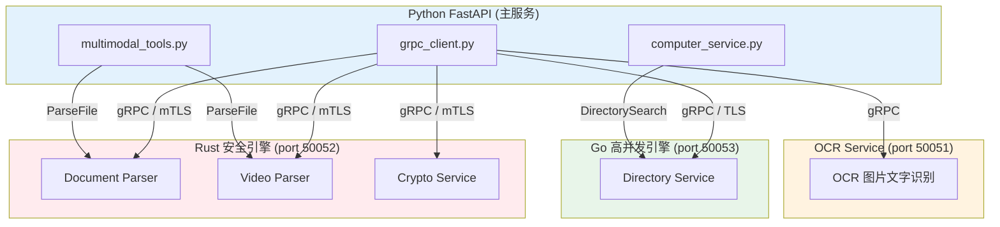
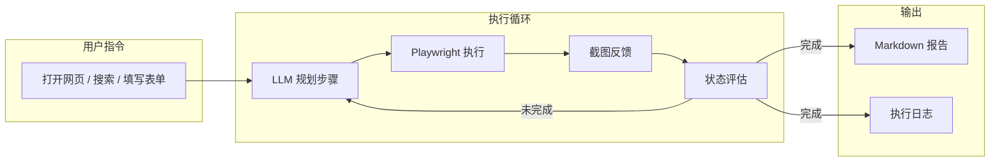
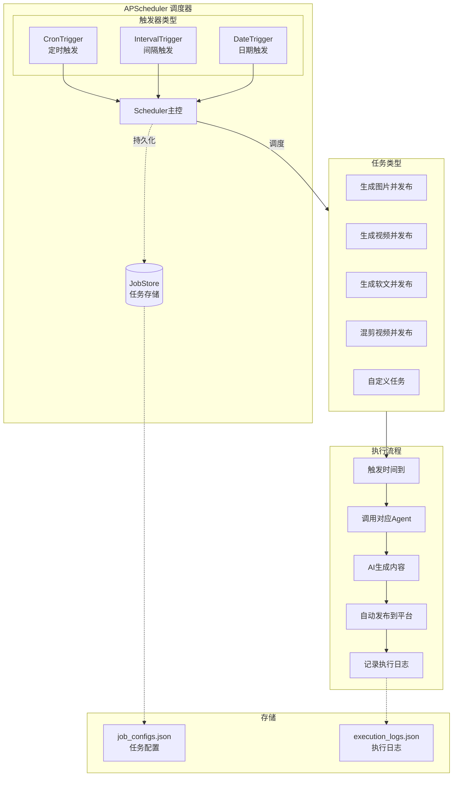

# AI Media Agent - Agent 协作指南

> 本文档面向 AI 编程助手 (Agent)。当你阅读本文时，默认你对本项目一无所知，请严格遵循以下规范进行开发。

---

## 项目概述

**AI Media Agent** 是一个全链路 AI 驱动的内容生产与分发平台。它帮助内容创作者、MCN 机构、品牌营销团队实现从文案撰写、剧本生成到 AI 图片/视频生成，再到社交媒体自动化发布的全流程自动化。

### 核心功能

| 功能              | 说明                                                         |
| ----------------- | ------------------------------------------------------------ |
| AI 文案与剧本生成 | 基于多平台特性生成定制化内容                                 |
| AI 媒体生成       | 支持文生图、图生视频、文生视频（多供应商）                   |
| 智能混剪          | AI 分析素材并生成创意视频，支持配音、字幕、BGM               |
| 社媒矩阵发布      | 自动化发布到抖音、快手、小红书、B站、YouTube、Twitter 等平台 |
| RAG 知识库        | 基于 LlamaIndex 的私有文档检索增强                           |
| 多 Agent 协作     | LangGraph 驱动的规划-执行-反思工作流                         |
| 多语言 Agent      | 各 Agent 支持中英文双语言提示词与输出                        |
| 多模态输入        | 支持图片、音频、视频作为对话输入，AI 理解并处理              |
| 定时发布          | APScheduler 驱动的 24h 自动调度                              |
| MCP 协议支持      | Model Context Protocol 客户端，连接外部工具服务器            |
| My Computer       | 本地文件夹索引，AI 可搜索本机文件内容                        |
| 工作台            | 统一入口聚合所有内容生产工具                                 |

### 技术栈

| 层级          | 技术                                                |
| ------------- | --------------------------------------------------- |
| 前端          | Next.js 16 + React 19 + TypeScript + Tailwind CSS 4 |
| 后端 (主)     | Python 3.10+ + FastAPI + LangChain/LangGraph        |
| 后端 (高并发) | Go 1.22+ + gRPC + Worker Pool + 令牌桶限流          |
| 后端 (安全)   | Rust + Tokio + Tonic + nom 二进制解析               |
| 跨服务通信    | gRPC + Protocol Buffers + mTLS                      |
| AI 模型       | 智谱 GLM、Google Gemini、DeepSeek、OpenRouter 聚合  |
| 媒体生成      | 即梦 AI、豆包 SeaDance、CogVideoX、Gemini Image     |
| 自动化        | Playwright (浏览器 RPA)                             |
| 向量检索      | LlamaIndex + ChromaDB                               |

---

## 架构总览

### 系统分层架构

> 更详细的版本（含新增子系统如媒体流水线、记忆协调器、审批门控等）见 [`docs/ARCHITECTURE_OVERVIEW.md`](./docs/ARCHITECTURE_OVERVIEW.md)。

```mermaid
flowchart TB
    subgraph Users["用户层"]
        U1[Web 浏览器]
        U2[API 客户端]
    end

    subgraph Frontend["前端层 (Next.js 16) — 37+ 页面"]
        subgraph F_Nav["导航/核心"]
            F1[AI对话界面 /page.tsx]
            F2[工作台 /workbench/]
            F14[历史记录 /history/]
            F17[架构图 /architecture/]
        end

        subgraph F_Create["内容创作"]
            F3[创作中心 /create/]
            F7[定时发布 /scheduler/]
            F10[爆款流水线 /pipeline/]
        end

        subgraph F_Media["媒体生成"]
            F4[媒体生成 /media/]
            F8[游戏热点 /trending/]
            F16[OpenClaw /openclaw/]
            F24[Game Art /game-art/]
            F25[Game Design /game-design/]
        end

        subgraph F_Platform["平台/运营"]
            F6[平台管理 /platforms/]
            F15[内容审核 /moderation/]
            F20[AI 资讯日报 /ai-news/]
            F23[Financial News /financial-news/]
        end

        subgraph F_Knowledge["知识/记忆"]
            F5[知识库 /knowledge/]
            F18[My Computer /settings/my-computer/]
            F19[Capabilities /settings/capabilities/]
        end

        subgraph F_Labs["专业助手 Labs"]
            F22[Labs /labs/]
            F31[Product Manager /product-manager/]
            F32[Legal Advisor /legal-advisor/]
            F33[Ad Campaign /ad-campaign/]
            F34[Business Partnership /business-partnership/]
            F35[Procurement Assistant /procurement-assistant/]
            F36[Workflows /workflows/]
            F29[Programmer /programmer/]
        end

        subgraph F_Automation["自动化/工具"]
            F11[Computer Use /computer-use/]
            F12[Hermes Agent /hermes-agent/]
            F13[Lark CLI /lark-cli/]
            F21[Claude Code /claude-code/]
            F26[System Assistant /system-assistant/]
            F27[Desktop Operator /desktop-operator/]
            F37[Meal /meal/]
        end

        subgraph F_Companion["伴侣"]
            F9[AI伙伴 /companion/]
            F30[Desktop Pet /desktop-pet/]
        end

        subgraph F_Service["服务"]
            F28[Customer Service /customer-service/]
        end
    end

    subgraph Backend["后端层 (FastAPI)"]
        API[API Router<br/>main.py]

        subgraph Core["核心层 (core/)"]
            LLMP[LLM Provider<br/>多供应商路由]
            MediaCfg[Media Models<br/>媒体模型配置]
            Prompts[System Prompts<br/>系统提示词]
        end

        subgraph Agents["Agent 层 (agents/) — 22 个注册 Agent"]
            subgraph A_Runtime["运行时 / 路由"]
                A1[ReAct Agent<br/>bot.py]
                A2[Planning Agent<br/>planning_bot.py]
                A5[Orchestrator<br/>orchestrator.py]
                A6[Intent Router<br/>router.py]
            end

            subgraph A_Media["媒体创作"]
                A_M1[Media Agent<br/>media_agent]
                A_M2[Image Edit Agent<br/>image_edit_agent]
                A_M3[Video Editor Agent<br/>video_editor_agent]
                A_M4[Long Video Agent<br/>long_video_agent]
            end

            subgraph A_Content["内容创作"]
                A_C1[Creative Agent<br/>creative_agent]
                A_C2[Copywriter Agent<br/>copywriter_agent]
                A_C3[Script Writer<br/>script_writer_agent]
                A_C4[Trend Analyst<br/>trend_analyst_agent]
                A_C5[Reviewer Agent<br/>reviewer_agent]
            end

            subgraph A_Labs["专业助手 Labs"]
                A_L1[Product Manager<br/>product_manager_agent]
                A_L2[Legal Agent<br/>legal_agent]
                A_L3[Ad Campaign<br/>ad_campaign_agent]
                A_L4[Business Partnership<br/>business_partnership_agent]
                A_L5[Procurement Agent<br/>procurement_agent]
                A_L6[Game Art Agent<br/>game_art_agent]
                A_L7[Game Design Agent<br/>game_design_agent]
                A_L8[Programmer Agent<br/>programmer_agent]
            end

            subgraph A_System["系统 / 桌面 / 代码"]
                A_S1[System Assistant<br/>system_assistant]
                A_S2[Desktop Operator<br/>desktop_operator_agent]
                A_S3[Code Analyst<br/>code_analyst_agent]
                A_S4[Architect<br/>architect_agent]
            end

            subgraph A_Lobster["分布式流水线"]
                A_LB1[Lobster Bot<br/>lobster_agent]
            end
        end

        subgraph Tools["工具层 (tools/)"]
            T1[文案工具<br/>copywriting_tools.py]
            T2[图片工具<br/>image_tools.py]
            T3[视频工具<br/>video_tools.py]
            T4[音频工具<br/>audio_tools.py]
            T5[RAG工具<br/>rag_tools.py]
            T6[趋势工具<br/>trend_tools.py]
            T7[发布工具<br/>publisher_tools.py]
            T8[审核工具<br/>moderation_tools.py]
            T9[长视频工具<br/>long_video_tools.py]
            T10[混剪工具<br/>remix_tools.py]
            T11[字幕工具<br/>subtitle_tools.py]
            T12[Reach工具<br/>reach_tools.py]
            T13[Lobster工具<br/>lobster_tools.py]
            T14[媒体解析<br/>media_resolver.py]
            T15[多模态工具<br/>multimodal_tools.py]
        end

        subgraph Services["服务层 (services/)"]
            SVC1[Scheduler<br/>定时调度]
            SVC2[Computer Service<br/>本地文件夹索引]
            SVC3[MCP Client<br/>外部工具接入]
            SVC4[Computer Use<br/>浏览器自动化]
            SVC5[gRPC Client<br/>微服务调用]
            SVC6[Approval / Task<br/>审批与任务]
            SVC7[Memory / Evolution<br/>记忆与进化学习]
            SVC8[System Assistant<br/>系统维护]
            SVC9[Desktop Operator<br/>桌面操作]
            SVC10[Labs Services<br/>专业助手服务]
            SVC11[Customer Service<br/>客服]
            SVC12[Workflow Service<br/>工作流]
        end

        subgraph Connectors["连接器层 (connectors/) — 14+ 平台"]
            C1[小红书]
            C2[抖音]
            C3[B站]
            C4[YouTube]
            C5[Twitter/X]
            C6[微博]
            C7[快手]
            C8[视频号]
            C9[TikTok]
            C10[Discord]
            C11[飞书]
        end
    end

    subgraph Microservices["微服务层 (gRPC)"]
        subgraph GoSvc["Go 高并发引擎"]
            G1[Directory Service<br/>目录检索]
            G2[Scraper<br/>批量抓取]
            G3[Watcher<br/>文件监控]
            G4[Aggregator<br/>聚合查询]
        end

        subgraph RustSvc["Rust 安全引擎"]
            R1[Document Parser<br/>二进制解析]
            R2[Video Parser<br/>MP4/MKV 流式解析]
            R3[Crypto Service<br/>加密/信封]
            R4[Keystore<br/>私钥安全存储]
            R5[OCR Service<br/>图片文字识别]
        end
    end

    subgraph External["外部服务"]
        subgraph LLM["LLM 供应商"]
            L1[智谱 GLM-4]
            L2[Google Gemini]
            L3[DeepSeek]
            L4[OpenRouter]
            L5[字节豆包]
        end

        subgraph MediaGen["媒体生成服务"]
            M1[即梦AI]
            M2[豆包SeaDance]
            M3[CogVideoX]
            M4[CogView]
        end

        subgraph Scheduler["定时调度"]
            SCH[APScheduler]
        end

        subgraph MCPServers["MCP 服务器"]
            MCP1[文件系统]
            MCP2[数据库]
            MCP3[第三方API]
        end
    end

    subgraph Storage["存储层 (storage/)"]
        S1[outputs/<br/>生成媒体]
        S2[uploads/<br/>用户上传]
        S3[temp/<br/>临时文件]
        S4[rag/<br/>向量索引]
        S5[scheduler/<br/>任务配置]
        S6[auth.db<br/>认证数据]
        S7[traces/<br/>执行追踪]
        S8[trending/<br/>热点数据]
        S9[profiles/<br/>平台账号]
        S10[memory/<br/>Agent记忆]
        S11[computer/<br/>本地文件夹索引]
        S12[mcp_servers.json<br/>MCP服务器配置]
        S13[skills_enabled.json<br/>技能开关配置]
    end

    U1 --> F1 & F2 & F3 & F4 & F5 & F6 & F7 & F8 & F9 & F10 & F11 & F12 & F13 & F14 & F15 & F16 & F17 & F18 & F19 & F20 & F21 & F22 & F23 & F24 & F25 & F26 & F27 & F28 & F29 & F30 & F31 & F32 & F33 & F34 & F35 & F36 & F37
    U2 --> API
    F1 & F2 & F3 & F4 & F5 & F6 & F7 & F8 & F9 & F10 & F11 & F12 & F13 & F14 & F15 & F16 & F17 & F18 & F19 & F20 & F21 & F22 & F23 & F24 & F25 & F26 & F27 & F28 & F29 & F30 & F31 & F32 & F33 & F34 & F35 & F36 & F37 -->|HTTP/REST| API

    API --> Agents
    API --> Tools
    API --> Services

    Agents -->|编排| Tools
    Agents -->|配置| Core
    Agents -->|调用| SVC3

    SVC3 -->|加载工具| MCPServers

    T1 & T2 & T3 & T4 -->|文本生成| LLMP
    LLMP --> L1 & L2 & L3 & L4 & L5

    T2 & T3 -->|媒体生成| M1 & M2 & M3 & M4

    T7 -->|浏览器自动化| Connectors
    C1 & C2 & C3 & C4 & C5 & C6 & C7 & C8 & C9 & C10 & C11 -->|Playwright| Connectors

    SCH -->|触发| API

    SVC2 -->|索引| S4

    SVC5 -.->|gRPC| GoSvc
    SVC5 -.->|gRPC| RustSvc
    T15 -->|多媒体解析| RustSvc

    Tools -.->|读写| Storage
    Connectors -.->|凭证| Storage
    SCH -.->|配置| Storage
    SVC2 -.->|配置| Storage
    SVC3 -.->|配置| Storage
```



**Agent 注册清单（22 个）**

| agent_id | 实现文件 | 职责 | 能力标签 |
|----------|----------|------|----------|
| `media_agent` | `agents/bot.py` | 多媒体创作：图/视频生成、发布、记忆、RAG | image, video, memory, knowledge, publish, image_edit |
| `creative_agent` | `agents/general_agent.py` | 全能媒体创作助理：图/视频/脚本/文案/审核/联网搜索 | script, copywriting, moderation, image, video, web_search, image_edit |
| `reviewer_agent` | `agents/reviewer_bot.py` | 资深内容主编：审查、合规、趋势洞察、文案润色 | review, moderation, optimization, trends |
| `video_editor_agent` | `agents/video_editor_agent.py` | 专业视频剪辑：合并、裁剪、转场、AI 混剪 | video_editing, remix |
| `opencut_agent` | `agents/opencut_agent.py` | OpenCut 风格专业剪辑：裁剪、拆分、变速、转场、画中画、字幕、滤镜、音轨 | opencut, video_editing, advanced_remix, multi_track, transitions, subtitles, pip |
| `image_edit_agent` | `agents/image_edit_agent.py` | 自然语言图片编辑：重绘、去水印、扩图、参考图编辑 | image_edit, instruction_edit, inpaint, remove_object, outpaint, reference_edit, watermark_remove, upscale, logo_motion, trace_logo_to_svg |
| `long_video_agent` | `agents/long_video_agent.py` | 长视频工坊：多分镜规划 + Wan 分段生成 + 成片拼接 | long_video, video, wan, storytelling |
| `architect_agent` | `agents/architect.py` | 项目架构师：目录结构、命名规范、代码质量 | architecture, code_review |
| `code_analyst_agent` | `agents/code_analyst_agent.py` | 代码分析专家：符号搜索、调用关系、源码阅读、架构建议 | code_analysis, code_review, architecture, symbol_search, call_graph |
| `copywriter_agent` | `agents/copywriter_agent.py` | 文案创作专家：多平台适配软文、种草文、标题变体 | copywriting, content_optimization, title_generation, platform_adaptation |
| `script_writer_agent` | `agents/script_writer_agent.py` | 视频脚本创作专家：结构化脚本、差异化版本 | script, storyboard, platform_adaptation, creative_writing |
| `trend_analyst_agent` | `agents/trend_analyst_agent.py` | 热点分析与选题策划：游戏/社媒趋势追踪 | trend_analysis, gaming_trends, topic_generation, hashtag_optimization |
| `system_assistant` | `agents/system_assistant_agent.py` | 电脑助手：软件安装/卸载、网络修复、环境配置、文件整理 | system_install, system_network, system_env, system_organize, install, uninstall, network, organize |
| `desktop_operator_agent` | `agents/desktop_operator_agent.py` | 桌面操作员：本机软件 CLI/GUI 自动化 | creative_app_script, app_launch, native_desktop_control, desktop_operator |
| `programmer_agent` | `agents/programmer_agent.py` | 程序员助手：Git/SSH、中间件运维、测试与代码工具 | dev_git_ops, dev_infra_manage, code_analysis, shell_command, git, infra, devops, redis, mysql, mongodb |
| `product_manager_agent` | `agents/product_manager_agent.py` | 产品经理助手：市场洞察、产品创意、PM 方法论 | pm_market_research, pm_product_analysis, pm_idea_generation, market_analysis, product_strategy, growth_ops |
| `legal_agent` | `agents/legal_agent.py` | 法律顾问助手：案例解读、合规体检、法规政策与合同金融风险分析 | legal_case_research, legal_compliance_audit, legal_regulation_interpret, legal_contract_review, legal_finance_advisory, compliance_analysis, case_research |
| `ad_campaign_agent` | `agents/ad_campaign_agent.py` | 广告投放助手：投放策略、创意文案、受众定向、预算分配与效果复盘 | ad_strategy_planning, ad_creative_generation, ad_audience_analysis, ad_budget_allocation, ad_performance_review, digital_marketing |
| `business_partnership_agent` | `agents/business_partnership_agent.py` | 商务合作助手：合作 outreach、方案撰写、条款要点、伙伴评估与 BD pipeline | bp_outreach_draft, bp_proposal_generation, bp_contract_review, bp_partner_evaluation, bp_pipeline_planning, business_development |
| `procurement_agent` | `agents/procurement_agent.py` | 采购助手：供应商评估、RFQ 起草、报价比对、合同审查与成本优化 | procurement_vendor_eval, procurement_rfq, procurement_quote_compare, procurement_contract_review, procurement_cost_optimize, procurement_sourcing, vendor_management, spend_analysis |
| `game_art_agent` | `agents/game_art_agent.py` | 游戏美术助手：视觉风格、角色场景 Brief、UI 规范与竞品视觉分析 | ga_visual_design, ga_character_scene, visual_style, character_design, scene_concept, game_ui_art |
| `game_design_agent` | `agents/game_design_agent.py` | 游戏策划助手：概念案、核心循环、系统设计、关卡规划与数值框架 | gd_concept_system, gd_level_content, gd_narrative_balance, game_design, system_design, level_design, game_balance |
| `lobster_agent` | `agents/lobster_bot.py` | 龙虾流水线 Agent：自动热点收集 → AI 克隆内容 → 多平台发布 | trend, clone, publish, lobster |

### 请求生命周期

> 更详细的时序图（含 `media_url` 自动推断说明）见 [`docs/ARCHITECTURE_OVERVIEW.md`](./docs/ARCHITECTURE_OVERVIEW.md) 第 5.1–5.2 节。



### Agent 协作模式

> 完整的路由决策流程、编排器状态机与多 Agent 协作时序图见 [`docs/AGENT_ROUTING_DIAGRAMS.md`](./docs/AGENT_ROUTING_DIAGRAMS.md)。



---

## 项目目录结构

```
ai-media-agent/
├── backend/                    # FastAPI 后端核心
│   ├── main.py                 # API 路由入口 (所有端点)
│   ├── agents/                 # LangGraph Agent 定义
│   │   ├── base/               # Agent 基类与消息结构
│   │   │   ├── bot.py          # BaseAgent 抽象基类
│   │   │   └── message.py      # Agent 间消息格式
│   │   ├── bot.py              # 标准 ReAct Agent / media_agent（媒体创作：图/视频/发布）
│   │   ├── planning_bot.py     # 规划-执行 Agent
│   │   ├── orchestrator.py     # 多Agent Supervisor编排
│   │   ├── router.py           # 意图路由
│   │   ├── reviewer_bot.py     # 内容审查 Agent
│   │   ├── copywriter_agent.py # 文案创作 Agent
│   │   ├── script_writer_agent.py # 脚本生成 Agent
│   │   ├── trend_analyst_agent.py # 热点分析 Agent
│   │   ├── lobster_bot.py      # OpenClaw 分布式 Agent (lobster_agent)
│   │   ├── architect.py        # 架构规划 Agent
│   │   ├── video_editor_agent.py # 视频剪辑/混剪 Agent
│   │   ├── opencut_agent.py      # OpenCut 风格专业视频剪辑 Agent
│   │   ├── long_video_agent.py   # 长视频分镜 Agent
│   │   ├── image_edit_agent.py   # 图片编辑 Agent（重绘/去水印/扩图/参考图编辑）
│   │   ├── general_agent.py      # 泛化入口 Agent (creative_agent)
│   │   ├── system_assistant_agent.py # 系统维护 Agent（环境诊断、智能修复）
│   │   ├── desktop_operator_agent.py # 桌面操作 Agent（原生 GUI 自动化）
│   │   ├── product_manager_agent.py  # 产品经理 Agent（PRD/竞品/需求分析）
│   │   ├── legal_agent.py        # 法务顾问 Agent（合同审查/合规建议）
│   │   ├── procurement_agent.py  # 采购助手 Agent（供应商管理/比价）
│   │   ├── ad_campaign_agent.py  # 广告投放 Agent（策略/素材/分析）
│   │   ├── business_partnership_agent.py # 商务合作 Agent（方案/谈判）
│   │   ├── game_art_agent.py     # 游戏美术 Agent（资产生成/概念设计）
│   │   ├── game_design_agent.py  # 游戏设计 Agent（策划/数值/系统）
│   │   ├── programmer_agent.py   # 编程助手 Agent（代码生成/调试）
│   │   ├── code_analyst_agent.py # 代码分析 Agent（仓库探索/架构分析）
│   │   ├── pet_service.py        # AI 伴侣/宠物 Agent（语音/交互）
│   │   └── registry.py         # Agent 注册中心
│   ├── core/                   # 核心配置与业务中台
│   │   ├── llm_provider.py     # LLM 多供应商路由
│   │   ├── augmented_llm.py    # 增强LLM封装
│   │   ├── media_models.py     # 媒体模型配置
│   │   ├── capabilities.py     # 能力注册表（风险等级、审批策略）
│   │   ├── platform_capabilities.py # 平台能力矩阵
│   │   ├── execution_approval.py    # 执行审批门控
│   │   ├── media_pipeline.py        # 媒体生产流水线（八步状态机）
│   │   ├── research_artifact.py     # 研究链路规范化
│   │   ├── research_content_plan.py # 研究内容计划
│   │   ├── research_knowledge.py    # 研究知识入库
│   │   ├── creative_software.py     # 创意软件配置
│   │   ├── desktop_actions.py       # 桌面元数据与画像
│   │   ├── local_computer.py        # 本地计算机沙箱动作
│   │   ├── super_agent_api.py       # 能力/审批/任务 API 组装
│   │   ├── companion_state.py       # AI 伙伴状态
│   │   ├── workflow_engine.py       # 工作流引擎
│   │   ├── workflow_schema.py       # 工作流 Schema
│   │   ├── system_*.py              # 系统维护模块（命令策略/环境画像/Recipe）
│   │   ├── native_desktop_bridge.py # 原生桌面桥接
│   │   ├── desktop_app_registry.py  # 桌面应用注册
│   │   ├── app_*.py                 # 应用自动化策略/目录/命令策略
│   │   ├── *_analysis.py            # Labs 业务分析模块（ad_campaign / legal / procurement 等）
│   │   ├── *_recipes.py             # Labs 业务 Recipe 定义
│   │   ├── coding_provider.py       # 编程 Provider
│   │   └── prompts/            # 系统提示词
│   ├── tools/                  # 原子工具层
│   │   ├── content/            # 内容创作 facade
│   │   ├── media/              # 媒体生成 facade
│   │   ├── social/             # 社交发布 facade
│   │   ├── knowledge/          # 知识库 facade
│   │   ├── connectors/         # 平台连接器
│   │   │   ├── base.py         # 连接器基类
│   │   │   ├── manager.py      # 管理器
│   │   │   ├── browser_login.py # 浏览器登录辅助
│   │   │   ├── douyin.py
│   │   │   ├── xiaohongshu.py
│   │   │   ├── bilibili.py
│   │   │   ├── youtube.py
│   │   │   ├── twitter.py
│   │   │   ├── weibo.py
│   │   │   ├── kuaishou.py
│   │   │   ├── tiktok.py
│   │   │   ├── discord_bot.py   # Discord Bot 连接器
│   │   │   ├── feishu.py        # 飞书连接器
│   │   │   ├── interactive_login.py # 交互式登录
│   │   │   ├── mock.py          # 模拟连接器
│   │   │   ├── semi_auto_im.py  # 半自动 IM
│   │   │   └── video_channel.py # 视频频道
│   │   ├── script_tools.py     # 剧本生成
│   │   ├── copywriting_tools.py
│   │   ├── image_tools.py      # 文生图
│   │   ├── video_tools.py      # 视频生成
│   │   ├── long_video_tools.py # 长视频生成
│   │   ├── audio_tools.py      # TTS/配音
│   │   ├── subtitle_tools.py   # ASR字幕
│   │   ├── remix_tools.py      # AI混剪
│   │   ├── publisher_tools.py  # 发布工具
│   │   ├── reach_tools.py      # 内容触达
│   │   ├── lobster_tools.py    # Lobster分布式工具
│   │   ├── rag_tools.py        # RAG查询
│   │   ├── memory_tools.py     # 历史记忆
│   │   ├── trend_tools.py      # 趋势分析
│   │   ├── gaming_trending.py  # 游戏热点抓取
│   │   ├── social_trending.py  # 社媒热点
│   │   ├── moderation_tools.py # 内容审核
│   │   ├── media_tools.py      # 媒体工具门面
│   │   ├── media_common.py     # 媒体通用类型
│   │   ├── multimodal_tools.py # 多模态解析
│   │   ├── _envelope.py        # 信封加密辅助
│   │   └── exceptions.py       # 工具层异常
│   ├── routers/                # API 路由模块
│   │   ├── auth_router.py      # 认证路由
│   │   └── users_router.py     # 用户管理
│   ├── services/               # 业务服务
│   │   ├── scheduler.py        # 定时发布服务
│   │   ├── computer_use_service.py # Computer Use浏览器自动化
│   │   ├── computer_service.py # My Computer本地文件夹索引
│   │   ├── mcp_client.py       # MCP客户端(连接外部工具服务器)
│   │   ├── grpc_client.py      # gRPC客户端(OCR:50051/Parser:50052/Directory:50053)
│   │   ├── approval_service.py      # 审批服务
│   │   ├── memory_coordinator.py    # 记忆生命周期管理
│   │   ├── memory_evaluation.py     # 记忆命中评估
│   │   ├── memory_quality.py        # 记忆质量评分
│   │   ├── learning_data_pipeline.py # 进化学习数据管道
│   │   ├── learning_curator.py      # 学习策展人
│   │   ├── evolution_signals.py     # 进化信号采集
│   │   ├── reflection_loop.py       # 任务复盘闭环
│   │   ├── connections_summary.py   # 连接摘要
│   │   ├── knowledge_layers.py      # 知识分层
│   │   ├── session_recall.py        # 会话召回
│   │   ├── wiki_compiler.py         # Wiki 编译器
│   │   ├── mcp_managed_launcher.py  # MCP 托管启动器
│   │   ├── mcp_presets.py           # MCP 预设配置
│   │   ├── context_knowledge_graph.py # 上下文知识图谱
│   │   ├── system_assistant_service.py # 系统助手服务
│   │   ├── desktop_operator_service.py # 桌面操作员服务
│   │   ├── customer_service_*.py    # 客服引擎/检索/存储/工作区
│   │   ├── workflow_service.py      # 工作流服务
│   │   ├── skill_runtime.py         # Skill 运行时
│   │   ├── skill_sync.py            # Skill 同步
│   │   ├── native_*.py              # Native Desktop 服务系列
│   │   ├── hermes_*.py              # Hermes 运行时/环境桥接/Sidecar
│   │   ├── *_service.py             # Labs 业务服务（ad_campaign / legal / procurement 等）
│   ├── utils/                  # 通用工具
│   │   ├── logger.py           # 统一日志
│   │   ├── rag_manager.py      # RAG管理
│   │   ├── vector_store.py     # 向量存储
│   │   ├── chroma_client.py    # ChromaDB客户端
│   │   ├── generation_history.py # 生成历史
│   │   ├── history_manager.py  # 历史记录管理
│   │   ├── media_resolver.py   # 媒体路径解析
│   │   ├── trace_store.py      # Agent执行追踪
│   │   ├── task_manager.py     # 任务管理
│   │   ├── auth.py / auth_db.py # 认证与数据库
│   │   ├── oauth_manager.py    # OAuth管理
│   │   ├── streamlit_handler.py
│   │   └── simple_ddg_search.py # DuckDuckGo 简单搜索
│   ├── admin/                  # 管理后台
│   ├── assets/                 # 静态资源
│   ├── memory_storage/         # 内存存储运行时数据
│   ├── tests/                  # 后端单元测试
│   └── generated/              # protobuf 生成的 Python 代码
│
│
├── web/                        # Next.js 前端
│   ├── app/                    # App Router
│   │   ├── page.tsx            # 主聊天界面
│   │   ├── ai-news/            # AI 资讯日报
│   │   ├── workbench/          # 工作台(工具聚合入口)
│   │   ├── companion/          # AI伙伴 (数字人)
│   │   ├── pipeline/           # 爆款流水线
│   │   ├── create/             # 创作中心 (article / copywriting / script)
│   │   ├── media/              # 媒体生成 (image / video / image-edit / long-video / auto-video / storyboard / happyhorse / image-to-psd)
│   │   ├── computer-use/       # Computer Use
│   │   ├── hermes-agent/       # Hermes Agent
│   │   ├── lark-cli/           # Lark CLI助手
│   │   ├── knowledge/          # 知识库
│   │   ├── platforms/          # 平台管理
│   │   ├── scheduler/          # 定时发布
│   │   ├── trending/           # 游戏热点
│   │   ├── history/            # 历史记录
│   │   ├── moderation/         # 内容审核
│   │   ├── openclaw/           # OpenClaw
│   │   ├── architecture/       # 架构图页面
│   │   ├── labs/               # 专业助手实验室入口
│   │   ├── product-manager/    # 产品经理助手
│   │   ├── legal-advisor/      # 法务顾问
│   │   ├── ad-campaign/        # 广告投放助手
│   │   ├── business-partnership/ # 商务合作助手
│   │   ├── procurement-assistant/ # 采购助手
│   │   ├── game-art/           # 游戏美术助手
│   │   ├── game-design/        # 游戏设计助手
│   │   ├── system-assistant/   # 系统维护助手
│   │   ├── desktop-operator/   # 桌面操作助手
│   │   ├── programmer/         # 编程助手
│   │   ├── customer-service/   # AI 客服助手
│   │   ├── financial-news/     # 金融资讯
│   │   ├── claude-code/        # Claude Code 工作区
│   │   ├── workflows/          # 可视化工作流 (new / [id])
│   │   ├── meal/               # 内部餐费/考勤工具
│   │   ├── settings/           # 设置中心
│   │   │   ├── capabilities/   # Capabilities管理
│   │   │   │   ├── page.tsx    # 主页面(含6个Tab)
│   │   │   │   ├── CapabilitiesConnectionsTab.tsx
│   │   │   │   ├── CapabilitiesSkillsTab.tsx
│   │   │   │   ├── CapabilitiesScheduledTab.tsx
│   │   │   │   └── CapabilitiesMCPTab.tsx
│   │   │   ├── context/        # My context：知识图谱 + Memory 面板
│   │   │   │   ├── page.tsx
│   │   │   │   ├── KnowledgeGraphPanel.tsx
│   │   │   │   └── MemoryPanel.tsx
│   │   │   ├── customization/  # 个性化设置
│   │   │   ├── my-computer/    # My Computer设置
│   │   │   └── users/          # 用户管理
│   │   └── api/                # API代理路由
│   └── components/             # React组件
│       ├── Sidebar.tsx
│       ├── MarkdownSummaryPreview.tsx  # 主对话 Markdown 渲染（主题令牌）
│       ├── PublishModal.tsx
│       ├── CompanionCharacter.tsx
│       └── OfficeBackground.tsx
│
├── .agent/skills/              # 54+ 专业数字员工技能定义
│   ├── copywriting/            # 文案生成
│   ├── script-writer/          # 剧本创作
│   ├── video-editor/           # 视频编辑
│   ├── media/                  # 媒体生产
│   ├── platform-publisher/     # 平台发布
│   ├── moderation/             # 内容审核
│   ├── rag-expert/             # RAG专家
│   ├── project-architect/      # 架构规范
│   ├── bilibili-operator/      # B站运营
│   ├── douyin-operator/        # 抖音运营
│   ├── xiaohongshu-operator/   # 小红书运营
│   ├── youtube-operator/       # YouTube运营
│   ├── code-reviewer/          # 代码审查
│   ├── content-moderator/      # 内容审核专家
│   ├── data-analyst/           # 数据分析
│   ├── doc-writer/             # 文档撰写
│   ├── env-manager/            # 环境管理
│   ├── electron-mac-packaging/ # Electron macOS DMG 打包与 logo 规范
│   ├── game-trend-analyst/     # 游戏趋势分析
│   ├── last30days/             # 近30天多源调研（Reddit/X/YouTube/HN/Polymarket 等，见 .agents/skills/last30days）
│   ├── media-expert/           # 媒体专家
│   ├── product-designer/       # 产品设计
│   ├── discovery-process/      # PM Discovery 全流程（deanpeters-pm-skills）
│   ├── jobs-to-be-done/        # PM JTBD 分析
│   ├── product-strategy-session/ # PM 产品战略工作坊
│   ├── roadmap-planning/       # PM Now/Next/Later 路线图
│   ├── user-story/             # PM 用户故事 + Gherkin 验收标准
│   ├── prioritization-advisor/ # PM RICE/ICE 优先级决策
│   ├── prompt-engineer/        # 提示工程
│   ├── seo-specialist/         # SEO专家
│   ├── test-generator/         # 测试生成
│   ├── frontend-design/        # 前端UI/组件/落地页生成
│   ├── canvas-design/          # Canvas图形设计
│   ├── algorithmic-art/        # 算法艺术/生成式图形
│   ├── theme-factory/          # 主题/配色方案生成
│   ├── brand-guidelines/       # 品牌规范文档
│   ├── docx/                   # Word文档生成
│   ├── xlsx/                   # Excel表格生成
│   ├── pptx/                   # PowerPoint生成
│   ├── pdf/                    # PDF生成与表单
│   ├── mcp-builder/            # MCP服务器构建
│   ├── claude-api/             # Claude API多语言集成
│   ├── web-artifacts-builder/  # Web组件/应用构建
│   ├── webapp-testing/         # Web应用自动化测试
│   ├── internal-comms/         # 内部沟通文案
│   ├── doc-coauthoring/        # 协作文档撰写
│   ├── slack-gif-creator/      # Slack GIF创建
│   └── skill-creator/          # 创建/评估/迭代新Skill
│
├── storage/                    # 持久化存储 (gitignore)
│   ├── outputs/                # 生成的媒体文件
│   ├── uploads/                # 用户上传
│   ├── temp/                   # 临时文件 (替代 /tmp)
│   ├── rag/                    # 向量索引
│   ├── scheduler/              # 定时任务配置
│   ├── trending/               # 热点数据缓存
│   ├── traces/                 # Agent执行追踪
│   ├── profiles/               # 平台账号配置
│   ├── memory/                 # Agent记忆
│   ├── auth.db                 # 认证数据库
│   ├── tasks/                  # 任务持久化
│   ├── approvals/              # 审批记录
│   ├── evolution/              # 进化学习事件
│   ├── knowledge/              # 知识库运行时数据
│   ├── computer/               # 本地计算机索引
│   ├── chroma_db/              # ChromaDB 向量数据
│   ├── debug/                  # 调试数据
│   ├── tmp/                    # 临时目录
│   ├── mcp_servers.json        # MCP 服务器配置
│   ├── skills_enabled.json     # 技能开关配置
│   └── lobster_nodes.json      # Lobster 节点配置
│
├── backend_block_chain/        # 区块链相关后端（独立模块）
├── tests/                      # 测试文件
├── docs/                       # 技术文档
├── proto/                      # Protocol Buffers 定义
├── scripts/                    # 脚本工具（proto 生成等）
├── services/                   # 独立服务（OCR 等，gRPC :50051）
├── backend_massive_concurrent/ # Go 高并发引擎 (gRPC :50053)
│   ├── cmd/server/             # 服务入口
│   ├── internal/               # 内部实现
│   │   └── directory/          # 目录检索服务
│   ├── generated/              # 生成的 protobuf Go 代码
│   ├── bin/                    # 编译输出
│   ├── Dockerfile
│   ├── go.mod / go.sum
│   └── docs/DESIGN.md          # Go 引擎架构设计
├── backend_safety/             # Rust 安全引擎 (gRPC :50052)
│   ├── src/
│   │   ├── grpc/               # gRPC 服务实现
│   │   ├── parser/             # 二进制解析器
│   │   │   └── formats/        # 格式实现（MP4/PDF/DOCX）
│   │   ├── generated/          # 生成的 protobuf Rust 代码
│   │   └── main.rs             # 服务入口
│   ├── docs/DESIGN.md          # Rust 引擎架构设计
│   ├── Cargo.toml / Cargo.lock / build.rs
│   └── Dockerfile
└── start_local.sh              # 一键启动脚本
```

---

## 核心模块详解

### 1. Agent 架构

#### 1.1 标准 ReAct Agent / media_agent (`bot.py`)

`bot.py` 在注册表中的 `AGENT_ID` 为 **`media_agent`**，是多媒体创作的核心 Agent：

- **图片生成**（`generate_image`）
- **视频生成**（`generate_video`）
- **内容发布**（`publish_content_tool`）
- **记忆检索**（`search_memory`）
- **知识库查询**（`search_knowledge_base`）

同时保留标准 ReAct (Reasoning + Acting) 能力：

```
Thought → Action → Observation → (循环直到完成)
```

**使用场景**：图片/视频创作、发布、简单问答、单次工具调用、快速响应任务。

#### 1.2 规划-执行 Agent (`planning_bot.py`)

适用于复杂多步任务，采用 Plan-and-Execute 模式：

```
Planner → Executor → Replan → (循环直到完成)
```

| 组件     | 职责                               |
| -------- | ---------------------------------- |
| Planner  | 将用户请求拆解为可执行步骤列表     |
| Executor | 调用 ReAct Agent 执行单步任务      |
| Replan   | 根据执行结果决定继续执行或返回结果 |

**使用场景**：剧本创作 → 分镜生成 → 图片生成 → 视频合成的完整工作流。

#### 1.3 内容审查 Agent (`reviewer_bot.py`)

审核内容是否符合平台规范，包含：

- 敏感词检测
- 平台规则检查
- AI 二次审核

#### 1.4 多 Agent 编排器 (`orchestrator.py`)

基于 LangGraph StateGraph 的 Supervisor 模式中央编排器：

```
用户请求 → supervisor_node (路由) → agent_node (执行) → supervisor_node (评估) → ... → END
```

| 组件          | 职责                                    |
| ------------- | --------------------------------------- |
| IntentRouter  | 两级路由：关键词快速匹配 + LLM 兜底分类 |
| AgentRegistry | 动态注册与发现可用 Agent                |
| StateGraph    | LangGraph 状态机驱动协作循环            |

**使用场景**：复杂多步骤任务由多个专业 Agent 协同完成，如「生成视频并发布到B站」。

#### 1.5 意图路由器 (`router.py`)

两级路由策略：

1. **关键词快速匹配** — 零延迟，基于预设关键词映射表
2. **LLM 兜底分类** — 模糊请求由 LLM 判断最合适的 Agent

返回 `RouteResult` 告知 Orchestrator 请求分派目标。

#### 1.6 专业助手 Labs Agent

除媒体与内容创作 Agent 外，系统还注册了一组面向垂直业务场景的**专业助手 Labs Agent**，每个都有独立的前端页面与后端 Recipe/Service 支撑：

| agent_id | 前端页面 | 核心能力 | 对应后端模块 |
|----------|----------|----------|--------------|
| `product_manager_agent` | `/product-manager/` | 市场洞察、产品创意、Discovery、路线图、用户故事 | `core/product_*_recipes.py`, `services/product_manager_service.py` |
| `legal_agent` | `/legal-advisor/` | 合同审查、法规解读、合规体检、金融风险分析 | `core/legal_*_recipes.py`, `services/legal_service.py` |
| `ad_campaign_agent` | `/ad-campaign/` | 投放策略、创意文案、受众定向、预算分配、效果复盘 | `core/ad_campaign_*_recipes.py`, `services/ad_campaign_service.py` |
| `business_partnership_agent` | `/business-partnership/` | 合作 outreach、方案撰写、条款要点、伙伴评估、BD pipeline | `core/business_partnership_*_recipes.py`, `services/business_partnership_service.py` |
| `procurement_agent` | `/procurement-assistant/` | 供应商评估、RFQ 起草、报价比对、合同审查、成本优化 | `core/procurement_*_recipes.py`, `services/procurement_service.py` |
| `game_art_agent` | `/game-art/` | 视觉风格、角色/场景 Brief、UI 规范、竞品视觉分析 | `core/game_art_*_recipes.py`, `services/game_art_service.py` |
| `game_design_agent` | `/game-design/` | 概念案、核心循环、系统设计、关卡规划、数值框架 | `core/game_design_*_recipes.py`, `services/game_design_service.py` |
| `programmer_agent` | `/programmer/` | Git/SSH、中间件运维、测试与代码工具 | `core/programmer_*_recipes.py`, `services/programmer_service.py` |
| `system_assistant` | `/system-assistant/` | 软件安装/卸载、网络修复、环境配置、文件整理 | `core/system_*.py`, `services/system_assistant_service.py` |
| `desktop_operator_agent` | `/desktop-operator/` | 本机任意软件 CLI/GUI 自动化 | `core/native_desktop_bridge.py`, `services/desktop_operator_service.py`, `services/native_*.py` |
| `code_analyst_agent` | （暂无独立页） | 仓库探索、符号搜索、调用关系、源码阅读、架构建议 | `agents/code_analyst_agent.py` |

### 2. 工具层设计

工具遵循原子性原则，每个工具只做一件事：

```python
# backend/tools/example_tools.py
from langchain.tools import tool
from utils.logger import setup_logger

logger = setup_logger("example_tools")

@tool
def atomic_tool(param: str) -> str:
    """
    工具描述 - 用于 Agent 理解工具用途

    Args:
        param: 参数说明

    Returns:
        返回结果说明
    """
    logger.info(f"Executing with {param}")
    # 纯函数，无副作用
    return result
```

**工具分类**：

| 类别     | 工具                                                                   | 依赖            |
| -------- | ---------------------------------------------------------------------- | --------------- |
| 内容生成 | copywriting_tools, script_tools                                        | LLM Provider    |
| 媒体生成 | image_tools, video_tools, audio_tools, long_video_tools                | Media Services  |
| 智能编辑 | remix_tools, subtitle_tools                                            | FFmpeg          |
| 数据处理 | rag_tools, memory_tools, trend_tools, gaming_trending, social_trending | Storage         |
| 平台操作 | publisher_tools, reach_tools                                           | Connectors      |
| 分布式   | lobster_tools                                                          | Lobster Network |
| 媒体解析 | media_resolver                                                         | Storage         |

### 3. 连接器设计

所有平台连接器继承统一基类：

```python
# backend/tools/connectors/base.py
class BasePlatformConnector(ABC):
    PLATFORM_ID: str          # 平台标识
    PLATFORM_NAME: str        # 平台名称

    @abstractmethod
    async def connect(self, credentials: dict) -> bool:
        """建立连接"""
        pass

    @abstractmethod
    async def is_connected(self) -> bool:
        """检查连接状态"""
        pass

    @abstractmethod
    async def publish_video(self, ...) -> PublishResult:
        """发布视频"""
        pass
```

### 4. RAG 知识库



### 5. 多模态输入

支持图片、音频、视频作为对话输入，AI 理解并处理多媒体内容 (`multimodal_tools.py`)：



**技术实现**：

- 前端：`MultimodalInput.tsx` 组件，支持拖拽上传、预览、格式校验
- 后端：`multimodal_tools.py` 提供媒体解析、OCR、ASR 等原子工具
- gRPC 调用 Rust 安全引擎进行高性能二进制解析（MP4/PDF/DOCX）
- gRPC 调用 Go 高并发引擎进行批量文件处理

### 6. gRPC 微服务架构

Python FastAPI 主服务通过 gRPC 调用 Go 高并发引擎和 Rust 安全引擎：



**Proto 定义**：`proto/mediaagent/` 目录下包含 common、directory、document、video、ocr 等 protobuf 定义。

### 7. Computer Use 浏览器自动化

基于 Playwright 的浏览器 GUI 自动化服务 (`computer_use_service.py`)：



**核心参数**：

- `MAX_STEPS_PER_ROUND = 12` — 每轮最大步骤
- `MAX_TOTAL_STEPS = 48` — 总步骤上限
- `MAX_WAIT_MS = 30_000` — 页面等待超时

### 8. 执行追踪与任务管理

#### 6.1 Trace Store (`trace_store.py`)

Agent 执行过程的全链路追踪：

| 字段       | 说明                                                 |
| ---------- | ---------------------------------------------------- |
| `id`       | UUID 追踪标识                                        |
| `kind`     | 任务类型 (`multi_agent` / `single` / `computer_use`) |
| `status`   | `running` / `completed` / `failed`                   |
| `events`   | 时间戳事件序列                                       |
| `metadata` | 扩展元数据                                           |

存储位置：`storage/traces/{trace_id}.json`

#### 6.2 Task Manager (`task_manager.py`)

异步任务队列管理，支持：

- 任务创建、取消、状态查询
- 超时自动清理
- 错误重试策略

### 9. 定时任务架构



---

## 开发规范

### 虚拟环境管理 (严格)

- **唯一环境**: 仅使用项目根目录下的 `venv/`
- **严禁操作**: 绝对禁止 `mv venv/`、`rm -rf venv/`
- **增量更新**: 使用 `pip install <package>` 单独安装
- **禁止编译**: 优先使用二进制轮子 `--only-binary :all:`

```bash
# 正确做法
pip install <缺失的包>

# 错误做法 (严禁)
rm -rf venv && python -m venv venv
pip install -r requirements.txt  # 非首次禁止
```

### 临时文件规范 (严格)

- **核心禁令**: 禁止使用 `/tmp` 或系统临时目录
- **强制替代**: 使用 `storage/temp/`
- **路径构造**: 基于项目根目录

```python
# 正确做法
PROJECT_ROOT = Path(__file__).parent.parent
TEMP_DIR = PROJECT_ROOT / "storage" / "temp"

# 错误做法 (严禁)
import tempfile
tempfile.gettempdir()  # 禁止!
```

### 代码风格

| 类型            | 命名规范   | 示例                |
| --------------- | ---------- | ------------------- |
| 文件夹          | kebab-case | `video-editor/`     |
| Python 文件     | snake_case | `media_tools.py`    |
| Python 类       | PascalCase | `VideoEditorAgent`  |
| TypeScript 组件 | PascalCase | `ArticleEditor.tsx` |

### 日志规范

```python
from utils.logger import setup_logger

logger = setup_logger("module_name")
logger.info("信息日志")
logger.error("错误日志", exc_info=True)
```

---

## 构建与运行

### 开发环境

```bash
# 一键启动前后端
./start_local.sh

# 后端: http://localhost:8000
# 前端: http://localhost:3000
# API文档: http://localhost:8000/docs
```

### Docker 部署

```bash
docker compose up -d --build
```

---

## LLM 供应商配置

### 支持的供应商

| 供应商     | 环境变量                           | 默认模型            |
| ---------- | ---------------------------------- | ------------------- |
| 智谱 AI    | `ZHIPUAI_API_KEY`                  | glm-4-plus          |
| Google     | `GOOGLE_API_KEY`                   | gemini-2.0-flash    |
| DeepSeek   | `DEEPSEEK_API_KEY`                 | deepseek-chat       |
| 字节豆包   | `BYTEDANCE_API_KEY`                | doubao-1.5-pro-32k  |
| 即梦 AI    | `JIMENG_ACCESS_KEY` + `SECRET_KEY` | -                   |
| OpenRouter | `OPENROUTER_API_KEY`               | google/gemini-3-pro |

### 运行时切换

```bash
POST /config/provider
{
  "provider": "zhipu",
  "model": "glm-4-plus",
  "api_keys": {"ZHIPUAI_API_KEY": "sk-xxx"}
}
```

---

## 常用 API 端点

| 端点                                                 | 描述                                          |
| ---------------------------------------------------- | --------------------------------------------- |
| `GET /health`                                        | 健康检查                                      |
| **配置**                                             |                                               |
| `GET /config/provider`                               | 获取 LLM 配置                                 |
| `POST /config/provider`                              | 更新 LLM 配置                                 |
| `GET /config/media-models`                           | 获取媒体模型配置                              |
| `POST /config/media-models`                          | 更新媒体模型配置                              |
| **AI 生成**                                          |                                               |
| `POST /tools/script`                                 | 生成剧本                                      |
| `POST /tools/copywriting`                            | 生成文案                                      |
| `POST /tools/image`                                  | 生成图片                                      |
| `POST /tools/video`                                  | 生成视频                                      |
| `POST /tools/video/long`                             | 长视频生成                                    |
| `GET /tools/video/long/{task_id}`                    | 查询长视频任务状态                            |
| `POST /tools/video/from-image`                       | 图生视频                                      |
| `POST /tools/video/from-upload`                      | 上传素材生视频                                |
| `POST /tools/video/remix`                            | 视频混剪                                      |
| `POST /tools/video/ai-remix`                         | AI 智能混剪                                   |
| `POST /tools/audio/tts`                              | 文本转语音                                    |
| `GET /tools/audio/config`                            | 获取语音配置                                  |
| **发布与平台**                                       |                                               |
| `POST /tools/publish`                                | 发布到平台                                    |
| `POST /tools/publish/all`                            | 一键发布全平台                                |
| `GET /tools/publish/accounts`                        | 获取已绑定的平台账号                          |
| `GET /connectors/platforms`                          | 获取支持的社交平台列表                        |
| `GET /connectors/platforms/{id}`                     | 获取平台详情                                  |
| `POST /connectors/connect`                           | 连接平台（Cookie/OAuth）                      |
| `POST /connectors/disconnect/{id}`                   | 断开平台连接                                  |
| `POST /connectors/oauth/authorize/{platform}`        | OAuth 授权跳转                                |
| `POST /connectors/oauth/callback`                    | OAuth 回调                                    |
| `POST /connectors/browser/start`                     | 启动浏览器登录                                |
| `POST /connectors/browser/status`                    | 查询浏览器登录状态                            |
| `POST /connectors/browser/cancel`                    | 取消浏览器登录                                |
| **多 Agent 协作**                                    |                                               |
| `GET /multi-agent/agents`                            | 列出可用 Agent                                |
| `POST /multi-agent/invoke`                           | 同步调用多 Agent                              |
| `POST /multi-agent/stream`                           | 流式调用多 Agent                              |
| `GET /multi-agent/traces`                            | 获取执行追踪列表                              |
| `GET /multi-agent/traces/{id}`                       | 获取单条追踪详情                              |
| **Computer Use**                                     |                                               |
| `POST /computer-use/run`                             | 执行浏览器自动化任务                          |
| **定时调度**                                         |                                               |
| `GET /scheduler/jobs`                                | 获取定时任务                                  |
| `POST /scheduler/jobs`                               | 创建定时任务                                  |
| `PUT /scheduler/jobs/{id}`                           | 更新定时任务                                  |
| `DELETE /scheduler/jobs/{id}`                        | 删除定时任务                                  |
| `POST /scheduler/jobs/{id}/run`                      | 立即执行任务                                  |
| `GET /scheduler/logs`                                | 获取执行日志                                  |
| `DELETE /scheduler/logs/{id}`                        | 删除单条日志                                  |
| `POST /scheduler/logs/batch-delete`                  | 批量删除日志                                  |
| **热点与趋势**                                       |                                               |
| `GET /trending/gaming`                               | 获取游戏热点                                  |
| `POST /trending/gaming/refresh`                      | 刷新游戏热点                                  |
| `GET /api/lobster/trending`                          | 获取社媒热点 (Lobster)                        |
| `POST /api/lobster/trending/refresh`                 | 刷新社媒热点                                  |
| `POST /tools/trends/analyze`                         | 趋势分析                                      |
| `POST /tools/trends/hashtags`                        | 生成话题标签                                  |
| **内容审核**                                         |                                               |
| `POST /tools/moderation/check`                       | 内容合规检测                                  |
| `POST /tools/moderation/fix`                         | 自动修正违规内容                              |
| `GET /tools/moderation/rules`                        | 获取审核规则                                  |
| **知识库**                                           |                                               |
| `POST /knowledge/upload`                             | 上传知识库文档                                |
| `GET /knowledge/documents`                           | 获取文档列表                                  |
| `DELETE /knowledge/documents/{id}`                   | 删除文档                                      |
| `POST /knowledge/query`                              | 查询知识库                                    |
| `GET /knowledge/status`                              | 获取知识库状态                                |
| `DELETE /knowledge/clear`                            | 清空知识库                                    |
| **历史记录**                                         |                                               |
| `GET /history`                                       | 获取生成历史                                  |
| `POST /chat/history`                                 | 保存对话历史                                  |
| `DELETE /history`                                    | 清空历史                                      |
| `DELETE /history/{id}`                               | 删除单条历史                                  |
| `GET /history/{id}/download`                         | 下载历史记录                                  |
| **媒体文件代理**                                     |                                               |
| `GET /api/media/{filename}`                          | 代理读取 storage/outputs 媒体文件（磁盘直读） |
| **上下文记忆**                                       |                                               |
| `GET /context/memory`                                | 获取上下文记忆                                |
| `POST /context/memory`                               | 保存记忆                                      |
| `DELETE /context/memory/{id}`                        | 删除记忆                                      |
| `POST /context/memory/search`                        | 搜索记忆                                      |
| `GET /context/knowledge-graph`                       | 获取上下文知识图谱                            |
| **能力与审批**                                       |                                               |
| `GET /capabilities/{capability_id}`                  | 获取能力详情                                  |
| `POST /tasks`                                        | 创建任务                                      |
| `GET /tasks`                                         | 获取任务列表                                  |
| `GET /tasks/{task_id}`                               | 获取任务详情                                  |
| `POST /tasks/{task_id}/cancel`                       | 取消任务                                      |
| `POST /tasks/{task_id}/resume`                       | 恢复任务                                      |
| `POST /approvals`                                    | 创建审批                                      |
| `GET /approvals`                                     | 获取审批列表                                  |
| `GET /approvals/{approval_id}`                       | 获取审批详情                                  |
| `POST /approvals/{approval_id}/approve`              | 批准审批                                      |
| `POST /approvals/{approval_id}/deny`                 | 拒绝审批                                      |
| **媒体生产流水线**                                   |                                               |
| `POST /media-pipeline/start`                         | 启动多媒体流水线                              |
| `POST /media-pipeline/{task_id}/step`                | 推进流水线步骤                                |
| `POST /media-pipeline/{task_id}/research`            | 流水线联网调研                                |
| `POST /media-pipeline/{task_id}/gate`                | 流水线闸口审批                                |
| **研究链路**                                         |                                               |
| `POST /research/web-search`                          | 联网搜索                                      |
| `POST /research/save-to-knowledge`                   | 保存研究到知识库                              |
| `POST /research/content-plan`                        | 从研究生成内容计划                            |
| **Computer / 本地动作**                              |                                               |
| `POST /computer-use/run`                             | 执行浏览器自动化任务                          |
| `GET /computer/roots`                                | 获取已登记本地目录                            |
| `GET /computer/desktop-profiles`                     | 获取桌面动作画像列表                          |
| `GET /computer/desktop-profiles/{action_id}`         | 获取桌面动作画像详情                          |
| `POST /computer/desktop-plan`                        | 提交桌面动作计划                              |
| `POST /computer/actions`                             | 提交本地电脑动作                              |
| `POST /computer/actions/{task_id}/resume`            | 恢复本地动作任务                              |
| `POST /computer/actions/{task_id}/rollback`          | 回滚本地文件操作                              |
| `GET /computer/actions/audit`                        | 查询本地动作审计日志                          |
| **进化学习**                                         |                                               |
| `POST /evolution/signals`                            | 提交偏好信号                                  |
| `GET /evolution/signals`                             | 查询偏好信号                                  |
| `POST /evolution/events`                             | 写入学习事件                                  |
| `GET /evolution/events`                              | 查询学习事件                                  |
| `POST /evolution/session-recall/search`              | 会话检索召回                                  |
| `POST /evolution/memory-usage/outcome`               | 记录记忆使用结果                              |
| `GET /evolution/memory-usage`                        | 查询记忆使用情况                              |
| `GET /evolution/memory-usage/hits`                   | 查询记忆命中记录（含 recall 轨迹与记忆内容）  |
| `GET /evolution/knowledge-layers`                    | 获取知识分层                                  |
| `POST /evolution/knowledge-layers/classify`          | 分类知识条目                                  |
| `POST /evolution/reflections/{trace_id}`             | 提交任务复盘                                  |
| `GET /evolution/reflections`                         | 查询复盘记录                                  |
| `POST /evolution/curator/run`                        | 运行后台 Curator                              |
| `GET /evolution/curator/runs`                        | 查询 Curator 运行记录                         |
| **AI 伙伴**                                          |                                               |
| `GET /companion/state`                               | 获取 AI 伙伴状态                              |
| `PATCH /companion/state`                             | 更新 AI 伙伴状态                              |
| **连接摘要**                                         |                                               |
| `GET /connections/summary`                           | 获取连接摘要                                  |
| `GET /settings/connections/summary`                  | 获取设置页连接摘要                            |
| **平台动作**                                         |                                               |
| `GET /connectors/capability-matrix`                  | 获取平台能力矩阵                              |
| `GET /connectors/capability-matrix/{platform_id}`    | 获取指定平台能力矩阵                          |
| `POST /connectors/platform-actions`                  | 请求平台动作                                  |
| `POST /connectors/platform-actions/{task_id}/resume` | 恢复平台动作任务                              |
| **Lobster 分布式**                                   |                                               |
| `GET /api/lobster/config`                            | 获取 Lobster 配置                             |
| `POST /api/lobster/config`                           | 更新 Lobster 配置                             |
| `GET /api/lobster/detect`                            | 自动发现本地节点                              |
| `POST /api/lobster/run`                              | 执行 Lobster 流水线                           |
| `GET /api/lobster/status`                            | 获取 Lobster 状态                             |
| `POST /api/lobster/chat`                             | Lobster 对话                                  |
| `POST /api/lobster/group-chat`                       | Lobster 群聊                                  |
| `GET /api/lobster/nodes`                             | 获取 Lobster 节点                             |
| **认证与用户**                                       |                                               |
| `POST /auth/login`                                   | 用户登录                                      |
| `POST /auth/register`                                | 用户注册                                      |
| `GET /auth/me`                                       | 获取当前用户                                  |
| `POST /auth/change-password`                         | 修改密码                                      |
| `POST /auth/logout`                                  | 用户登出                                      |
| `GET /users`                                         | 用户列表                                      |
| `GET /users/{id}`                                    | 用户详情                                      |
| `PUT /users/{id}`                                    | 更新用户                                      |
| `DELETE /users/{id}`                                 | 删除用户                                      |
| `POST /users/{id}/reset-password`                    | 重置密码                                      |

---

## 故障排查

### Playwright 浏览器问题

```bash
python -m playwright install chromium
export PLAYWRIGHT_BROWSERS_PATH=./.browsers
```

### 端口占用

```bash
lsof -ti:8000,3000 | xargs kill -9
```

### 依赖问题

```bash
pip show <package>
pip install <package>
```

---

## 相关文档

- `README.md` - 项目主文档与快速开始
- `docs/ARCHITECTURE_OVERVIEW.md` - 系统架构总览（含 §4.5 前端主题 · §4.6 能力/审批/任务）
- `docs/CANVAS_OVERVIEW.md` - Cursor Canvas 工作区速览（IDE 彩色架构图与速查）
- `docs/SUPER_AGENT_TODO.md` - 超级 Agent 实施进度与验证命令
- `.agent/spec.md` - Agent 行为规范
- `.agent/skills/*/SKILL.md` - 各技能详细定义
- `docs/INSTALLATION.md` - 安装指南（v1.0.36 DMG / ZIP 桌面包）
- `docs/WINDOWS_DEPLOYMENT.md` - Windows 部署补充
- `docs/OAUTH_IMPLEMENTATION_GUIDE.md` - OAuth 实现
- `docs/DEVELOPMENT_GUIDE.md` - 开发者快速上手指南
- `docs/AGENT_ROUTING_DIAGRAMS.md` - 路由与协作流程图
- `docs/AGENT_ROUTING_COLLABORATION.md` - Agent 路由协作详细说明
- `docs/COMPUTER_SERVICE.md` - My Computer 本地索引文档
- `docs/DOCUMENT_PARSING_FLOW.md` - 文档上传解析流程
- `docs/MCP_CLIENT.md` - MCP 协议客户端文档
- `docs/PLATFORM_CONNECTION_GUIDE.md` - 平台连接用户指南
- `docs/HERMES_ALIGNMENT_TODO.md` - Hermes 范式对齐实施清单
- `docs/LABS_PRODUCT_MANAGER.md` - 产品经理助手
- `docs/LABS_LEGAL_ADVISOR.md` - 法务顾问助手
- `docs/LABS_AD_CAMPAIGN.md` - 广告投放助手
- `docs/LABS_BUSINESS_PARTNERSHIP.md` - 商务合作助手
- `docs/LABS_PROCUREMENT.md` - 采购助手
- `docs/LABS_GAME_ART.md` - 游戏美术助手
- `docs/LABS_GAME_DESIGN.md` - 游戏设计助手
- `docs/LABS_PROGRAMMER.md` - 编程助手
- `docs/LABS_SYSTEM_ASSISTANT.md` - 系统维护助手
- `docs/LABS_DESKTOP_OPERATOR.md` - 桌面操作助手
- `docs/LABS_CUSTOMER_SERVICE.md` - AI 客服助手
- `docs/LABS_WORKFLOWS.md` - 可视化工作流
- `docs/LABS_FINANCIAL_NEWS.md` - 金融资讯日报
- `docs/LABS_CLAUDE_CODE.md` - Claude Code 工作区
- `docs/LABS_MEAL.md` - 内部餐费/考勤工具
- `canvases/` - Cursor Canvas 源码；IDE 渲染与同步见 `docs/CANVAS_OVERVIEW.md`

---

_文档版本：2026-06-14 · 补齐 22 个 Agent、37+ 前端页面、专业助手 Labs、15 个 Labs 独立文档（同步 ARCHITECTURE_OVERVIEW.md / AGENT_ROUTING_DIAGRAMS.md）_
