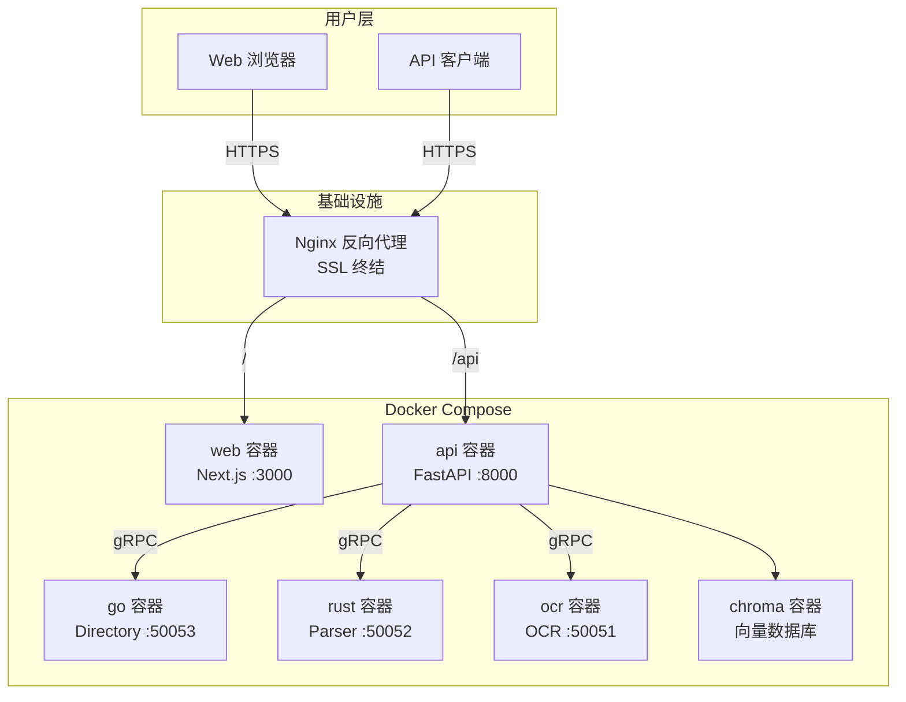

# AI Media Agent — Docker 生产环境部署指南

> 面向运维与开发者的完整 Docker 部署手册，涵盖单机 Compose、多服务编排、Nginx 反向代理、HTTPS 与数据持久化。

---

## 一、部署架构



---

## 二、前置要求

| 项目 | 要求 | 说明 |
|------|------|------|
| 操作系统 | Ubuntu 22.04+ / Debian 12+ / macOS 14+ | 推荐 Linux 服务器 |
| CPU | 2 核+ | 编译 Rust/Go 需要 |
| 内存 | 4GB+ | 前端构建 `npm run build` 较耗内存 |
| 磁盘 | 20GB+ | 媒体文件持续增长 |
| Docker | 24.0+ | 支持 BuildKit |
| Docker Compose | 2.20+ | 支持 `depends_on.condition` |

---

## 三、快速部署步骤

### 3.1 准备项目代码

```bash
git clone https://github.com/phuhao00/ai-media-agent.git
cd ai-media-agent
```

### 3.2 配置环境变量

```bash
# 复制模板
cp backend/.env.example backend/.env
nano backend/.env
```

**必须配置的项：**

```env
# 核心 LLM（至少配置一个）
ZHIPUAI_API_KEY=sk-xxx
# OPENROUTER_API_KEY=sk-or-xxx
# DEEPSEEK_API_KEY=sk-xxx

# 媒体生成
JIMENG_ACCESS_KEY=xxx
JIMENG_SECRET_KEY=xxx
ARK_API_KEY=Bearer xxx

# 基础配置
BACKEND_URL=http://backend:8000
PLAYWRIGHT_BROWSERS_PATH=./.browsers
```

### 3.3 一键启动

```bash
# 使用提供的启动脚本
chmod +x start_local.sh
./start_local.sh

# 或纯 Docker 部署
docker compose up -d --build
```

### 3.4 访问服务

| 地址 | 说明 |
|------|------|
| `http://服务器IP:3000` | 前端界面 |
| `http://服务器IP:8000/docs` | API 文档（Swagger） |
| `http://服务器IP:8000/health` | 健康检查 |

---

## 四、Docker Compose 详解

### 4.1 服务定义

```yaml
services:
  backend:
    build: ./backend
    container_name: ai-agent-backend
    ports:
      - "8000:8000"
    env_file:
      - ./backend/.env
    volumes:
      - ./storage:/app/../storage
      - ./logs:/app/../logs
    restart: unless-stopped
    depends_on:
      ocr_service:
        condition: service_healthy
      parser_service:
        condition: service_healthy
      directory_service:
        condition: service_healthy
    healthcheck:
      test: ["CMD", "curl", "-f", "http://localhost:8000/health"]
      interval: 30s
      timeout: 10s
      retries: 3

  frontend:
    build:
      context: ./web
      args:
        - BACKEND_URL=http://backend:8000
    container_name: ai-agent-frontend
    ports:
      - "3000:3000"
    depends_on:
      - backend
    restart: unless-stopped

  ocr_service:
    build: ./services/ocr
    container_name: ai-agent-ocr
    ports:
      - "50051:50051"
    environment:
      - OCR_PORT=50051
      - OCR_WORKERS=4
      - USE_GPU=0
    volumes:
      - ./storage:/app/storage
    restart: unless-stopped
    healthcheck:
      test: ["CMD", "python", "-c", "import grpc; ch=grpc.insecure_channel('localhost:50051'); grpc.channel_ready_future(ch).result(timeout=5)"]
      interval: 30s
      timeout: 15s
      retries: 5
      start_period: 60s

  parser_service:
    build: ./backend_safety
    container_name: ai-agent-parser
    ports:
      - "50052:50052"
    environment:
      - PARSER_PORT=50052
    volumes:
      - ./storage:/app/storage
    restart: unless-stopped
    healthcheck:
      test: ["CMD", "nc", "-z", "localhost", "50052"]
      interval: 20s
      timeout: 5s
      retries: 5
      start_period: 30s

  directory_service:
    build: ./backend_massive_concurrent
    container_name: ai-agent-directory
    ports:
      - "50053:50053"
    environment:
      - DIRECTORY_PORT=50053
    volumes:
      - ./storage:/app/storage
    restart: unless-stopped
    healthcheck:
      test: ["CMD", "nc", "-z", "localhost", "50053"]
      interval: 20s
      timeout: 5s
      retries: 5
      start_period: 15s
```

### 4.2 服务依赖关系

```
frontend ──→ backend ──→ ocr_service
              │           parser_service
              │           directory_service
              └─→ (可选) chroma
```

### 4.3 构建优化

```bash
# 并行构建
docker compose build --parallel

# 不使用缓存强制重新构建
docker compose build --no-cache

# 只构建特定服务
docker compose build backend
```

---

## 五、Nginx 反向代理与 HTTPS

### 5.1 基础 Nginx 配置

```nginx
# /etc/nginx/sites-available/ai-media-agent
server {
    listen 80;
    server_name your-domain.com;
    return 301 https://$server_name$request_uri;
}

server {
    listen 443 ssl http2;
    server_name your-domain.com;

    ssl_certificate /path/to/cert.pem;
    ssl_certificate_key /path/to/key.pem;

    # 前端
    location / {
        proxy_pass http://localhost:3000;
        proxy_set_header Host $host;
        proxy_set_header X-Real-IP $remote_addr;
    }

    # 后端 API
    location /api/ {
        proxy_pass http://localhost:8000;
        proxy_set_header Host $host;
        proxy_set_header X-Real-IP $remote_addr;
        
        # SSE 长连接支持
        proxy_buffering off;
        proxy_cache off;
        proxy_read_timeout 86400s;
    }

    # 媒体文件代理
    location /media/ {
        proxy_pass http://localhost:8000;
    }
}
```

### 5.2 使用 Caddy（更简单）

```caddyfile
your-domain.com {
    reverse_proxy / localhost:3000
    reverse_proxy /api/* localhost:8000
    reverse_proxy /media/* localhost:8000
}
```

### 5.3 自动 HTTPS（Let's Encrypt）

```bash
# 使用 certbot
sudo certbot --nginx -d your-domain.com

# 或使用 Caddy（自动管理证书）
caddy run
```

---

## 六、数据持久化

### 6.1 卷映射

| 宿主机路径 | 容器路径 | 用途 |
|-----------|---------|------|
| `./storage` | `/app/../storage` | 所有运行时数据 |
| `./logs` | `/app/../logs` | 日志文件 |

### 6.2 备份策略

```bash
#!/bin/bash
# backup.sh
DATE=$(date +%Y%m%d_%H%M%S)
tar czvf /backup/ai-agent-${DATE}.tar.gz \
  ./storage/profiles/ \
  ./storage/scheduler/ \
  ./storage/approvals/ \
  ./storage/tasks/ \
  ./storage/memory/ \
  ./storage/companion/ \
  ./storage/auth.db \
  ./storage/chroma_db/ \
  ./logs/

# 保留最近 7 天
find /backup -name "ai-agent-*.tar.gz" -mtime +7 -delete
```

### 6.3 迁移到新服务器

```bash
# 1. 在原服务器备份
bash backup.sh

# 2. 传输到新服务器
scp /backup/ai-agent-*.tar.gz new-server:/tmp/

# 3. 在新服务器恢复
tar xzvf /tmp/ai-agent-*.tar.gz -C /path/to/project

# 4. 重新构建并启动
cd /path/to/project
docker compose up -d --build
```

---

## 七、常见问题

### 7.1 构建问题

| 问题 | 原因 | 解决 |
|------|------|------|
| 内存溢出（OOM） | 前端 `npm run build` 吃内存 | 增加 Swap 或服务器内存到 4G+ |
| Rust 编译失败 | 缺少 Rust 工具链 | 确保 `backend_safety/Dockerfile` 基于 `rust:1.75`+ |
| Go 编译失败 | 模块依赖问题 | `go mod download` 在 Dockerfile 中 |

### 7.2 运行时问题

| 问题 | 原因 | 解决 |
|------|------|------|
| 后端无法连接 gRPC | 服务启动顺序 | 确保 `depends_on.condition` 生效 |
| 前端无法访问后端 | CORS 或网络隔离 | 检查 `BACKEND_URL` 环境变量 |
| 媒体文件 404 | 卷映射错误 | 确认 `storage/outputs/` 存在 |
| 发布失败 | Playwright 未安装 | 后端容器需包含 `playwright install chromium` |

### 7.3 性能优化

```bash
# 查看资源使用
docker stats

# 限制容器内存（防止 OOM）
docker compose up -d --compatibility

# 在 docker-compose.yml 中添加
services:
  backend:
    deploy:
      resources:
        limits:
          memory: 2G
        reservations:
          memory: 512M
```

---

## 八、生产环境检查清单

- [ ] 修改所有默认密码和 API Key
- [ ] 配置 HTTPS（不是 HTTP）
- [ ] 启用防火墙，只开放 80/443
- [ ] 配置自动备份脚本
- [ ] 设置日志轮转和监控
- [ ] 配置 Docker 容器自动重启
- [ ] 测试健康检查端点
- [ ] 验证 gRPC 服务健康
- [ ] 检查 storage/ 权限（不可全局可写）
- [ ] 配置告警规则（磁盘、内存、服务宕机）

---

## 九、升级指南

```bash
# 1. 拉取最新代码
git pull origin main

# 2. 备份数据
bash backup.sh

# 3. 重新构建并重启
docker compose down
docker compose up -d --build

# 4. 验证健康
curl https://your-domain.com/health
```

---

_文档版本：2026-05-10_
