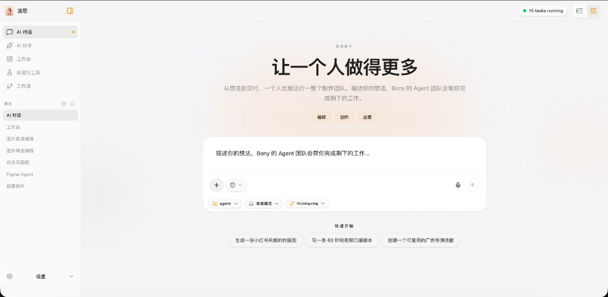
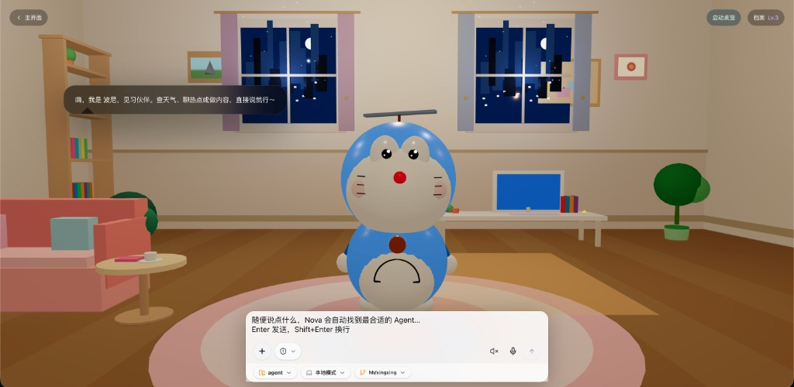
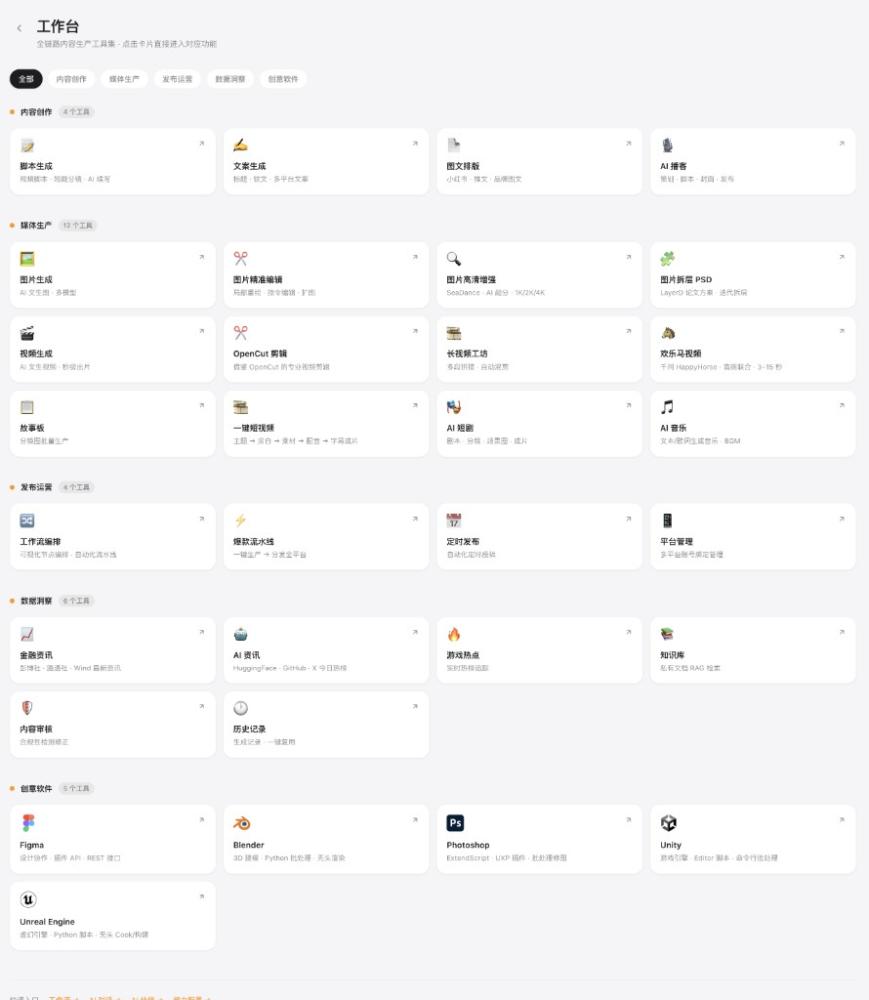
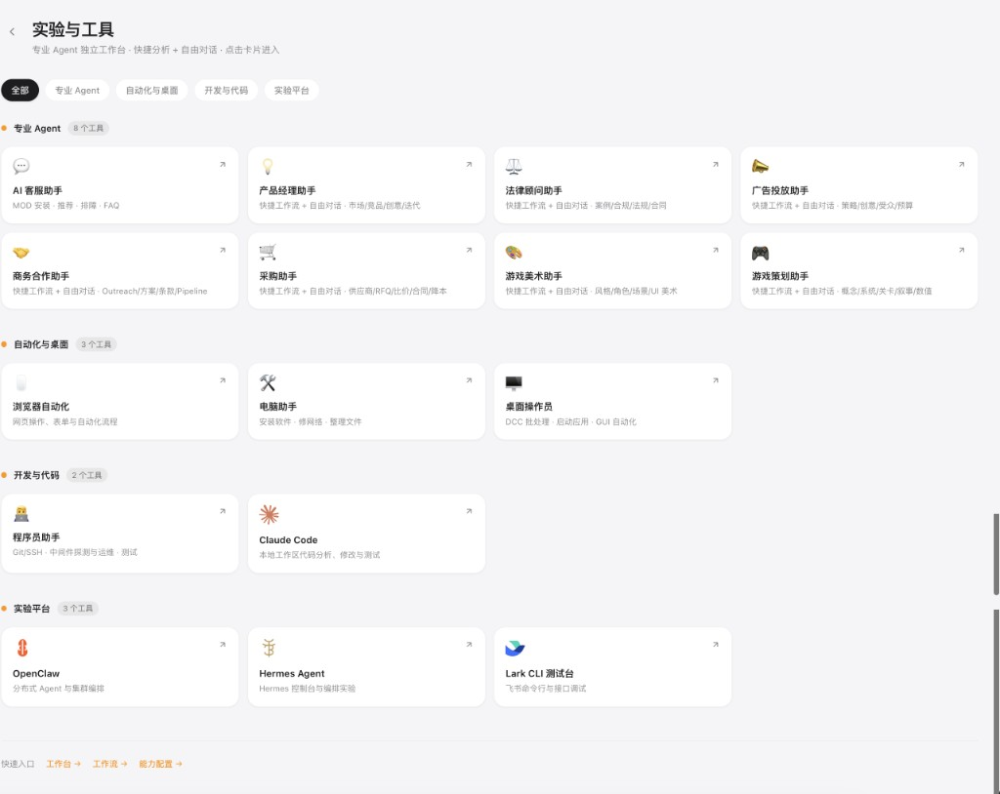
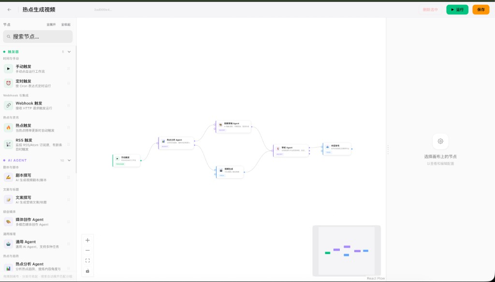
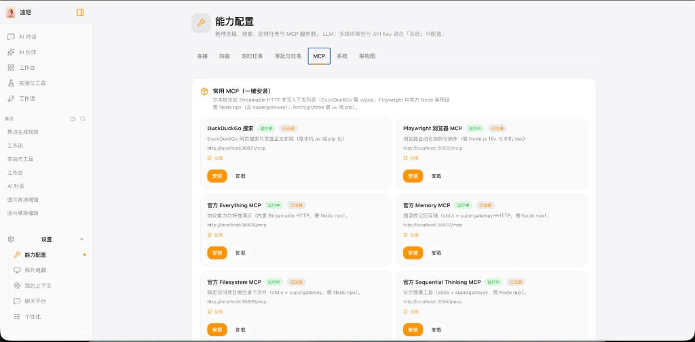
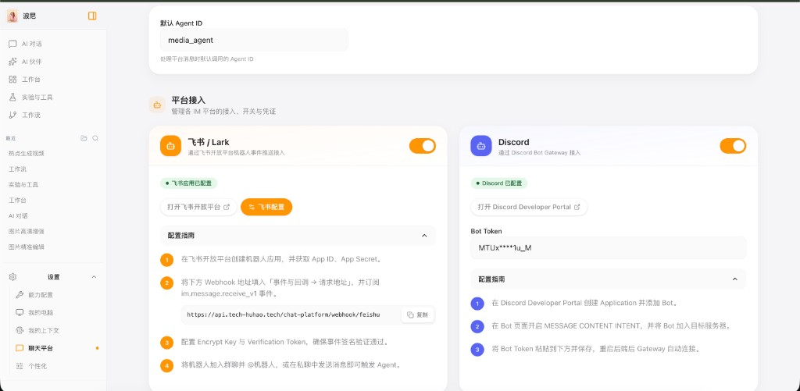
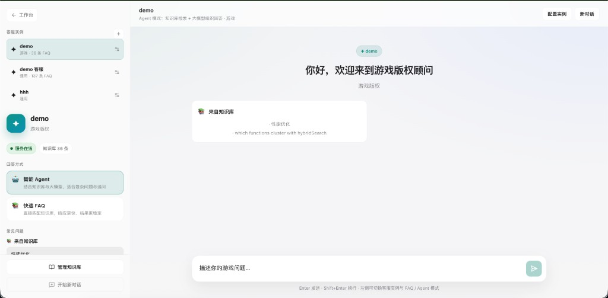
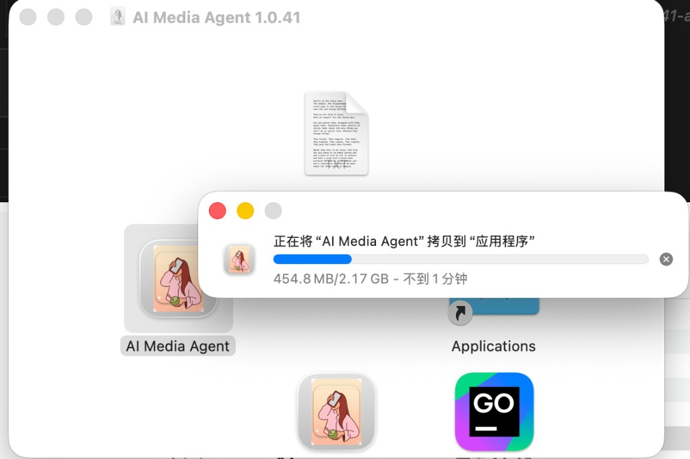
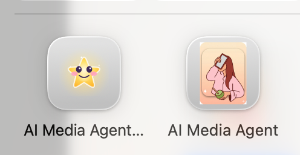

# 🤖 Bony Agent — Full-Stack AI Content Production & Distribution Platform

> One-stop AI-powered content automation: Copywriting → Image / Video / Music / Short Drama generation → Scheduled multi-platform publishing.

[](https://opensource.org/licenses/MIT)
[](https://python.org)
[](https://nextjs.org)
[](docs/CHANGELOG.md)

**[中文文档](./README.md)** | **English**

---

## 📸 Screenshots

### Main Interface · AI Chat


> **Bony** — Do more with one person. From idea to delivery, one person can run an entire production team. Describe your idea and Bony's Agent team handles the rest.

### AI Companion


> Interactive digital human companion with voice dialogue support, always on standby.

### Workbench


> Full-stack content production toolkit: Content Creation · Media Production · Publishing · Data Insights · Creative Software — all in one place.

### Labs · Professional Agent Suite


> 27+ specialized Agents: AI Customer Service, Product Manager, Legal Advisor, Ad Campaign, Business Partnership, Procurement, Game Art/Design, Programmer, and more.

### Visual Workflow Builder


> Drag-and-drop Agent orchestration — trending trigger → content generation → multi-platform distribution, fully automated.

### MCP Capabilities Configuration


> One-click install for DuckDuckGo Search, Playwright Browser, Filesystem, Memory, and more MCP tool servers.

### Chat Platform Integration


> Lark/Feishu and Discord integration — event-driven bots for seamless team collaboration.

### AI Customer Service


> Dual-mode knowledge base retrieval + LLM answering (Smart Agent / Quick FAQ), multi-instance management, ready for gaming, e-commerce, and general scenarios.

---

## ✨ Key Features

| Feature | Description |
|---------|-------------|
| 🤖 Multi-model AI Chat | GLM-4, GPT-4o, Claude 3.5, Gemini and more — switchable in UI with model labels |
| 🎨 AI Image Generation | CogView-3-Plus, Jimeng 4.0, Gemini Image, OpenRouter multi-backend |
| 🖼️ AI Image Editing | 11 editing modes: repaint, watermark removal, outpaint, reference edit, inpaint, upscale, super-resolution |
| 🎬 AI Video Generation | CogVideoX, Doubao SeaDance, image-to-video, storyboard remix, long video, OpenCut professional editing |
| 🎵 AI Music Generation | Text-to-music, lyric composition, style transfer, one-click video BGM |
| 🎭 AI Short Drama | One sentence → script → storyboard → scene generation → dubbing/subtitles → final cut |
| 🎙️ AI Podcast Production | Planning → script → cover → TTS dubbing → multi-platform publishing |
| 🎞️ One-Click Short Video | MoneyPrinterTurbo style: topic → copy → Pexels assets → dubbing/subtitles → final video |
| 🐴 HappyHorse Video Studio | Alibaba DashScope integration, professional video generation with 5-stage precise layer processing |
| 🖨️ Image to PSD | LayerD AI intelligent layering: image/design → Photoshop editable multi-layer PSD |
| ✍️ Copywriting | Multi-platform style adaptation (Xiaohongshu/Douyin/Weibo/Zhihu), one-click generation + title variants |
| 📋 Storyboard Generation | Shot scripts → AI illustration → auto-assembled video, fully automated |
| 🔥 Gaming Trends Dashboard | Steam (bestsellers/new/deals), Epic (free games), TapTap (trending), real-time headless scraping |
| ⏰ 24h Scheduled Publishing | APScheduler-driven, Cron/interval dual mode, auto-generate and publish combining trending topics |
| 📢 Multi-Platform Auto-Publish | Playwright browser automation for **14** platforms: Xiaohongshu, Douyin, Bilibili, Weibo, Kuaishou, WeChat Channels, YouTube, Twitter/X, TikTok, Discord, Lark, and more |
| 🧠 RAG Knowledge Base | Upload PDF/Word/MD to build private knowledge base, AI auto-retrieval for enriched responses |
| 🔍 Content Safety Review | Built-in sensitive word detection + AI secondary review |
| 🤝 Multi-Agent Collaboration | LangGraph Supervisor orchestration, **27+** specialized Agents working together |
| 🌐 Computer Use | Playwright browser GUI automation, LLM-planned web operations |
| 🦞 OpenClaw | Distributed multi-Agent collaboration network with node discovery and group chat |
| 🧑‍💻 AI Companion + Desktop Pet | Interactive digital human + 5 desktop pet characters (Kitty, Bear, GG Bond, 3D Peppa, etc.) with voice dialogue |
| 🏭 Viral Content Pipeline | One-click content production pipeline from topic selection to publishing |
| 🧠 My Context | Backend-assembled knowledge graph visualization + context memory retrieval and management |
| 🔌 MCP Protocol | Model Context Protocol client, seamlessly connects external tool servers |
| 💻 Figma Integration | Figma API + Plugin tools, design and AI content production synergy |

---

## 🚀 Quick Start

> Desktop installer (v1.0.36 DMG / ZIP): [`docs/INSTALLATION.md`](docs/INSTALLATION.md)

### 🍎 macOS Desktop App Installation (Recommended)

The easiest way — no environment setup required, download and run:

1. Go to the [Releases](https://github.com/phuhao00/bony-agent/releases) page and download the latest `.dmg` file
2. Open the DMG and drag the **AI Media Agent** icon into the **Applications** folder

   

3. Find **AI Media Agent** in your Applications folder and double-click to launch

   After installation, the app icon should look like this:

   

4. If macOS shows "Unable to verify developer", go to **System Settings → Privacy & Security** and click **Open Anyway**

> **Tip**: On macOS 14 Sonoma or later, you can run `xattr -cr /Applications/"AI Media Agent.app"` in Terminal to remove the quarantine attribute before launching.

---

### 💻 Source Code (Developer Mode)

### Prerequisites

- **Node.js** 18+ (20 recommended)
- **Python** 3.10+
- At least one AI model API Key (see configuration below)

### One-Command Launch

```bash
# Clone the repository
git clone https://github.com/phuhao00/bony-agent.git
cd bony-agent

# Start (auto-installs dependencies + launches frontend and backend)
./start_local.sh
```

After startup, visit:

- **UI**: http://localhost:3000
- **API Docs**: http://localhost:8000/docs
- **Backend Logs**: `tail -f logs/agent.log`

### Configure API Keys

Edit `backend/.env` (auto-generated template on first run):

```env
# Choose at least one (Zhipu or OpenRouter recommended)
ZHIPUAI_API_KEY=your_key_here        # Zhipu GLM-4 / CogView / CogVideoX
OPENROUTER_API_KEY=your_key_here     # Access GPT-4o / Claude / Gemini + 100 more models
GOOGLE_API_KEY=your_key_here         # Gemini models
DEEPSEEK_API_KEY=your_key_here       # DeepSeek
BYTEDANCE_API_KEY=your_key_here      # Doubao

# Media generation
JIMENG_ACCESS_KEY=your_key_here      # Jimeng AI image/video generation
JIMENG_SECRET_KEY=your_key_here
ARK_API_KEY=your_key_here            # Doubao SeaDance video generation
ALIBABA_API_KEY=your_key_here        # Tongyi/DashScope (HappyHorse)

# Short video assets (optional)
PEXELS_API_KEY=your_key_here         # Pexels royalty-free library (auto video pipeline)
```

### Docker Deployment

```bash
docker compose up -d --build
```

---

## 🎨 Media Generation Matrix

### Image Generation & Editing

| Feature | Route | Description |
|---------|-------|-------------|
| Text-to-Image | `/media/image` | CogView / Jimeng / Gemini Image / OpenRouter multi-backend |
| Image Editing | `/media/image-edit` | 11 modes: repaint, watermark removal, outpaint, reference, inpaint, upscale |
| HD Upscale | `/media/image-hd` | AI high-resolution upscaling with detail enhancement |
| Super Resolution | `/media/image-sr` | Super-resolution processing |
| Image to PSD | `/media/image-to-psd` | LayerD 5-stage precise layering → editable Photoshop file |

### Video Generation & Editing

| Feature | Route | Description |
|---------|-------|-------------|
| Text-to-Video | `/media/video` | CogVideoX, Doubao SeaDance |
| Image-to-Video | `/media/video` | Upload image to generate video |
| Storyboard | `/media/storyboard` | Shots → AI illustration → assembled video |
| Long Video | `/media/long-video` | Multi-shot planning + Wan segmented generation + final assembly |
| Auto Short Video | `/media/auto-video` | One-click pipeline: topic → copy → Pexels assets → dubbing → final cut |
| HappyHorse | `/media/happyhorse` | DashScope integrated professional video studio |
| OpenCut | `/media/opencut` | OpenCut-style professional editing |
| OpenCut Pro | `/media/opencut-pro` | Multi-track, transitions, picture-in-picture, subtitles, filters |
| Short Drama | `/media/short-drama` | AI short drama pipeline: script → storyboard → scene → dubbing → final cut |

### Audio Content

| Feature | Route | Description |
|---------|-------|-------------|
| Music Generation | `/media/music` | Text/lyrics → music, style transfer, video BGM |
| Podcast Production | `/create/podcast` | Planning → script → cover → TTS dubbing → publish |

---

## ⏰ Scheduled Publishing

Navigate to **⏰ Scheduler** in the sidebar.

**Supported scheduling modes:**

- **Cron expression**: `0 9 * * *` (daily 9AM), `0 */6 * * *` (every 6 hours)
- **Fixed interval**: every N hours

**Quick presets:**

- Post AI image every morning at 9AM
- Post image every 6 hours
- Post video daily
- Post article every Monday

**Execution flow:**

1. Scheduler triggers → AI generates content (image/video/article)
2. Publishes via real platform connectors (configure Cookie/Token in Platform Management)
3. Execution logs record result (success/failure/URL)

---

## 📢 Platform Publishing Configuration

Go to **⚙️ Settings → Platform Management** to configure credentials:

| Platform | Auth Method | How to Obtain | Status |
|----------|-------------|---------------|--------|
| **Xiaohongshu** | Cookie (`a1` etc.) | Browser DevTools | ✅ Stable |
| **Douyin** | Cookie | Same as above | ✅ Stable |
| **Bilibili** | Cookie (`SESSDATA` etc.) | Same as above | ✅ Stable |
| **Weibo** | Cookie | Same as above | ✅ Stable |
| **Kuaishou** | Cookie | Same as above | ✅ Stable |
| **WeChat Channels** | Cookie | Same as above | ✅ Stable |
| **YouTube** | OAuth2 Token | Google Cloud Console | ✅ Stable |
| **Twitter/X** | API Token | developer.twitter.com | ✅ Stable |
| **TikTok** | Cookie/Session | Same as above | ✅ Stable |
| **Discord** | Bot Token | Discord Developer Portal | ✅ Stable |
| **Lark/Feishu** | Bot/App Token | Lark Open Platform | ✅ Stable |

---

## 🤖 Agent Registry (27+ Specialized Agents)

| Agent | Role | Core Capabilities |
|-------|------|-------------------|
| `media_agent` | Multimedia creation core | Image/video generation, publishing, memory, RAG |
| `creative_agent` | Full-stack media assistant | Image/video/script/copy/review/web search |
| `image_edit_agent` | Image editing expert | 11 modes: repaint/watermark/outpaint/reference/inpaint |
| `video_editor_agent` | Video editor | Merge, cut, transitions, AI remix |
| `opencut_agent` | OpenCut professional editor | Multi-track, transitions, PiP, subtitles, filters |
| `long_video_agent` | Long video workshop | Multi-shot planning + Wan segmented + final assembly |
| `music_agent` | AI music production | Text/lyrics to music, style transfer, video BGM |
| `podcast_agent` | AI podcast production | Planning, scripting, cover, TTS dubbing & publishing |
| `short_drama_agent` | AI short drama director | Script, storyboard, scene generation, dubbing & assembly |
| `copywriter_agent` | Copywriting | Multi-platform articles, promotional content, title variants |
| `script_writer_agent` | Video scripting | Structured scripts, differentiated versions |
| `trend_analyst_agent` | Trend analysis | Steam/Epic/TapTap/social media trend tracking |
| `reviewer_agent` | Content review | Compliance, trend insights, copy polish |
| `system_assistant` | System maintenance | Software install/uninstall, network repair, env config |
| `desktop_operator_agent` | Desktop automation | Local software CLI/GUI automation |
| `programmer_agent` | Programming assistant | Git/SSH, middleware ops, testing & code tools |
| `product_manager_agent` | Product manager | Market insight, product ideation, PM methodology |
| `legal_agent` | Legal advisor | Contract review, compliance audit, regulatory analysis |
| `ad_campaign_agent` | Ad campaign | Strategy, creative copy, audience targeting |
| `business_partnership_agent` | Business development | Outreach, proposals, BD pipeline |
| `procurement_agent` | Procurement | Vendor evaluation, RFQ drafting, cost optimization |
| `game_art_agent` | Game art | Visual style, character/scene briefs, UI specs |
| `game_design_agent` | Game design | Concept, core loop, system design, level planning |
| `code_analyst_agent` | Code analysis | Symbol search, call graph, architecture advice |
| `architect_agent` | Project architect | Directory structure, naming conventions, code quality |
| `lobster_agent` | OpenClaw distributed | Trend collection → AI content cloning → multi-platform publish |
| `image_hd_agent` | HD image | High-resolution upscaling and image detail enhancement |

---

## 🛠️ Tech Stack

| Layer | Technology |
|-------|-----------|
| Frontend | Next.js 16 (App Router), Tailwind CSS 4, **40+ pages**, unified CSS variable theming |
| Backend | FastAPI, Python 3.10+ |
| AI Orchestration | LangChain, LangGraph (Supervisor multi-Agent + Plan-Execute) |
| Vector Search | LlamaIndex (ChromaDB / local JSON fallback) |
| Scheduling | APScheduler |
| Browser Automation | Microsoft Playwright |
| High-Concurrency Engine | Go 1.22+ + gRPC + Worker Pool (directory lookup, batch scraping) |
| Security Engine | Rust + Tokio + Tonic (document/video parsing, OCR, encryption) |
| Cross-Service Communication | gRPC + Protocol Buffers + mTLS |
| Media Processing | FFmpeg (via imageio-ffmpeg auto-bundled) |
| Figma Integration | Figma REST API + Plugin Bridge |
| Desktop App | Electron + Tauri Sidecar (Mac DMG / Windows ZIP) |
| Persistence | JSON files + ChromaDB + SQLite (auth.db) |

---

## 📂 Project Structure

```
bony-agent/
├── backend/                        # FastAPI backend
│   ├── main.py                     # Entry point, all API endpoints
│   ├── agents/                     # LangGraph multi-Agent orchestration (27+)
│   │   ├── orchestrator.py         # Supervisor multi-Agent scheduling
│   │   ├── router.py               # Intent routing (keyword + LLM fallback)
│   │   ├── music_agent.py          # 🎵 AI music production Agent
│   │   ├── podcast_agent.py        # 🎙️ AI podcast production Agent
│   │   ├── short_drama_agent.py    # 🎭 AI short drama director Agent
│   │   ├── opencut_agent.py        # ✂️ OpenCut professional editing Agent
│   │   ├── long_video_agent.py     # 📽️ Long video workshop Agent
│   │   ├── image_edit_agent.py     # 🖼️ Image editing Agent (11 modes)
│   │   ├── image_hd_agent.py       # 🔍 HD upscale Agent
│   │   ├── lobster_bot.py          # 🦞 OpenClaw distributed Agent
│   │   ├── copywriter_agent.py     # ✍️ Copywriting Agent
│   │   ├── script_writer_agent.py  # 📋 Script generation Agent
│   │   └── registry.py             # Agent registry
│   ├── tools/                      # Functional tool library
│   │   ├── image_tools.py          # AI image generation
│   │   ├── video_tools.py          # AI video generation
│   │   ├── music_tools.py          # 🎵 Music generation
│   │   ├── podcast_tools.py        # 🎙️ Podcast production
│   │   ├── short_drama_tools.py    # 🎭 Short drama production
│   │   ├── copywriting_tools.py    # Copywriting generation
│   │   ├── publisher_tools.py      # Publishing tools
│   │   ├── gaming_trending.py      # Gaming trends (Steam/Epic/TapTap)
│   │   └── connectors/             # Platform connectors (14+ platforms)
│   ├── services/
│   │   ├── scheduler.py            # APScheduler scheduled publishing
│   │   └── computer_use_service.py # Computer Use browser automation
│   └── core/                       # LLM provider routing & capability registry
├── web/                            # Next.js frontend (40+ pages)
│   └── app/
│       ├── page.tsx                # AI chat homepage
│       ├── workbench/              # 🏗️ Workbench
│       ├── companion/              # 🧑‍💻 AI Companion
│       ├── pipeline/               # 🏭 Viral content pipeline
│       ├── scheduler/              # ⏰ Scheduled publishing
│       ├── trending/               # 🔥 Gaming trends dashboard
│       ├── media/                  # Image / Video / Music / Short Drama generation
│       ├── labs/                   # 🧪 Professional Agent Labs
│       ├── workflows/              # Visual workflow builder
│       └── settings/               # Settings center
├── .agent/skills/                  # 54+ professional digital employee skill definitions
├── backend_massive_concurrent/     # Go high-concurrency engine (gRPC :50053)
├── backend_safety/                 # Rust security engine (gRPC :50052)
├── storage/                        # Local persistent storage
├── docs/                           # Technical documentation (50+ articles)
├── proto/                          # Protocol Buffers definitions
├── start_local.sh                  # One-command local startup script
└── docker-compose.yml              # Docker deployment config
```

---

## 🧠 Agent Skills (`.agent/skills/`)

**54+** built-in professional skills covering 7 categories: Platform Operations, Content Creation, Data Intelligence, Document & Office, Design & Frontend, Technical Engineering, and Infrastructure.

| Skill | Category | Description |
|-------|----------|-------------|
| `xiaohongshu-operator` | Platform Ops | Xiaohongshu viral content strategy |
| `douyin-operator` | Platform Ops | Douyin first-3-second hook + completion rate optimization |
| `youtube-operator` | Platform Ops | YouTube SEO titles + global operations |
| `platform-publisher` | Platform Ops | Multi-platform publishing strategy coordination |
| `script-writer` | Content | AI video script generation |
| `copywriter` | Content | One-click multi-platform article generation |
| `video-editor` | Content | AI remix instruction orchestration |
| `data-analyst` | Data | Play/completion/engagement rate analysis |
| `game-trend-analyst` | Data | Steam/Epic/TapTap trend extraction & topic planning |
| `last30days` | Data | 30-day multi-source research (Reddit/X/YouTube/HN/Polymarket) |
| `seo-specialist` | Data | Long-tail keyword mining & recommendation weight optimization |
| `frontend-design` | Design | Web frontend UI design & component suggestions |
| `theme-factory` | Design | Theme factory (color/font/style systems) |
| `mcp-builder` | Engineering | MCP protocol tool server construction |
| `project-architect` | Engineering | Project architecture design & tech stack selection |
| `prompt-engineer` | Infrastructure | Prompt engineering (Midjourney/SD/Sora) |

---

## 📚 RAG Knowledge Base

Visit `/knowledge` to upload private documents (PDF, Word, Markdown, TXT, CSV).

- Uploaded documents are automatically vectorized; AI chat auto-retrieves relevant content as context
- Supports content viewing & editing, one-click AI content quality optimization
- Knowledge base status, document management, and bulk operations are all visualized

---

## 📖 Documentation

| Document | Description |
|----------|-------------|
| [`docs/INSTALLATION.md`](docs/INSTALLATION.md) | Installation guide (v1.0.36 DMG / ZIP desktop package) |
| [`docs/DEVELOPMENT_GUIDE.md`](docs/DEVELOPMENT_GUIDE.md) | Developer quick-start guide |
| [`docs/ARCHITECTURE_OVERVIEW.md`](docs/ARCHITECTURE_OVERVIEW.md) | System architecture overview (V4 tri-language collaboration) |
| [`docs/CHANGELOG.md`](docs/CHANGELOG.md) | Version changelog |
| [`AGENTS.md`](AGENTS.md) | Agent collaboration guide & dev conventions (27+ Agent registry) |
| [`docs/API_REFERENCE.md`](docs/API_REFERENCE.md) | Backend API reference manual |
| [`docs/MCP_CLIENT.md`](docs/MCP_CLIENT.md) | MCP protocol client documentation |
| [`docs/MEMORY_SYSTEM.md`](docs/MEMORY_SYSTEM.md) | Memory system implementation |
| [`docs/FEATURE_LIST.md`](docs/FEATURE_LIST.md) | Full feature list (54+ skills / 14+ platforms / 40+ modules) |

---

## 🤝 Contributing

PRs are welcome! Common contribution areas:

- New platform connectors (TikTok, Snapchat, LinkedIn, etc.)
- Integrate more AI models/providers
- Add Agent skills (`.agent/skills/` directory)
- Improve scheduling strategies (e.g., auto-adjust publish time based on performance data)

```bash
# Development flow
git fork + clone
git checkout -b feat/your-feature
# develop + test
git push origin feat/your-feature
# submit PR
```

---

## 📄 License

This project is open-sourced under the **MIT License** — free to modify and use commercially.
