# AI Media Agent - 路由与协作流程图

> 使用 Mermaid 图表直观展示 Agent 路由和协作机制。
>
> **Agent 实现对照**：`media_agent` → `backend/agents/bot.py`（图/视频/发布）；`video_editor_agent` → `backend/agents/video_editor_agent.py`（剪辑/混剪）；`long_video_agent` → `backend/agents/long_video_agent.py`（长视频分镜）。

---

## 零、统一 LangGraph 入口（Graph Router · 2026-05）

Direct 与 Multi 已收敛到 **单一后端编排入口** `POST /agent/chat/stream`；前端 `page.tsx` 无论 direct/multi 均 POST `/api/agent/chat/stream`（Next 代理）。旧端点 `/multi-agent/stream`、`/api/chat` 保留为 thin proxy。

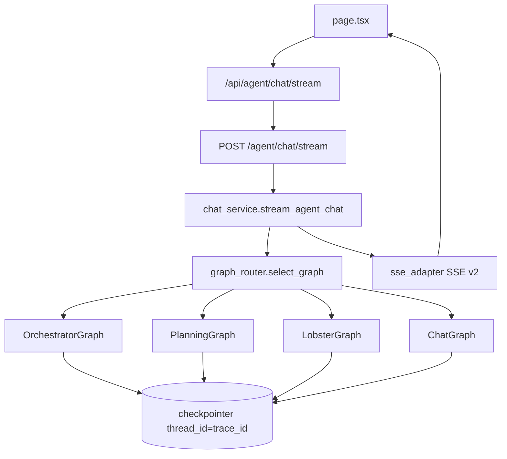
```mermaid
flowchart TB
    FE[page.tsx] --> Proxy["/api/agent/chat/stream"]
    Proxy --> API["POST /agent/chat/stream"]
    API --> CS[chat_service.stream_agent_chat]
    CS --> GR[graph_router.select_graph]
    GR --> G1[OrchestratorGraph]
    GR --> G2[PlanningGraph]
    GR --> G3[LobsterGraph]
    GR --> G4[ChatGraph]
    G1 --> CP[(checkpointer thread_id=trace_id)]
    G2 --> CP
    G3 --> CP
    G4 --> CP
    CS --> SSE[sse_adapter SSE v2]
    SSE --> FE
```

| 选中图 | 条件 | 实现 |
|--------|------|------|
| `chat` | direct 默认 / `agent_id` 强制 | `backend/agents/chat_graph.py` |
| `orchestrator` | `mode=multi` 或 graph_hint | `backend/agents/orchestrator.py`（Supervisor 使用 `Command` 路由） |
| `planning` | 分步/规划关键词 | `backend/agents/planning_bot.py` |
| `lobster` | 龙虾/OpenClaw 关键词 | `backend/agents/lobster_bot.py` |

**SSE v2 事件类型**：`metadata`、`graph_selected`、`memory_prefetch`、`decision`、`agent_result`、`tool_start`/`tool_end`、`token`、`final`、`done`、`error`。

**Checkpoint**：`storage/checkpoints/langgraph.db`（`AsyncSqliteSaver`，启动时 `setup_checkpointer()`；未就绪时 `MemorySaver` 兜底）。`thread_id` 与 `trace_id` 对齐。

**视频+发布确定性流水线**：由 Graph Router 设置 `use_publish_pipeline`，Orchestrator 内 `publish_pipeline` 节点执行（`backend/agents/publish_pipeline_node.py`），不再在 `main.py` 图外 bypass。

---

## 一、整体架构图

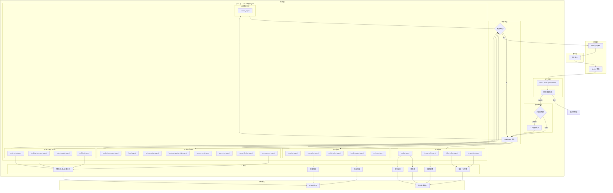
```mermaid
flowchart TB
    subgraph User["用户层"]
        U1[用户输入]
    end

    subgraph Frontend["前端层"]
        FE1[Next.js 界面]
        FE2[SSE 流式接收]
    end

    subgraph Backend["后端层"]
        subgraph API["API 入口"]
            E1[POST /multi-agent/stream]
            E2[特殊管道检测]
        end

        subgraph Router["意图路由层"]
            R1{关键词匹配?}
            R2[LLM 兜底分类]
        end

        subgraph Orchestrator["编排器层"]
            S1[Supervisor 节点]
            S2{需要继续?}
        end

        subgraph Agents["Agent 层 — 22 个注册 Agent"]
            subgraph A_Media["媒体创作"]
                A1[media_agent]
                A2[image_edit_agent]
                A3[video_editor_agent]
                A4[long_video_agent]
            end

            subgraph A_Content["内容创作"]
                A5[creative_agent]
                A6[copywriter_agent]
                A7[script_writer_agent]
                A8[trend_analyst_agent]
                A9[reviewer_agent]
            end

            subgraph A_Labs["专业助手 Labs"]
                A10[product_manager_agent]
                A11[legal_agent]
                A12[ad_campaign_agent]
                A13[business_partnership_agent]
                A14[procurement_agent]
                A15[game_art_agent]
                A16[game_design_agent]
                A17[programmer_agent]
            end

            subgraph A_System["系统 / 桌面 / 代码"]
                A18[system_assistant]
                A19[desktop_operator_agent]
                A20[code_analyst_agent]
                A21[architect_agent]
            end

            subgraph A_Lobster["分布式流水线"]
                A22[lobster_agent]
            end
        end

        subgraph Tools["工具层"]
            T1[文生图]
            T2[文生视频]
            T3[文案生成]
            T4[热点抓取]
            T5[图片编辑]
            T6[混剪 / 长视频]
            T7[代码 / 系统 / 桌面工具]
        end
    end

    subgraph External["外部服务"]
        LLM[LLM 供应商]
        Media[媒体生成服务]
    end

    U1 --> FE1
    FE1 --> E1
    E1 --> E2
    E2 -->|命中| Pipeline[确定性管道]
    E2 -->|未命中| R1
    R1 -->|命中| S1
    R1 -->|未命中| R2
    R2 --> S1
    S1 --> A_Media & A_Content & A_Labs & A_System & A_Lobster
    A_Media & A_Content & A_Labs & A_System & A_Lobster --> S2
    S2 -->|是| S1
    S2 -->|否| FE2
    FE2 --> U1

    A1 --> T1 & T2
    A2 --> T5
    A3 --> T6
    A4 --> T6
    A6 --> T3
    A8 --> T4
    A17 & A18 & A19 & A20 & A21 --> T7
    T1 & T2 --> Media
    T3 & T4 --> LLM
    T5 & T6 --> Media
    T7 --> LLM
```

---

## 二、时序图

### 2.1 简单任务 - 单次 Agent 执行

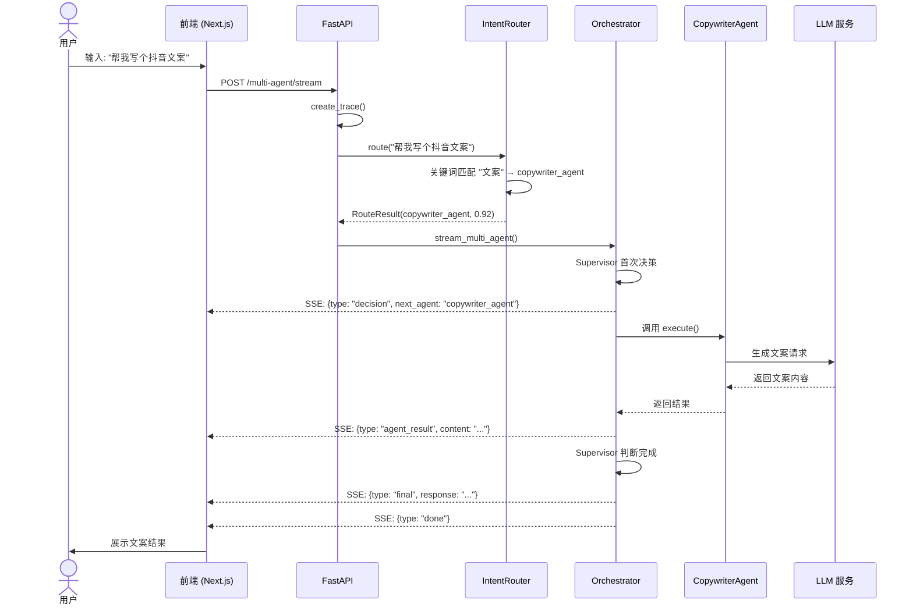
```mermaid
sequenceDiagram
    actor User as 用户
    participant FE as 前端 (Next.js)
    participant API as FastAPI
    participant Router as IntentRouter
    participant Orchestrator as Orchestrator
    participant Agent as CopywriterAgent
    participant LLM as LLM 服务

    User->>FE: 输入: "帮我写个抖音文案"
    FE->>API: POST /multi-agent/stream
    API->>API: create_trace()

    API->>Router: route("帮我写个抖音文案")
    Router->>Router: 关键词匹配 "文案" → copywriter_agent
    Router-->>API: RouteResult(copywriter_agent, 0.92)

    API->>Orchestrator: stream_multi_agent()
    Orchestrator->>Orchestrator: Supervisor 首次决策
    Orchestrator-->>FE: SSE: {type: "decision", next_agent: "copywriter_agent"}

    Orchestrator->>Agent: 调用 execute()
    Agent->>LLM: 生成文案请求
    LLM-->>Agent: 返回文案内容
    Agent-->>Orchestrator: 返回结果

    Orchestrator-->>FE: SSE: {type: "agent_result", content: "..."}
    Orchestrator->>Orchestrator: Supervisor 判断完成
    Orchestrator-->>FE: SSE: {type: "final", response: "..."}
    Orchestrator-->>FE: SSE: {type: "done"}

    FE->>User: 展示文案结果
```

### 2.2 复杂任务 - 多 Agent 协作

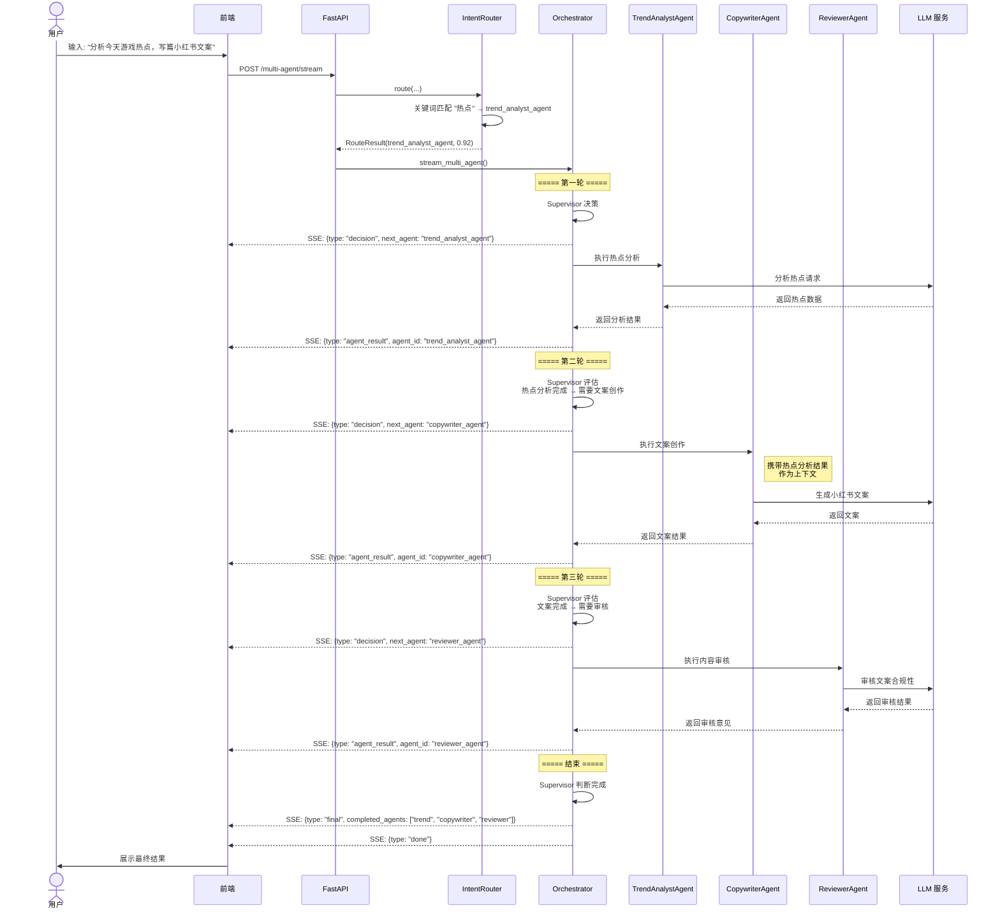
```mermaid
sequenceDiagram
    actor User as 用户
    participant FE as 前端
    participant API as FastAPI
    participant Router as IntentRouter
    participant Orchestrator as Orchestrator
    participant TrendAgent as TrendAnalystAgent
    participant CopyAgent as CopywriterAgent
    participant Reviewer as ReviewerAgent
    participant LLM as LLM 服务

    User->>FE: 输入: "分析今天游戏热点，写篇小红书文案"
    FE->>API: POST /multi-agent/stream
    API->>Router: route(...)
    Router->>Router: 关键词匹配 "热点" → trend_analyst_agent
    Router-->>API: RouteResult(trend_analyst_agent, 0.92)

    API->>Orchestrator: stream_multi_agent()

    Note over Orchestrator: ===== 第一轮 =====
    Orchestrator->>Orchestrator: Supervisor 决策
    Orchestrator-->>FE: SSE: {type: "decision", next_agent: "trend_analyst_agent"}

    Orchestrator->>TrendAgent: 执行热点分析
    TrendAgent->>LLM: 分析热点请求
    LLM-->>TrendAgent: 返回热点数据
    TrendAgent-->>Orchestrator: 返回分析结果
    Orchestrator-->>FE: SSE: {type: "agent_result", agent_id: "trend_analyst_agent"}

    Note over Orchestrator: ===== 第二轮 =====
    Orchestrator->>Orchestrator: Supervisor 评估<br/>热点分析完成 → 需要文案创作
    Orchestrator-->>FE: SSE: {type: "decision", next_agent: "copywriter_agent"}

    Orchestrator->>CopyAgent: 执行文案创作
    Note right of CopyAgent: 携带热点分析结果<br/>作为上下文
    CopyAgent->>LLM: 生成小红书文案
    LLM-->>CopyAgent: 返回文案
    CopyAgent-->>Orchestrator: 返回文案结果
    Orchestrator-->>FE: SSE: {type: "agent_result", agent_id: "copywriter_agent"}

    Note over Orchestrator: ===== 第三轮 =====
    Orchestrator->>Orchestrator: Supervisor 评估<br/>文案完成 → 需要审核
    Orchestrator-->>FE: SSE: {type: "decision", next_agent: "reviewer_agent"}

    Orchestrator->>Reviewer: 执行内容审核
    Reviewer->>LLM: 审核文案合规性
    LLM-->>Reviewer: 返回审核结果
    Reviewer-->>Orchestrator: 返回审核意见
    Orchestrator-->>FE: SSE: {type: "agent_result", agent_id: "reviewer_agent"}

    Note over Orchestrator: ===== 结束 =====
    Orchestrator->>Orchestrator: Supervisor 判断完成
    Orchestrator-->>FE: SSE: {type: "final", completed_agents: ["trend", "copywriter", "reviewer"]}
    Orchestrator-->>FE: SSE: {type: "done"}

    FE->>User: 展示最终结果
```

### 2.3 确定性管道 - 视频生成并发布

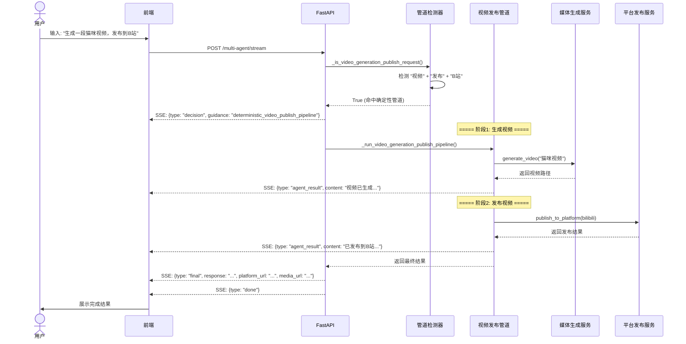
```mermaid
sequenceDiagram
    actor User as 用户
    participant FE as 前端
    participant API as FastAPI
    participant Detector as 管道检测器
    participant Pipeline as 视频发布管道
    participant Media as 媒体生成服务
    participant Platform as 平台发布服务

    User->>FE: 输入: "生成一段猫咪视频，发布到B站"
    FE->>API: POST /multi-agent/stream

    API->>Detector: _is_video_generation_publish_request()
    Detector->>Detector: 检测 "视频" + "发布" + "B站"
    Detector-->>API: True (命中确定性管道)

    API-->>FE: SSE: {type: "decision", guidance: "deterministic_video_publish_pipeline"}

    Note over Pipeline: ===== 阶段1: 生成视频 =====
    API->>Pipeline: _run_video_generation_publish_pipeline()
    Pipeline->>Media: generate_video("猫咪视频")
    Media-->>Pipeline: 返回视频路径
    Pipeline-->>FE: SSE: {type: "agent_result", content: "视频已生成..."}

    Note over Pipeline: ===== 阶段2: 发布视频 =====
    Pipeline->>Platform: publish_to_platform(bilibili)
    Platform-->>Pipeline: 返回发布结果
    Pipeline-->>FE: SSE: {type: "agent_result", content: "已发布到B站..."}

    Pipeline-->>API: 返回最终结果
    API-->>FE: SSE: {type: "final", response: "...", platform_url: "...", media_url: "..."}
    API-->>FE: SSE: {type: "done"}

    FE->>User: 展示完成结果
```

**media_url 推断**：后端从 `agent_result` / `final` 的 content/response 中自动提取媒体路径（Markdown 图片 ``、本地 `/storage/outputs/` 路径、外链），注入 `media_url` 字段，前端可直接渲染。

---

## 三、路由决策流程图

### 3.1 两级路由策略

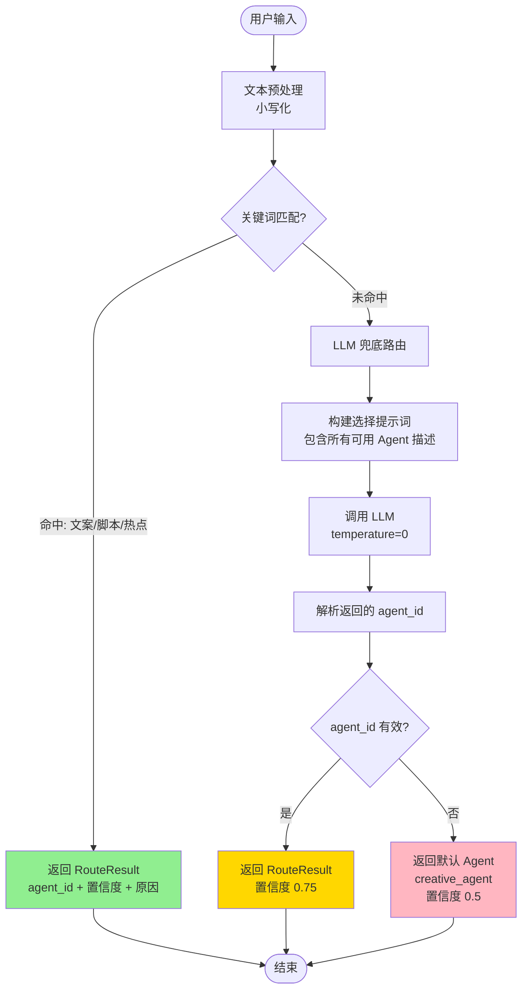
```mermaid
flowchart TD
    Start([用户输入]) --> Normalize[文本预处理<br/>小写化]

    Normalize --> KeywordCheck{关键词匹配?}

    KeywordCheck -->|命中: 文案/脚本/热点| Matched[返回 RouteResult<br/>agent_id + 置信度 + 原因]
    KeywordCheck -->|未命中| LLMRouter[LLM 兜底路由]

    LLMRouter --> BuildPrompt[构建选择提示词<br/>包含所有可用 Agent 描述]
    BuildPrompt --> CallLLM[调用 LLM<br/>temperature=0]
    CallLLM --> ParseResult[解析返回的 agent_id]

    ParseResult --> ValidCheck{agent_id 有效?}
    ValidCheck -->|是| LLMResult[返回 RouteResult<br/>置信度 0.75]
    ValidCheck -->|否| Fallback[返回默认 Agent<br/>creative_agent<br/>置信度 0.5]

    Matched --> End1([结束])
    LLMResult --> End1
    Fallback --> End1

    style Matched fill:#90EE90
    style LLMResult fill:#FFD700
    style Fallback fill:#FFB6C1
```

### 3.2 关键词匹配规则

```mermaid
flowchart LR
    subgraph Keywords["关键词规则表"]
        K1["审核/合规/敏感词"] --> A1[reviewer_agent]
        K2["视频剪辑/混剪/拼接"] --> A2[video_editor_agent]
        K3["图片编辑/修图/去水印/扩图/重绘"] --> A8[image_edit_agent]
        K4["图片/画/海报"] --> A3[media_agent]
        K5["视频/动画/生成视频"] --> A3
        K6["长视频/分镜/分段生成"] --> A9[long_video_agent]
        K7["发布/投稿/B站/小红书"] --> A3
        K8["脚本/分镜"] --> A4[script_writer_agent]
        K9["文案/种草/标题"] --> A5[copywriter_agent]
        K10["热点/趋势/榜单"] --> A6[trend_analyst_agent]
        K11["创作/创意"] --> A7[creative_agent]
        K12["架构/规范/目录结构"] --> A10[architect_agent]
        K13["代码分析/仓库/调用链"] --> A11[code_analyst_agent]
        K14["产品经理/PRD/Discovery/路线图"] --> A12[product_manager_agent]
        K15["法务/合同/合规/法律"] --> A13[legal_agent]
        K16["广告投放/广告计划/受众"] --> A14[ad_campaign_agent]
        K17["商务合作/BD/方案/伙伴"] --> A15[business_partnership_agent]
        K18["采购/供应商/RFQ/比价"] --> A16[procurement_agent]
        K19["游戏美术/角色/场景/UI"] --> A17[game_art_agent]
        K20["游戏设计/策划/数值/关卡"] --> A18[game_design_agent]
        K21["程序员/代码/运维/Git"] --> A19[programmer_agent]
        K22["系统/安装/网络/环境"] --> A20[system_assistant]
        K23["桌面操作/自动化/Blender/PS"] --> A21[desktop_operator_agent]
        K24["龙虾/OpenClaw/热点克隆"] --> A22[lobster_agent]
    end

    style A1 fill:#FF6B6B
    style A2 fill:#4ECDC4
    style A3 fill:#45B7D1
    style A4 fill:#96CEB4
    style A5 fill:#FFEAA7
    style A6 fill:#DDA0DD
    style A7 fill:#98D8C8
    style A8 fill:#F7DC6F
    style A9 fill:#B8B8D1
    style A10 fill:#F7DC6F
    style A11 fill:#95E1D3
    style A12 fill:#F38181
    style A13 fill:#AA96DA
    style A14 fill:#FCBAD3
    style A15 fill:#FFFFD2
    style A16 fill:#A8D8EA
    style A17 fill:#AA96DA
    style A18 fill:#FCBAD3
    style A19 fill:#95E1D3
    style A20 fill:#F38181
    style A21 fill:#FFFFD2
    style A22 fill:#B8B8D1
```

---

## 四、编排器状态机

### 4.1 Supervisor 决策流程

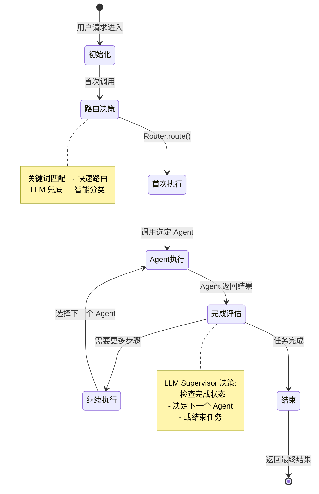
```mermaid
stateDiagram-v2
    [*] --> 初始化: 用户请求进入

    初始化 --> 路由决策: 首次调用
    路由决策 --> 首次执行: Router.route()

    首次执行 --> Agent执行: 调用选定 Agent
    Agent执行 --> 完成评估: Agent 返回结果

    完成评估 --> 继续执行: 需要更多步骤
    完成评估 --> 结束: 任务完成

    继续执行 --> Agent执行: 选择下一个 Agent

    结束 --> [*]: 返回最终结果

    note right of 路由决策
        关键词匹配 → 快速路由
        LLM 兜底 → 智能分类
    end note

    note right of 完成评估
        LLM Supervisor 决策:
        - 检查完成状态
        - 决定下一个 Agent
        - 或结束任务
    end note
```

### 4.2 多 Agent 协作循环

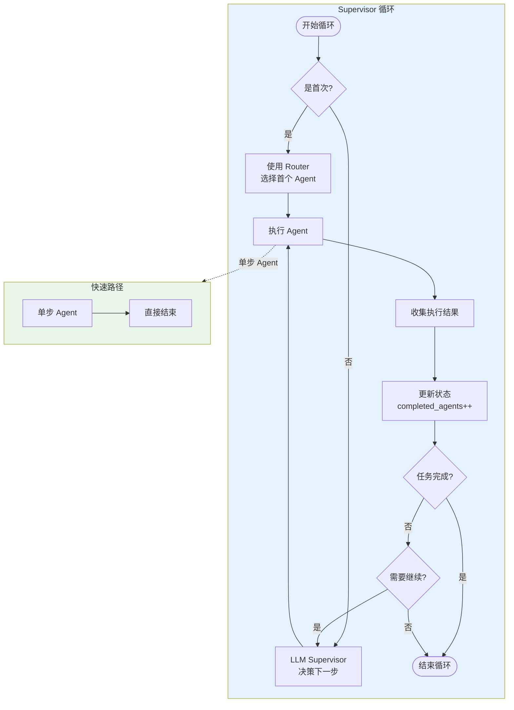
```mermaid
flowchart TB
    subgraph Loop["Supervisor 循环"]
        direction TB

        StartLoop([开始循环]) --> CheckFirst{是首次?}
        CheckFirst -->|是| FirstRoute[使用 Router<br/>选择首个 Agent]
        CheckFirst -->|否| LLMDecision[LLM Supervisor<br/>决策下一步]

        FirstRoute --> ExecuteAgent[执行 Agent]
        LLMDecision --> ExecuteAgent

        ExecuteAgent --> CollectResult[收集执行结果]
        CollectResult --> UpdateState[更新状态<br/>completed_agents++]

        UpdateState --> CheckComplete{任务完成?}
        CheckComplete -->|否| NeedContinue{需要继续?}
        CheckComplete -->|是| EndLoop([结束循环])

        NeedContinue -->|是| LLMDecision
        NeedContinue -->|否| EndLoop
    end

    subgraph FastPath["快速路径"]
        FP1[单步 Agent] --> FP2[直接结束]
    end

    ExecuteAgent -.->|单步 Agent| FastPath

    style Loop fill:#E3F2FD
    style FastPath fill:#E8F5E9
```

---

## 五、Agent 协作模式

### 5.1 常见协作链

```mermaid
flowchart LR
    subgraph Chain1["简单任务"]
        C1A[copywriter_agent] --> C1END[FINISH]
    end

    subgraph Chain2["热点创作"]
        C2A[trend_analyst_agent] --> C2B[copywriter_agent] --> C2END[FINISH]
    end

    subgraph Chain3["脚本审核"]
        C3A[script_writer_agent] --> C3B[reviewer_agent] --> C3END[FINISH]
    end

    subgraph Chain4["视频生成+发布"]
        C4A[media_agent] --> C4B[platform_publisher] --> C4END[FINISH]
    end

    subgraph Chain5["完整工作流"]
        C5A[trend_analyst_agent] --> C5B[script_writer_agent] --> C5C[media_agent] --> C5D[reviewer_agent] --> C5END[FINISH]
    end

    subgraph Chain6["广告投放"]
        C6A[ad_campaign_agent] --> C6B[copywriter_agent] --> C6END[FINISH]
    end

    subgraph Chain7["商务合作"]
        C7A[business_partnership_agent] --> C7B[legal_agent] --> C7END[FINISH]
    end

    subgraph Chain8["游戏内容生产"]
        C8A[game_design_agent] --> C8B[game_art_agent] --> C8C[media_agent] --> C8END[FINISH]
    end

    subgraph Chain9["系统维护"]
        C9A[system_assistant] --> C9END[FINISH]
    end

    style Chain1 fill:#E8F5E9
    style Chain2 fill:#FFF3E0
    style Chain3 fill:#E3F2FD
    style Chain4 fill:#F3E5F5
    style Chain5 fill:#FFEBEE
    style Chain6 fill:#E8F5E9
    style Chain7 fill:#FFF3E0
    style Chain8 fill:#E3F2FD
    style Chain9 fill:#F3E5F5
```

### 5.2 工具调用链

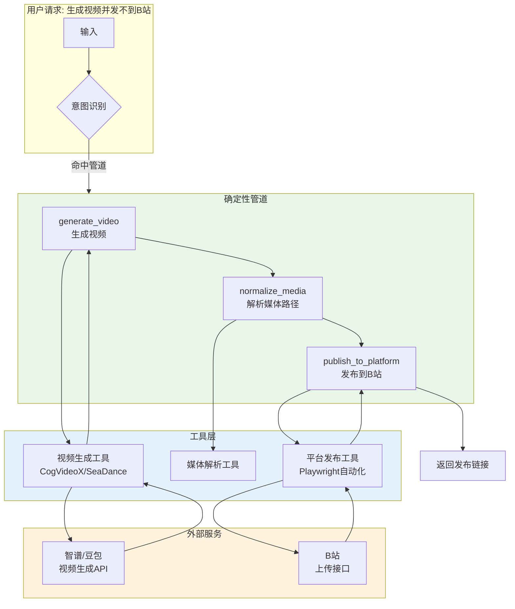
```mermaid
flowchart TB
    subgraph UserRequest["用户请求: 生成视频并发不到B站"]
        direction TB
        Request[输入] --> Intent{意图识别}
    end

    subgraph Pipeline["确定性管道"]
        P1[generate_video<br/>生成视频] --> P2[normalize_media<br/>解析媒体路径]
        P2 --> P3[publish_to_platform<br/>发布到B站]
    end

    subgraph Tools["工具层"]
        T1[视频生成工具<br/>CogVideoX/SeaDance]
        T2[媒体解析工具]
        T3[平台发布工具<br/>Playwright自动化]
    end

    subgraph External["外部服务"]
        E1[智谱/豆包<br/>视频生成API]
        E2[B站<br/>上传接口]
    end

    Intent -->|命中管道| Pipeline
    P1 --> T1
    T1 --> E1
    E1 --> T1
    T1 --> P1

    P2 --> T2
    P3 --> T3
    T3 --> E2
    E2 --> T3
    T3 --> P3

    P3 --> Result[返回发布链接]

    style Pipeline fill:#E8F5E9
    style Tools fill:#E3F2FD
    style External fill:#FFF3E0
```

---

## 六、流式输出事件流

### 6.1 SSE 事件序列

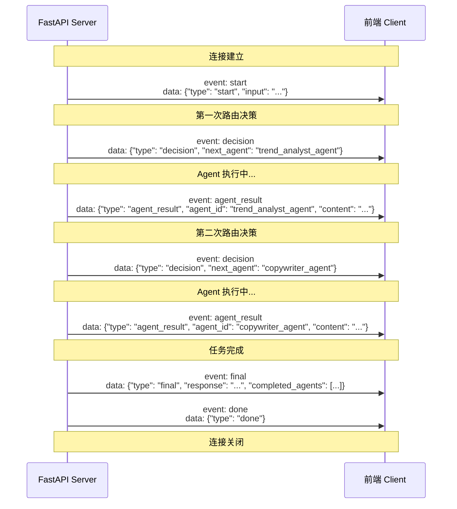
```mermaid
sequenceDiagram
    participant Server as FastAPI Server
    participant Client as 前端 Client

    Note over Server,Client: 连接建立

    Server->>Client: event: start<br/>data: {"type": "start", "input": "..."}

    Note over Server,Client: 第一次路由决策
    Server->>Client: event: decision<br/>data: {"type": "decision", "next_agent": "trend_analyst_agent"}

    Note over Server,Client: Agent 执行中...
    Server->>Client: event: agent_result<br/>data: {"type": "agent_result", "agent_id": "trend_analyst_agent", "content": "..."}

    Note over Server,Client: 第二次路由决策
    Server->>Client: event: decision<br/>data: {"type": "decision", "next_agent": "copywriter_agent"}

    Note over Server,Client: Agent 执行中...
    Server->>Client: event: agent_result<br/>data: {"type": "agent_result", "agent_id": "copywriter_agent", "content": "..."}

    Note over Server,Client: 任务完成
    Server->>Client: event: final<br/>data: {"type": "final", "response": "...", "completed_agents": [...]}

    Server->>Client: event: done<br/>data: {"type": "done"}

    Note over Server,Client: 连接关闭
```

**SSE 代理实现**：`web/app/api/multi-agent/stream/route.ts` 使用原生 Node.js `http(s).request`（而非 `fetch(undici)`）代理后端 SSE，避免 Next.js/Vercel 默认 300s body timeout（长视频等工具可能数分钟不吐分片）。部署环境设置 `maxDuration = 800`。

### 6.2 事件类型说明

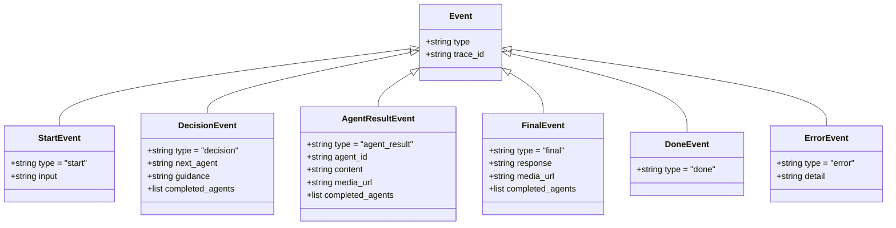
```mermaid
classDiagram
    class Event {
        +string type
        +string trace_id
    }

    class StartEvent {
        +string type = "start"
        +string input
    }

    class DecisionEvent {
        +string type = "decision"
        +string next_agent
        +string guidance
        +list completed_agents
    }

    class AgentResultEvent {
        +string type = "agent_result"
        +string agent_id
        +string content
        +string media_url
        +list completed_agents
    }

    class FinalEvent {
        +string type = "final"
        +string response
        +string media_url
        +list completed_agents
    }

    class DoneEvent {
        +string type = "done"
    }

    class ErrorEvent {
        +string type = "error"
        +string detail
    }

    Event <|-- StartEvent
    Event <|-- DecisionEvent
    Event <|-- AgentResultEvent
    Event <|-- FinalEvent
    Event <|-- DoneEvent
    Event <|-- ErrorEvent
```

---

## 七、执行追踪 (Trace) 数据流

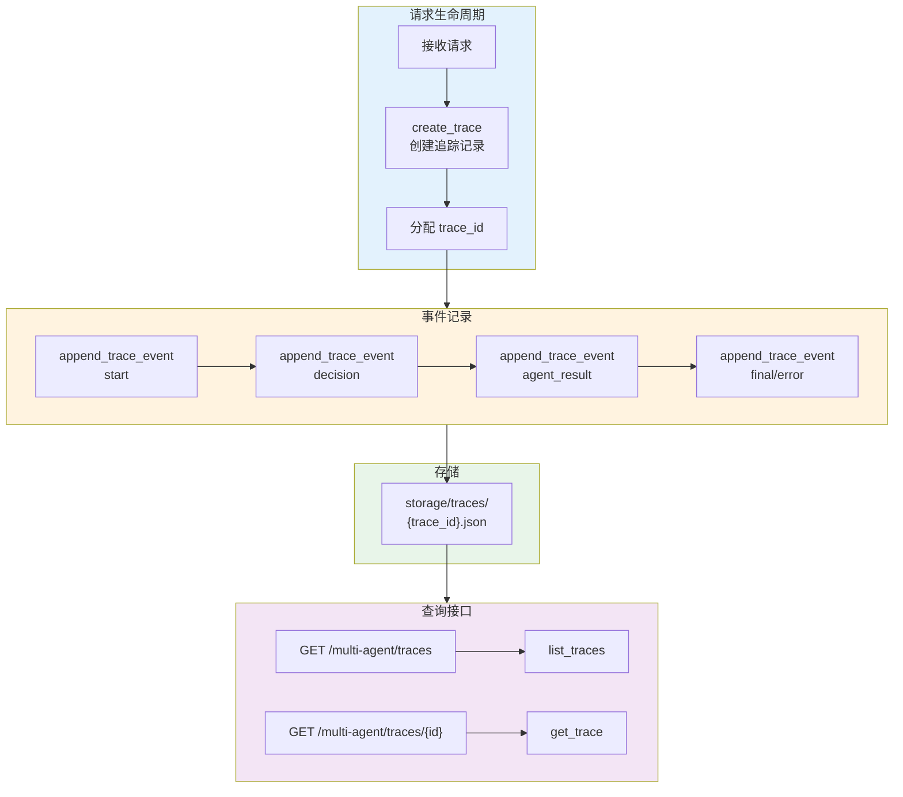
```mermaid
flowchart TB
    subgraph Request["请求生命周期"]
        R1[接收请求] --> R2[create_trace<br/>创建追踪记录]
        R2 --> R3[分配 trace_id]
    end

    subgraph Events["事件记录"]
        E1[append_trace_event<br/>start] --> E2[append_trace_event<br/>decision]
        E2 --> E3[append_trace_event<br/>agent_result]
        E3 --> E4[append_trace_event<br/>final/error]
    end

    subgraph Storage["存储"]
        S1["storage/traces/<br/>{trace_id}.json"]
    end

    subgraph Query["查询接口"]
        Q1[GET /multi-agent/traces] --> Q2[list_traces]
        Q3["GET /multi-agent/traces/{id}"] --> Q4[get_trace]
    end

    R3 --> Events
    Events --> S1
    S1 --> Query

    style Request fill:#E3F2FD
    style Events fill:#FFF3E0
    style Storage fill:#E8F5E9
    style Query fill:#F3E5F5
```

---

## 八、Agent 注册与发现

### 8.1 注册流程

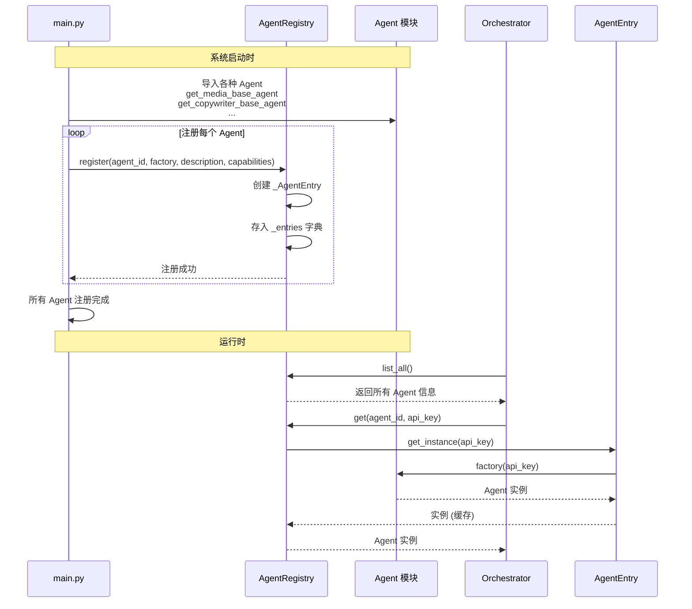
```mermaid
sequenceDiagram
    participant Main as main.py
    participant Registry as AgentRegistry
    participant Agent as Agent 模块

    Note over Main,Agent: 系统启动时

    Main->>Agent: 导入各种 Agent<br/>get_media_base_agent<br/>get_copywriter_base_agent<br/>...

    loop 注册每个 Agent
        Main->>Registry: register(agent_id, factory, description, capabilities)
        Registry->>Registry: 创建 _AgentEntry
        Registry->>Registry: 存入 _entries 字典
        Registry-->>Main: 注册成功
    end

    Main->>Main: 所有 Agent 注册完成

    Note over Main,Agent: 运行时

    Orchestrator->>Registry: list_all()
    Registry-->>Orchestrator: 返回所有 Agent 信息

    Orchestrator->>Registry: get(agent_id, api_key)
    Registry->>AgentEntry: get_instance(api_key)
    AgentEntry->>Agent: factory(api_key)
    Agent-->>AgentEntry: Agent 实例
    AgentEntry-->>Registry: 实例 (缓存)
    Registry-->>Orchestrator: Agent 实例
```

### 8.2 Agent 注册表结构

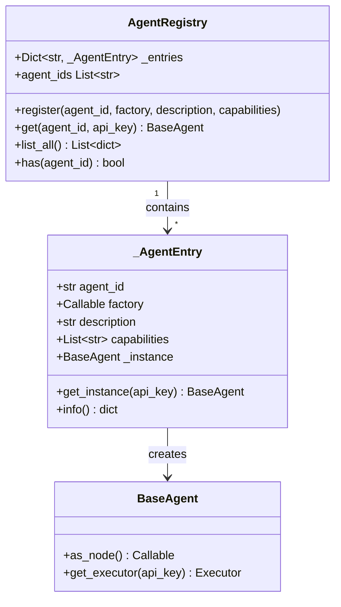
```mermaid
classDiagram
    class AgentRegistry {
        +Dict~str, _AgentEntry~ _entries
        +register(agent_id, factory, description, capabilities)
        +get(agent_id, api_key) BaseAgent
        +list_all() List~dict~
        +has(agent_id) bool
        +agent_ids List~str~
    }

    class _AgentEntry {
        +str agent_id
        +Callable factory
        +str description
        +List~str~ capabilities
        +BaseAgent _instance
        +get_instance(api_key) BaseAgent
        +info() dict
    }

    class BaseAgent {
        +as_node() Callable
        +get_executor(api_key) Executor
    }

    AgentRegistry "1" --> "*" _AgentEntry : contains
    _AgentEntry --> BaseAgent : creates
```

---

## 九、缓存机制

### 9.1 Graph 缓存

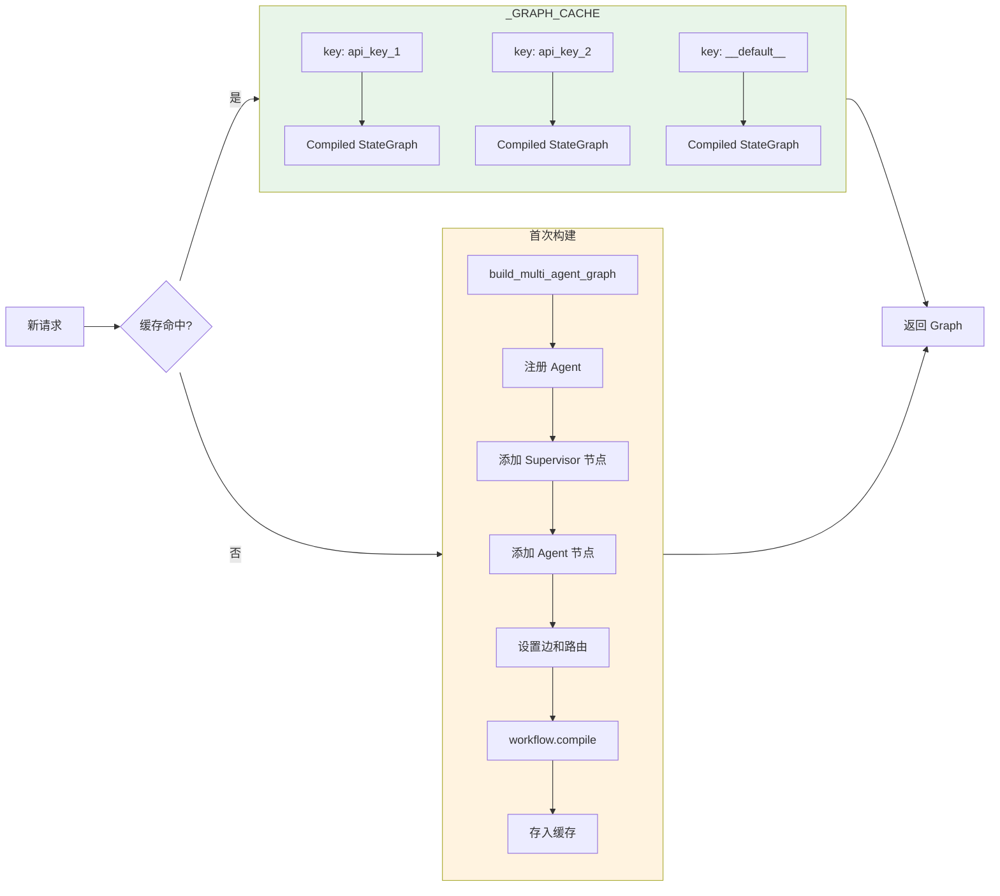
```mermaid
flowchart LR
    subgraph Cache["_GRAPH_CACHE"]
        C1[key: api_key_1] --> G1[Compiled StateGraph]
        C2[key: api_key_2] --> G2[Compiled StateGraph]
        C3[key: __default__] --> G3[Compiled StateGraph]
    end

    subgraph Build["首次构建"]
        B1[build_multi_agent_graph] --> B2[注册 Agent]
        B2 --> B3[添加 Supervisor 节点]
        B3 --> B4[添加 Agent 节点]
        B4 --> B5[设置边和路由]
        B5 --> B6[workflow.compile]
        B6 --> B7[存入缓存]
    end

    Request[新请求] --> Check{缓存命中?}
    Check -->|是| Cache
    Check -->|否| Build
    Cache --> Return[返回 Graph]
    Build --> Return

    style Cache fill:#E8F5E9
    style Build fill:#FFF3E0
```

---

## 十、完整请求生命周期

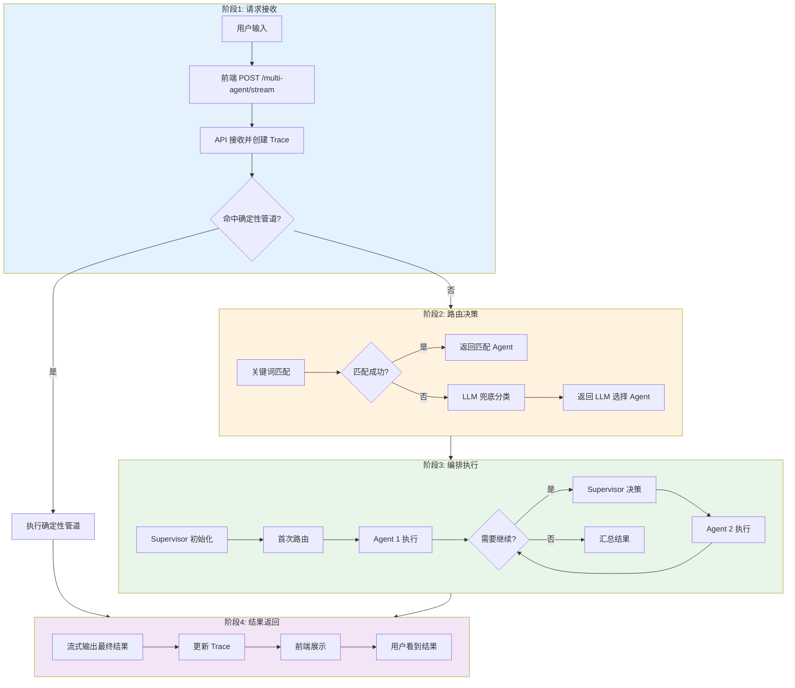
```mermaid
flowchart TB
    subgraph Phase1["阶段1: 请求接收"]
        P1A[用户输入] --> P1B[前端 POST /multi-agent/stream]
        P1B --> P1C[API 接收并创建 Trace]
        P1C --> P1D{命中确定性管道?}
    end

    subgraph Phase2["阶段2: 路由决策"]
        P2A[关键词匹配] --> P2B{匹配成功?}
        P2B -->|是| P2C[返回匹配 Agent]
        P2B -->|否| P2D[LLM 兜底分类]
        P2D --> P2E[返回 LLM 选择 Agent]
    end

    subgraph Phase3["阶段3: 编排执行"]
        P3A[Supervisor 初始化] --> P3B[首次路由]
        P3B --> P3C[Agent 1 执行]
        P3C --> P3D{需要继续?}
        P3D -->|是| P3E[Supervisor 决策]
        P3E --> P3F[Agent 2 执行]
        P3F --> P3D
        P3D -->|否| P3G[汇总结果]
    end

    subgraph Phase4["阶段4: 结果返回"]
        P4A[流式输出最终结果] --> P4B[更新 Trace]
        P4B --> P4C[前端展示]
        P4C --> P4D[用户看到结果]
    end

    P1D -->|否| Phase2
    P1D -->|是| Pipeline[执行确定性管道] --> Phase4
    Phase2 --> Phase3
    Phase3 --> Phase4

    style Phase1 fill:#E3F2FD
    style Phase2 fill:#FFF3E0
    style Phase3 fill:#E8F5E9
    style Phase4 fill:#F3E5F5
```

---

## 十一、错误处理流程

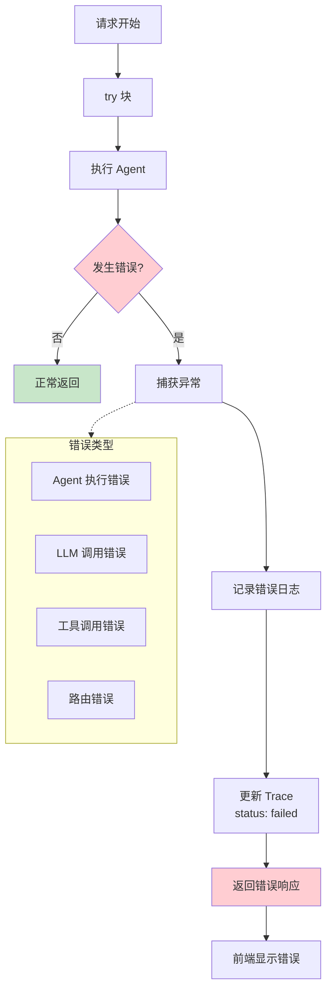
```mermaid
flowchart TB
    Start[请求开始] --> Try[try 块]

    Try --> Execute[执行 Agent]
    Execute --> Error{发生错误?}

    Error -->|否| Success[正常返回]
    Error -->|是| Catch[捕获异常]

    Catch --> Log[记录错误日志]
    Log --> TraceUpdate[更新 Trace<br/>status: failed]

    TraceUpdate --> ErrorResponse[返回错误响应]
    ErrorResponse --> Client[前端显示错误]

    subgraph ErrorTypes["错误类型"]
        E1[Agent 执行错误]
        E2[LLM 调用错误]
        E3[工具调用错误]
        E4[路由错误]
    end

    Catch -.-> ErrorTypes

    style Error fill:#FFCDD2
    style ErrorResponse fill:#FFCDD2
    style Success fill:#C8E6C9
```

---

## 十二、MCP 工具集成流程

### 12.1 MCP 整体架构

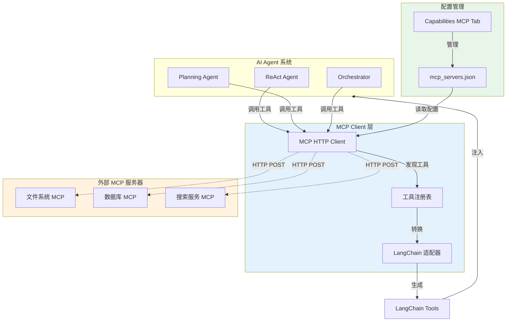
```mermaid
flowchart TB
    subgraph AgentSystem["AI Agent 系统"]
        A1[ReAct Agent]
        A2[Planning Agent]
        A3[Orchestrator]
    end

    subgraph MCPClient["MCP Client 层"]
        MC1[MCP HTTP Client]
        MC2[工具注册表]
        MC3[LangChain 适配器]
    end

    subgraph Config["配置管理"]
        CFG1[mcp_servers.json]
        CFG2[Capabilities MCP Tab]
    end

    subgraph External["外部 MCP 服务器"]
        S1[文件系统 MCP]
        S2[数据库 MCP]
        S3[搜索服务 MCP]
    end

    A1 -->|调用工具| MC1
    A2 -->|调用工具| MC1
    A3 -->|调用工具| MC1

    MC1 -->|发现工具| MC2
    MC2 -->|转换| MC3
    MC3 -->|生成| Tools[LangChain Tools]
    Tools -->|注入| AgentSystem

    CFG1 -->|读取配置| MC1
    CFG2 -->|管理| CFG1

    MC1 -.->|HTTP POST| S1
    MC1 -.->|HTTP POST| S2
    MC1 -.->|HTTP POST| S3

    style MCPClient fill:#E3F2FD
    style Config fill:#E8F5E9
    style External fill:#FFF3E0
```

### 12.2 MCP 工具调用时序

```mermaid
sequenceDiagram
    actor User as 用户
    participant Agent as AI Agent
    participant MCP as MCP Client
    participant Server as MCP Server

    User->>Agent: "列出我的文档目录"
    Agent->>Agent: LLM 推理
    Note right of Agent: 决定调用<br/>filesystem__list_directory

    Agent->>MCP: 调用工具(name="list_directory",<br/>args={"path": "/docs"})

    MCP->>MCP: 构建 JSON-RPC 请求
    Note right of MCP: jsonrpc: "2.0"<br/>method: "tools/call"<br/>params: {name, arguments}

    MCP->>Server: POST /mcp (HTTP)
    Server->>Server: 执行文件系统操作
    Server-->>MCP: JSON-RPC 响应
    Note left of Server: result: {content: [...]}

    MCP-->>Agent: 返回文本结果
    Agent->>Agent: LLM 生成回复
    Agent-->>User: "您的文档目录包含: ..."
```

---

## 十三、My Computer 索引流程

### 13.1 文件夹索引架构

```mermaid
flowchart TB
    subgraph Frontend["前端"]
        UI1[My Computer 设置页]
        UI2[文件夹列表]
    end

    subgraph Backend["后端"]
        API[Computer API]
        SVC[Computer Service]
    end

    subgraph Storage["本地存储"]
        Folders[folders.json]
        Prefs[index_prefs.json]
    end

    subgraph RAG["RAG 系统"]
        RAGM[RAG Manager]
        VectorDB[(ChromaDB)]
    end

    subgraph FileSystem["本地文件系统"]
        Dir1[~/Documents]
        Dir2[~/Projects]
    end

    UI1 -->|添加文件夹| API
    API -->|调用| SVC
    SVC -->|读写| Folders
    SVC -->|读写| Prefs

    SVC -->|后台索引| RAGM
    RAGM -->|存储向量| VectorDB
    RAGM -->|读取| FileSystem

    UI2 -->|查询状态| API

    style Backend fill:#E3F2FD
    style RAG fill:#FFF3E0
    style Storage fill:#E8F5E9
```

### 13.2 文件夹添加与索引流程

```mermaid
sequenceDiagram
    actor User as 用户
    participant UI as My Computer 页面
    participant API as Computer API
    participant SVC as Computer Service
    participant BG as BackgroundTasks
    participant RAG as RAG Manager
    participant DB as ChromaDB

    User->>UI: 输入文件夹路径
    UI->>API: POST /computer/folders
    API->>SVC: add_folder(name, path)

    SVC->>SVC: 验证路径存在
    SVC->>SVC: 统计可索引文件数
    SVC->>SVC: 创建记录 (status: pending)
    SVC-->>API: 返回 folder 对象
    API-->>UI: 添加成功

    API->>BG: index_folder_background(folder_id)
    BG->>SVC: 执行索引

    SVC->>SVC: status = indexing
    SVC->>RAG: ingest_documents(files)

    loop 每个文件
        RAG->>RAG: 文本分块
        RAG->>RAG: 向量化
        RAG->>DB: 存入向量
    end

    RAG-->>SVC: 返回 doc_ids
    SVC->>SVC: status = indexed
    SVC->>SVC: 保存 doc_ids

    Note over UI: 前端轮询状态更新
```

---

## 十四、Capabilities 设置页面架构

### 14.1 Capabilities 整体结构

```mermaid
flowchart TB
    subgraph Capabilities["Capabilities 页面"]
        Nav[导航栏]

        subgraph Tabs["6 个 Tab"]
            T1[Connections<br/>平台连接]
            T2[Skills<br/>技能管理]
            T3[Scheduled<br/>定时任务]
            T4[MCP<br/>MCP服务器]
            T5[System<br/>LLM设置]
            T6[Architecture<br/>架构图]
        end
    end

    subgraph BackendAPI["后端 API"]
        API1["/connectors/*"]
        API2["/api/skills/*"]
        API3["/scheduler/*"]
        API4["/api/mcp/*"]
        API5["/config/provider"]
    end

    Nav --> Tabs

    T1 --> API1
    T2 --> API2
    T3 --> API3
    T4 --> API4
    T5 --> API5
    T6 -->|iframe| ArchPage["/architecture"]

    style Capabilities fill:#E3F2FD
    style Tabs fill:#E8F5E9
```

### 14.2 Workbench 工具聚合

```mermaid
flowchart TB
    subgraph Workbench["工作台 /workbench"]
        Filter[筛选标签]

        subgraph Groups["工具分组"]
            G1[内容创作]
            G2[媒体生产]
            G3[发布运营]
            G4[数据洞察]
        end
    end

    subgraph Tools["具体工具"]
        T1_1[脚本生成]
        T1_2[文案生成]
        T1_3[图文排版]

        T2_1[图片生成]
        T2_2[视频生成]
        T2_3[长视频工坊]

        T3_1[爆款流水线]
        T3_2[定时发布]
        T3_3[平台管理]

        T4_1[游戏热点]
        T4_2[知识库]
        T4_3[内容审核]
    end

    Workbench -->|点击跳转| Tools

    style Workbench fill:#E3F2FD
    style Groups fill:#E8F5E9
    style Tools fill:#FFF3E0
```

---

## 十五、完整系统架构（更新版）

```mermaid
flowchart TB
    subgraph User["用户层"]
        U1[Web 浏览器]
        U2[API 客户端]
    end

    subgraph Frontend["前端层 (Next.js 16) — 37+ 页面"]
        F1[AI对话 /page.tsx]
        F2[工作台 /workbench]
        F3[Capabilities /settings]
        F4[My Computer /settings]
        F5[AI资讯 /ai-news]
        F6[专业助手 Labs<br/>PM / Legal / Ad / BD / Procurement / Game]
        F7[系统与自动化<br/>System Assistant / Desktop Operator / Programmer]
        F8[客服 / 工作流 / Claude Code]
    end

    subgraph Backend["后端层 (FastAPI)"]
        API[API Router]

        subgraph Core["核心层"]
            C1[LLM Provider]
            C2[Media Models]
            C3[Prompts]
            C4[Capabilities / Approval / Tasks]
            C5[Workflow Engine / Recipe Modules]
            C6[System / Desktop Profiles]
        end

        subgraph Agents["Agent 层 — 22 个注册 Agent"]
            A_Runtime[Planning / Orchestrator / Router]
            A_Media[Media / Image Edit / Video Editor / Long Video]
            A_Content[Creative / Copywriter / Script / Trend / Reviewer]
            A_Labs[PM / Legal / Ad / BD / Procurement / GameArt / GameDesign / Programmer]
            A_System[System Assistant / Desktop Operator / Code Analyst / Architect]
            A_Lobster[Lobster]
        end

        subgraph Services["服务层"]
            S1[Scheduler]
            S2[Computer Service · Use]
            S3[MCP Client]
            S4[gRPC Client]
            S5[Approval / Task / Capabilities]
            S6[Memory / Evolution / Reflection]
            S7[Labs Services]
            S8[Native Desktop / System Assistant]
            S9[Customer Service / Workflows]
        end

        subgraph Tools["工具层"]
            T1[内容工具]
            T2[媒体工具]
            T3[平台连接器]
            T4[代码 / 系统 / 桌面工具]
        end
    end

    subgraph External["外部服务"]
        LLM[LLM 供应商]
        Media[媒体生成]
        MCP[MCP 服务器]
    end

    subgraph Storage["存储层"]
        DB1[向量索引]
        DB2[任务配置]
        DB3[MCP配置]
        DB4[Computer配置]
    end

    U1 --> Frontend
    Frontend --> API

    API --> Agents
    API --> Services
    API --> Tools

    Agents --> Core
    Agents --> Tools
    Agents --> S3

    S3 -.-> MCP
    S2 --> DB1

    Tools --> LLM
    Tools --> Media

    Services --> Storage
    Tools --> Storage

    style Frontend fill:#E3F2FD
    style Backend fill:#E8F5E9
    style Services fill:#FFF3E0
    style External fill:#FFEBEE
```

---

## 十六、多模态输入架构

### 16.1 多模态处理流程

```mermaid
flowchart TB
    subgraph UserInput["用户输入"]
        U1[文本消息]
        U2[图片上传]
        U3[音频上传]
        U4[视频上传]
    end

    subgraph Frontend["前端处理"]
        F1[MultimodalInput.tsx]
        F2[格式校验 & 预览]
        F3[Base64 / Blob 上传]
    end

    subgraph Backend["后端处理"]
        B1[接收多媒体文件]
        B2{类型检测}
        B3[图片 → OCR / Vision]
        B4[音频 → ASR 转录]
        B5[视频 → 帧提取 + 音频分离]
    end

    subgraph Microservices["gRPC 微服务"]
        M1[Rust OCR Service]
        M2[Rust Video Parser]
        M3[Go Aggregator]
    end

    subgraph LLM["LLM 理解"]
        L1[Gemini / GLM-V]
        L2[文本上下文组装]
    end

    U1 --> F1
    U2 & U3 & U4 --> F1 --> F2 --> F3
    F3 --> B1 --> B2
    B2 -->|image| B3 --> M1
    B2 -->|audio| B4
    B2 -->|video| B5 --> M2
    B3 & B4 & B5 --> L2
    M1 & M2 --> B3 & B5
    L2 --> L1

    style UserInput fill:#E3F2FD
    style Microservices fill:#FFEBEE
    style LLM fill:#FFF3E0
```

### 16.2 多模态工具调用链

```mermaid
sequenceDiagram
    actor User as 用户
    participant FE as 前端
    participant API as FastAPI
    participant MT as MultimodalTools
    participant Rust as Rust 安全引擎
    participant LLM as LLM (Vision)

    User->>FE: 上传图片 + 文字"提取文字并总结"
    FE->>API: POST /chat (带 media_urls)
    API->>API: 检测多模态输入

    API->>MT: process_image(image_path)
    MT->>Rust: gRPC ParseDocument (OCR)
    Rust-->>MT: 提取的文本块

    MT->>LLM: 发送提取的文本 + 用户指令
    LLM-->>MT: 总结结果

    MT-->>API: 多模态处理结果
    API-->>FE: 流式返回总结
    FE-->>User: 展示结果
```

---

## 十七、gRPC 微服务架构

### 17.1 三语言协作架构

```mermaid
flowchart TB
    subgraph Python["Python FastAPI (主服务)"]
        P1[API Router]
        P2[grpc_client.py]
        P3[Agent 层]
        P4[工具层]
    end

    subgraph Go["Go 高并发引擎 (:50053)"]
        G1[Directory Service<br/>目录检索]
    end

    subgraph Rust["Rust 安全引擎 (:50052)"]
        R1[Document Parser<br/>PDF/DOCX/TXT 流式解析]
        R2[Video Parser<br/>MP4/MKV 零拷贝解析]
        R3[Crypto Service<br/>ChaCha20/AES + Argon2]
        R4[Keystore<br/>OS Keychain 私钥存储]
    end

    subgraph OCR["OCR Service (:50051)"]
        O1[图片文字识别]
    end

    subgraph Proto["Protocol Buffers"]
        PR1[common.proto]
        PR2[directory.proto]
        PR3[document.proto]
        PR4[video.proto]
        PR5[ocr.proto]
    end

    P2 -->|gRPC + TLS| G1 & G2 & G3 & G4
    P2 -->|gRPC + mTLS| R1 & R2 & R3 & R4 & R5

    G1 & G2 & G3 & G4 & R1 & R2 & R3 & R4 & R5 -.->|code-gen| Proto

    style Python fill:#E3F2FD
    style Go fill:#E8F5E9
    style Rust fill:#FFEBEE
    style Proto fill:#FFF9C4
```

### 17.2 gRPC 调用时序 — 文件解析

```mermaid
sequenceDiagram
    participant PY as Python FastAPI
    participant GC as grpc_client.py
    participant RS as Rust 安全引擎
    participant FS as 本地文件系统

    PY->>GC: parse_document(file_path)
    GC->>RS: gRPC ParseFileRequest
    Note right of RS: 零拷贝 mmap 读取
    RS->>FS: mmap 文件
    FS-->>RS: 内存映射

    RS->>RS: FormatDetector 魔数识别
    RS->>RS: nom 解析器组合子
    Note right of RS: 流式返回 ParseChunk

    loop 流式响应
        RS-->>GC: ParseChunk (元数据 + 文本段)
        GC-->>PY: 累积解析结果
    end

    RS-->>GC: ParseSummary (完整元数据)
    GC-->>PY: DocumentParseResult
```

### 17.3 gRPC 调用时序 — 目录检索

```mermaid
sequenceDiagram
    participant PY as Python FastAPI
    participant GC as grpc_client.py
    participant GO as Go Directory Service

    PY->>GC: search_directory(path, query)
    GC->>GO: gRPC SearchRequest

    GO->>GO: 建立内存索引
    GO->>GO: 模糊匹配 / 全文检索

    GO-->>GC: SearchResponse (hits[])
    GC-->>PY: 格式化结果
```

---

## 十八、多语言 Agent 架构

### 18.1 Agent 多语言支持设计

```mermaid
flowchart TB
    subgraph Registry["AgentRegistry"]
        R1[注册表]
    end

    subgraph Agents["多语言 Agent"]
        A1[CopywriterAgent<br/>zh / en]
        A2[ScriptWriterAgent<br/>zh / en]
        A3[TrendAnalystAgent<br/>zh / en]
        A4[ReviewerAgent<br/>zh / en]
        A5[VideoEditorAgent<br/>zh / en]
        A6[ArchitectAgent<br/>zh / en]
    end

    subgraph Prompts["提示词管理"]
        P1[core/prompts/zh/]
        P2[core/prompts/en/]
        P3[动态语言选择]
    end

    subgraph Router["意图路由"]
        RT1[检测输入语言]
        RT2[匹配对应提示词]
    end

    R1 --> A1 & A2 & A3 & A4 & A5 & A6
    A1 & A2 & A3 & A4 & A5 & A6 --> P3
    P3 --> P1 & P2
    RT1 --> RT2 --> P3

    style Agents fill:#E3F2FD
    style Prompts fill:#E8F5E9
```

### 18.2 多语言请求处理时序

```mermaid
sequenceDiagram
    actor User as 用户
    participant FE as 前端
    participant API as FastAPI
    participant Router as IntentRouter
    participant Agent as MultiLangAgent
    participant Prompts as PromptManager
    participant LLM as LLM

    User->>FE: "Write a TikTok script about AI"
    FE->>API: POST /multi-agent/stream
    API->>Router: route(input)
    Router->>Router: 检测语言 = en
    Router->>Router: 关键词匹配 "script" → script_writer_agent

    API->>Agent: execute(input, lang="en")
    Agent->>Prompts: get_prompt("script_writer", lang="en")
    Prompts-->>Agent: 英文版系统提示词

    Agent->>LLM: 英文提示词 + 用户输入
    LLM-->>Agent: 英文脚本
    Agent-->>API: 结果
    API-->>FE: SSE 流式输出
    FE-->>User: 展示英文脚本
```

---

## 十九、完整技术栈全景图

```mermaid
flowchart TB
    subgraph Layer1["用户层"]
        L1U1[Web 浏览器]
        L1U2[移动端]
        L1U3[API 客户端]
    end

    subgraph Layer2["前端层"]
        L2F1[Next.js 16]
        L2F2[React 19 + TypeScript]
        L2F3[Tailwind CSS 4]
        L2F4[MultimodalInput.tsx]
    end

    subgraph Layer3["API 网关层"]
        L3A1[FastAPI]
        L3A2[SSE 流式响应]
        L3A3[API 代理路由]
    end

    subgraph Layer4["业务逻辑层 (Python)"]
        L4B1[Agent 编排 LangGraph]
        L4B2[意图路由]
        L4B3[工具层]
        L4B4[服务层]
        L4B5[MCP Client]
    end

    subgraph Layer5["微服务层"]
        L5G1[Go 高并发引擎]
        L5G2[目录检索 / 抓取 / 监控]
        L5R1[Rust 安全引擎]
        L5R2[解析 / 加密 / OCR]
    end

    subgraph Layer6["外部服务"]
        L6E1[智谱 GLM]
        L6E2[Google Gemini]
        L6E3[DeepSeek]
        L6E4[OpenRouter]
        L6E5[即梦 AI]
        L6E6[豆包 SeaDance]
        L6E7[MCP 服务器]
    end

    subgraph Layer7["数据层"]
        L7D1[ChromaDB 向量库]
        L7D2[SQLite auth.db]
        L7D3[JSON 文件存储]
        L7D4[本地文件系统]
    end

    Layer1 --> Layer2
    Layer2 --> Layer3
    Layer3 --> Layer4
    Layer4 --> Layer5
    Layer4 --> Layer6
    Layer5 --> Layer6
    Layer4 --> Layer7
    Layer5 --> Layer7

    style Layer2 fill:#E3F2FD
    style Layer3 fill:#E8F5E9
    style Layer4 fill:#FFF3E0
    style Layer5 fill:#FFEBEE
    style Layer6 fill:#F3E5F5
    style Layer7 fill:#E0F7FA
```

---

_文档版本：2026-05-10 · 含多模态、多语言、gRPC 微服务架构_
---

## 二十、媒体生产流水线架构

### 20.1 流水线状态机

```mermaid
flowchart TB
    subgraph Pipeline["Media Pipeline 八步状态机"]
        direction TB
        S1[script<br/>脚本生成] --> S2[storyboard<br/>分镜规划]
        S2 --> S3[images<br/>图片生成]
        S3 --> S4[video<br/>视频生成]
        S4 --> S5[audio<br/>配音/TTS]
        S5 --> S6[subtitles<br/>字幕生成]
        S6 --> S7[remix<br/>混剪合成]
        S7 --> S8[publish<br/>平台发布]
    end

    subgraph Gate["闸口审批节点"]
        G1{人工审批?}
    end

    subgraph Persist["产物持久化"]
        P1[storage/tasks/<br/>任务 JSON]
        P2[storage/outputs/<br/>媒体文件]
        P3[history/knowledge<br/>可选落库]
    end

    S3 & S4 & S7 --> Gate
    Gate -->|批准| Next[继续下一步]
    Gate -->|拒绝| Fail[步骤失败]
    Pipeline --> Persist

    style Pipeline fill:#E3F2FD
    style Gate fill:#FFF3E0
    style Persist fill:#E8F5E9
```

### 20.2 流水线闸口审批时序

```mermaid
sequenceDiagram
    actor User as 用户
    participant FE as 前端
    participant API as FastAPI
    participant Pipeline as MediaPipeline
    participant Approval as ApprovalService

    User->>FE: 提交流水线任务
    FE->>API: POST /media-pipeline/start
    API->>Pipeline: 创建任务，进入 script 步骤

    loop 各步骤执行
        Pipeline->>Pipeline: 执行当前步骤
        Pipeline-->>FE: SSE: 步骤进度
    end

    Note over Pipeline: 到达闸口步骤（如 storyboard）
    Pipeline->>Pipeline: status = waiting_approval
    Pipeline->>Approval: 创建 gate 审批
    Approval-->>FE: 显示待审批项

    User->>FE: 查看产物并审批
    FE->>API: POST /approvals/{id}/approve
    API->>Approval: 批准
    Approval-->>Pipeline: 审批通过
    Pipeline->>Pipeline: 步骤标记 completed，进入下一步

    Pipeline-->>FE: SSE: 继续执行
```

---

## 二十一、审批与任务门控架构

### 21.1 能力注册到审批执行的数据流

```mermaid
flowchart TB
    subgraph Entry["入口"]
        E1[Capabilities 页 / API]
        E2[Computer Use 高危步骤]
        E3[Platform Actions]
        E4[Local Computer 动作]
    end

    subgraph Reg["注册与策略"]
        R1[capabilities.py<br/>能力注册表]
        R2[platform_capabilities.py<br/>平台矩阵]
    end

    subgraph Gate["门控与持久化"]
        G1[approval_service<br/>创建/批准/拒绝/过期]
        G2[task_manager<br/>任务持久化]
        G3[execution_approval.py<br/>步骤映射能力]
    end

    subgraph Resume["批准后执行"]
        A1[approve + BackgroundTasks<br/>auto_resume_*]
        A2[resume Computer Use]
        A3[resume platform_action]
        A4[resume local_computer]
    end

    E1 --> R1
    E2 & E3 & E4 --> G3 --> G1
    G1 --> G2
    A1 --> A2 & A3 & A4
    G1 -->|批准| A1

    style Entry fill:#E3F2FD
    style Reg fill:#E8F5E9
    style Gate fill:#FFF3E0
    style Resume fill:#F3E5F5
```

### 21.2 审批生命周期状态机

```mermaid
stateDiagram-v2
    [*] --> pending: 创建审批
    pending --> approved: 用户批准
    pending --> denied: 用户拒绝
    pending --> expired: 超时过期
    approved --> executing: 触发恢复执行
    executing --> completed: 执行成功
    executing --> failed: 执行失败
    denied --> [*]
    expired --> [*]
    completed --> [*]
    failed --> [*]
```

---

## 二十二、研究链路架构

### 22.1 研究链路整体流程

```mermaid
flowchart LR
    Input["用户课题 / 流水线调研"] --> Search["DuckDuckGo<br/>结构化搜索"]
    Search --> Artifact["research_artifact<br/>规范化条目"]
    Artifact --> Save["POST /research/save-to-knowledge<br/>存入知识库"]
    Artifact --> Plan["POST /research/content-plan<br/>生成内容计划"]
    Save --> RAG[(ChromaDB)]
    Plan --> Output["选题 / 脚本 / 发布计划"]

    style Search fill:#E3F2FD
    style Artifact fill:#FFF3E0
    style Save fill:#E8F5E9
```

### 22.2 联网搜索时序

```mermaid
sequenceDiagram
    actor User as 用户
    participant API as FastAPI
    participant Research as ResearchService
    participant Search as DuckDuckGo
    participant LLM as LLM

    User->>API: POST /research/web-search<br/>{"query": "AI 视频生成趋势"}
    API->>Research: web_search(query)
    Research->>Search: ddg_html_search_structured
    Search-->>Research: 返回结果列表

    Research->>Research: make_research_artifact<br/>规范化 title/url/snippet/quote
    Research->>LLM: 生成 summary_preview
    LLM-->>Research: 聚焦摘要

    Research-->>API: research_artifact + previews
    API-->>User: 返回结构化研究结论
```

---

## 二十三、平台连接器架构

### 23.1 平台能力矩阵与动作执行

```mermaid
flowchart TB
    subgraph Matrix["platform_capabilities"]
        M1[PlatformProfile] --> M2[PlatformAction]
        M2 --> M3[risk_level]
        M2 --> M4[requires_approval]
        M2 --> M5[接入方式<br/>API/Webhook/RPA/SemiAuto]
    end

    subgraph Connector["连接器"]
        C1[飞书 connector<br/>读/写/消息/日历/Base]
        C2[Discord Bot<br/>频道/消息/管理]
        C3[SemiAutoIM<br/>微信/QQ/钉钉]
    end

    subgraph Gate["审批门控"]
        G1[request_platform_action]
        G2[approval_service]
        G3[resume_approved_platform_action]
    end

    M2 --> Gate
    Gate -->|批准后| Connector
    C3 -->|SemiAuto| Playbook[返回操作手册]

    style Matrix fill:#E3F2FD
    style Connector fill:#E8F5E9
    style Gate fill:#FFF3E0
```

### 23.2 飞书消息发送时序

```mermaid
sequenceDiagram
    actor User as 用户
    participant FE as Capabilities 页
    participant API as FastAPI
    participant Action as platform_actions
    participant Approval as ApprovalService
    participant Feishu as 飞书 Connector

    User->>FE: 请求飞书发送消息
    FE->>API: POST /connectors/platform-actions
    API->>Action: request_platform_action<br/>action=send_message
    Action->>Action: 检查风险等级 → 需审批
    Action->>Approval: 创建审批
    Approval-->>FE: 显示待审批

    User->>FE: 批准
    FE->>API: POST /approvals/{id}/approve
    API->>Approval: 批准
    Approval-->>Action: 审批通过
    Action->>Feishu: 调用官方 API 发送消息
    Feishu-->>Action: 发送结果
    Action-->>API: 返回结果
    API-->>FE: 更新任务状态
```

---

## 二十四、进化学习数据管道

### 24.1 学习数据管道架构

```mermaid
flowchart TB
    subgraph Sources["事件来源"]
        S1[trace_store<br/>Agent 追踪]
        S2[history_manager<br/>对话历史]
        S3[evolution_signals<br/>用户反馈]
        S4[memory_evaluation<br/>记忆使用结果]
        S5[tool_telemetry<br/>工具遥测]
    end

    subgraph Pipeline["learning-data-pipeline"]
        P1[统一事件 schema] --> P2[storage/evolution/<br/>events.jsonl]
        P2 --> P3[reflection-loop<br/>任务复盘]
        P2 --> P4[curator-worker<br/>后台整理]
        P2 --> P5[session-recall<br/>会话检索]
    end

    subgraph Outputs["产出"]
        O1[save_memory<br/>长期记忆]
        O2[curator_report<br/>整理报告]
        O3[session_summary<br/>会话摘要]
        O4[lessons_playbooks<br/>经验手册]
    end

    Sources --> Pipeline
    P3 & P4 & P5 --> Outputs

    style Sources fill:#E3F2FD
    style Pipeline fill:#FFF3E0
    style Outputs fill:#E8F5E9
```

### 24.2 Reflection Loop 时序

```mermaid
sequenceDiagram
    participant Trace as TraceStore
    participant Reflect as ReflectionLoop
    participant LLM as LLM
    participant Memory as MemoryService

    Note over Trace: trace finalize 后触发
    Trace->>Reflect: trigger_reflection(trace_id)
    Reflect->>Reflect: 读取 trace 事件与结果
    Reflect->>LLM: 生成复盘摘要<br/>成功要素 / 失败原因 / 可复用偏好
    LLM-->>Reflect: 复盘内容
    Reflect->>Memory: save_memory(type=reflection)
    Memory-->>Reflect: 保存成功
    Reflect->>Reflect: growth_add_xp: +1<br/>（不再写入 companion_state.recent_feedback<br/>避免档案页出现无关长文）
```

---

## 二十五、记忆协调器架构

### 25.1 记忆协调器生命周期

```mermaid
flowchart LR
    subgraph LC["memory_coordinator 生命周期"]
        direction TB
        L1[initialize<br/>会话初始化] --> L2[prefetch<br/>预取相关记忆]
        L2 --> L3[after_turn<br/>回合后处理]
        L3 --> L4[on_pre_compress<br/>压缩前抽取]
        L4 --> L5[shutdown<br/>会话结束]
    end

    subgraph Agent["Agent 对话"]
        A1[用户输入] --> A2[LLM 推理]
        A2 --> A3[Agent 回复]
    end

    subgraph Storage["存储"]
        S1[ChromaDB]
        S2[JSON fallback]
    end

    LC -->|注入记忆上下文| Agent
    L2 & L4 --> Storage
    L3 -->|save_reflection| Storage

    style LC fill:#E3F2FD
    style Agent fill:#E8F5E9
    style Storage fill:#FFF3E0
```

### 25.2 Prefetch 注入时序

```mermaid
sequenceDiagram
    participant Agent as AgentRuntime
    participant MC as MemoryCoordinator
    participant VS as VectorStore
    participant LLM as LLM

    Note over Agent: 新会话 / 新回合开始
    Agent->>MC: prefetch(query=用户输入, k=5)
    MC->>VS: similarity_search(query)
    VS-->>MC: 返回 top-k 记忆片段
    MC->>MC: 组装短摘要 + 来源<br/>包裹 <memory-context> fence
    MC->>MC: record_recall + memory_snapshot<br/>（记录命中时的记忆内容与元数据）
    MC-->>Agent: 注入记忆上下文
    Agent->>LLM: 系统提示 + 记忆 fence + 用户输入
    LLM-->>Agent: 生成回复
    Agent-->>MC: after_turn(input, output)
    MC->>MC: 评估是否生成 reflection
```

### 25.3 记忆命中可视化（Hits 视图）

前端 `MemoryPanel.tsx` 提供 Memories / Hits 双视图，用于诊断记忆的召回效果：

```mermaid
flowchart TB
    subgraph Frontend["MemoryPanel.tsx"]
        F1[Memories 视图] --> F2[记忆库列表]
        F1 --> F3[搜索/筛选/投票]
        F4[Hits 视图] --> F5[recall 轨迹列表]
        F5 --> F6[Query 语句]
        F5 --> F7[命中记忆内容]
        F5 --> F8[媒体引用预览]
        F5 --> F9[missing / snapshot 状态]
    end

    subgraph Backend["API"]
        B1[GET /context/memory] --> B2[记忆库]
        B3[GET /evolution/memory-usage/hits] --> B4[list_memory_hit_records]
    end

    subgraph Data["数据层"]
        D1[memories.json / ChromaDB]
        D2[memory_usage.jsonl<br/>recall 记录]
        D3[memory_snapshot<br/>prefetch 时刻快照]
    end

    F2 --> B1
    F5 --> B3
    B2 --> D1
    B4 --> D2 --> D3

    style Frontend fill:#E3F2FD
    style Backend fill:#E8F5E9
    style Data fill:#FFF3E0
```

**HitCard 信息结构**：

| 字段 | 说明 |
|------|------|
| `query` | 触发 recall 的用户查询 |
| `rank` | 该记忆在搜索结果中的排名 |
| `memory.content` | 记忆内容（优先当前库，降级 snapshot） |
| `memory.missing` | 记忆是否已从当前库移除 |
| `memory.snapshot_available` | prefetch 时刻是否有快照 |
| `memory.media_refs` | 关联的媒体引用（封面图/缩略图） |
| `trace_id` | 关联的 trace |

**使用场景**：排查「为什么 Agent 没按我的偏好执行」→ 查看 Hits 视图确认偏好记忆是否被召回、排名多少、内容是否正确。

---

## 二十六、本地计算机动作架构

### 26.1 本地动作沙箱与审批

```mermaid
flowchart TB
    subgraph Request["动作请求"]
        R1[file_read] --> R2[file_write]
        R1 --> R3[file_delete]
        R1 --> R4[shell_command]
        R1 --> R5[app_launch]
    end

    subgraph Sandbox["沙箱策略"]
        S1[目录白名单<br/>My Computer 已登记目录]
        S2[Shell allowlist<br/>只读安全参数]
        S3[命令级参数校验]
    end

    subgraph Gate["审批门控"]
        G1{requires_approval?}
        G1 -->|是| G2[approval_service]
        G1 -->|否| G3[直接执行]
    end

    subgraph Audit["审计与回滚"]
        A1[local_actions.jsonl<br/>审计日志]
        A2[rollback/<br/>快照备份]
        A3["POST /computer/actions/{id}/rollback<br/>回滚恢复"]
    end

    Request --> Sandbox
    Sandbox --> Gate
    G3 --> Audit
    G2 -->|批准后| Audit

    style Request fill:#E3F2FD
    style Sandbox fill:#E8F5E9
    style Gate fill:#FFF3E0
    style Audit fill:#F3E5F5
```

### 26.2 Shell 执行安全链

```mermaid
sequenceDiagram
    participant User as 用户/Agent
    participant LC as LocalComputer
    participant Policy as ShellPolicy
    participant Approval as ApprovalService
    participant OS as OS 进程

    User->>LC: POST /computer/actions<br/>type=shell_command
    LC->>Policy: 校验命令 allowlist
    Policy->>Policy: 检查参数数量/长度<br/>检查路径参数沙箱
    Policy-->>LC: 校验结果 + read_only_proof

    LC->>Approval: 创建审批（高风险）
    Approval-->>User: 等待审批
    User->>Approval: 批准
    Approval-->>LC: 审批通过

    LC->>OS: 执行命令（5秒超时）
    OS-->>LC: 输出结果
    LC->>LC: 风险标注<br/>非零退出/超时/截断/疑似 secret
    LC->>LC: 写入 local_actions.jsonl
    LC-->>User: 返回结果 + 风险标注
```

---

_文档版本：2026-06-14 · 增补 22 个注册 Agent、关键词规则、专业助手 Labs 协作链、完整系统架构更新_
