# AI Media Agent — 系统架构总览

> 面向开发者的完整架构指南，涵盖前端、Python 主服务、Go 高并发引擎、Rust 安全引擎及所有子系统。

---

## 一、架构演进

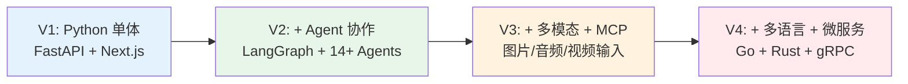

当前版本：**V4** — 三语言协作架构

---

## 二、整体架构图

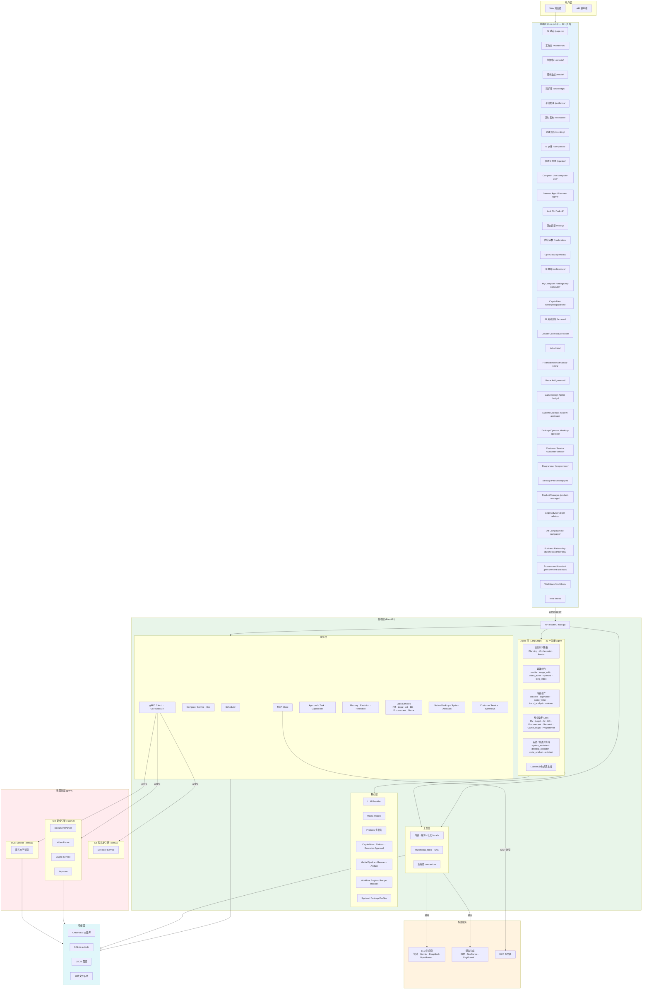

---

## 三、三语言协作详解

### 3.1 职责划分

| 语言       | 服务           | 核心职责                                 | 性能目标                        |
| ---------- | -------------- | ---------------------------------------- | ------------------------------- |
| **Python** | FastAPI 主服务 | Agent 编排、LLM 调用、业务逻辑、API 网关 | 快速迭代、生态丰富              |
| **Go**     | 高并发引擎     | 目录检索、批量抓取、文件监控、聚合查询   | ≥500 URL/s 抓取吞吐             |
| **Rust**   | 安全引擎       | 二进制解析、加密、私钥存储、OCR          | 流式解析 GB 级文件，内存 <128MB |

### 3.2 通信方式

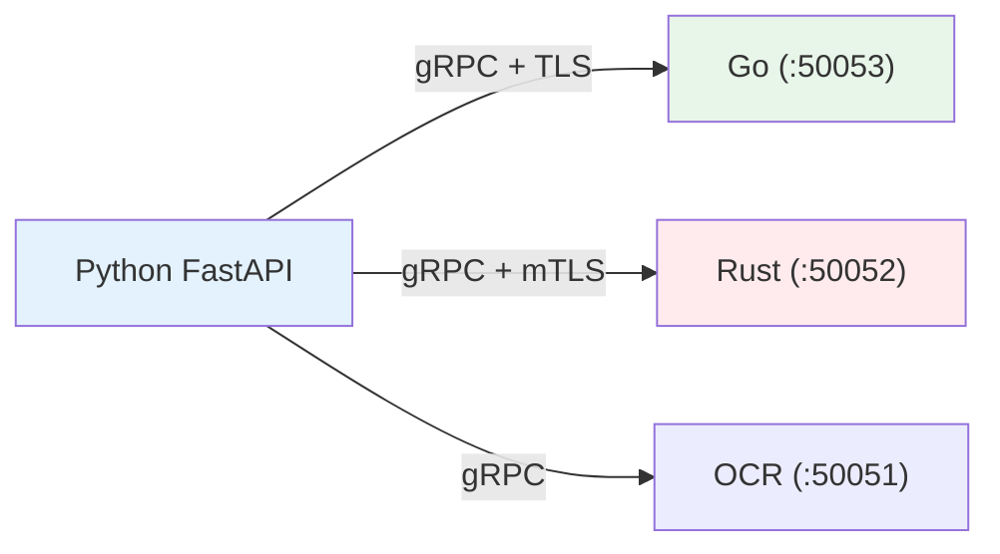

**Protocol Buffers** 定义在 `proto/mediaagent/` 目录：

| Proto 文件        | 用途                     |
| ----------------- | ------------------------ |
| `common.proto`    | 通用类型、错误码         |
| `directory.proto` | 目录搜索、文件监控       |
| `document.proto`  | 文档解析（PDF/DOCX/TXT） |
| `video.proto`     | 视频解析（MP4/MKV）      |
| `ocr.proto`       | 图片文字识别             |

---

## 四、核心子系统

### 4.1 Agent 协作系统

基于 LangGraph StateGraph 的 Supervisor 模式：

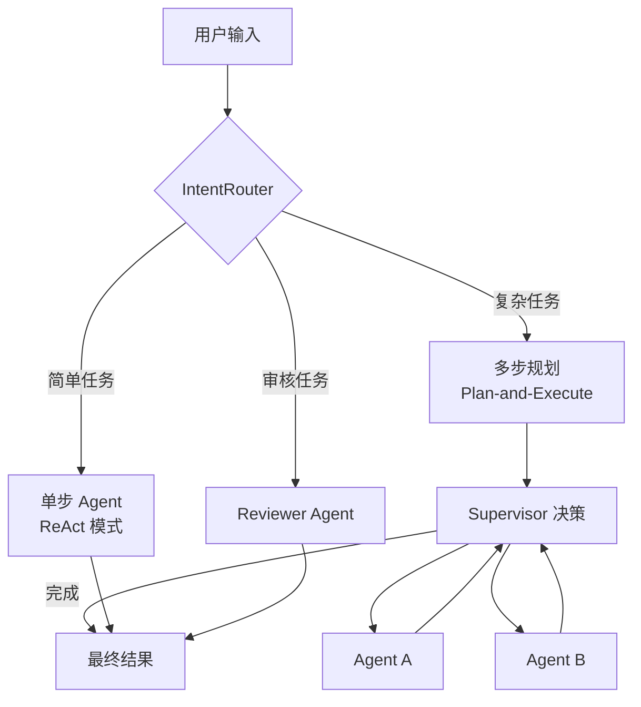

### 4.2 多模态输入系统

**文档类上传（PDF/DOCX 等）的端到端解析流程**（含 Rust gRPC 与降级路径）见专文：[DOCUMENT_PARSING_FLOW.md](./DOCUMENT_PARSING_FLOW.md)。

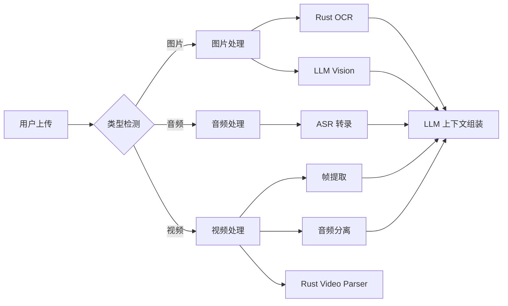

### 4.3 RAG 知识库系统

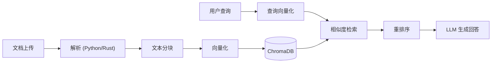

### 4.4 定时发布系统

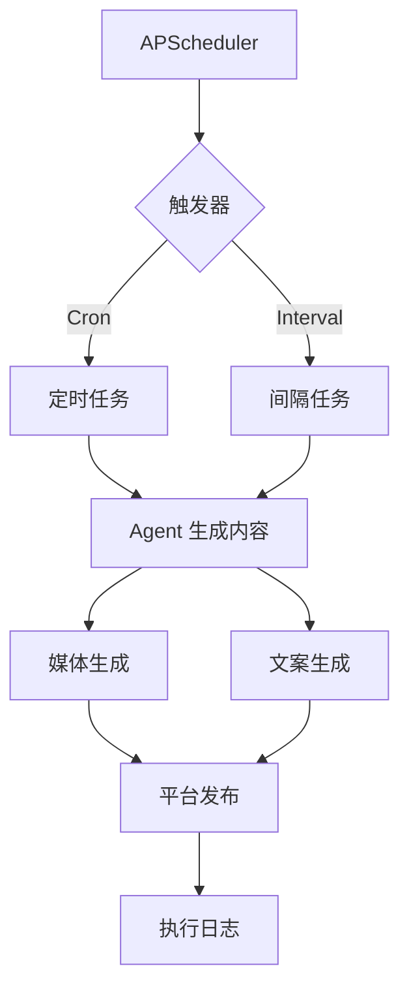

### 4.5 前端界面层：主题令牌与关键页面

主应用在 **`web/app/globals.css`** 中通过 CSS 变量统一明暗壳层（根节点 `:root`、`html.theme-dark`、`html.theme-light`），避免页面各处硬编码 `slate-*` / `bg-white` 导致深色模式下对比度崩溃。

| 变量 / 类                                            | 用途                                  |
| ---------------------------------------------------- | ------------------------------------- |
| `--shell-bg`                                         | 应用工作区底色                        |
| `--foreground` / `--label-secondary`                 | 主文案 / 次级标签                     |
| `--card-bg`、`--chrome-rail-bg`、`--nav-active-fill` | 卡片、侧栏轨、列表 hover              |
| `--separator` / `--separator-subtle`                 | 分割线                                |
| `--accent`                                           | 品牌强调（按钮、聚焦环等）            |
| `--status-danger-*` / `--status-success-*`           | 错误 / 成功提示文字与衬底（深浅可读） |
| `.page-canvas`                                       | 内页画布（继承 `--foreground`）       |
| `.card-surface`                                      | 实心卡片 + 发丝边框 + 轻阴影          |
| `.popover-vibrant`                                   | 对话框 / 浮层磨砂底                   |

**约定：**列表、表单、对话 Markdown 等用户可读正文优先使用 `text-[color:var(--foreground)]`（或等价令牌），勿在同一个深色卡片上再叠浅色主题的 `text-slate-800`。

**关键路径：**

| 路径                                        | 说明                                                                                                                         |
| ------------------------------------------- | ---------------------------------------------------------------------------------------------------------------------------- |
| `web/app/page.tsx`                          | 主对话；助手气泡用 `card-surface`，正文 Markdown 由 `MarkdownSummaryPreview` 渲染                                            |
| `web/components/MarkdownSummaryPreview.tsx` | 对话内 Markdown 组件映射（标题、段落、表格等），已与令牌对齐                                                                 |
| `web/app/settings/capabilities/`            | **能力配置**：能力矩阵、审批与任务、`args_preview` 预览；Computer Use 相关入口与代理 API                                     |
| `web/app/settings/context/`                 | **My context**：知识图谱（`KnowledgeGraphPanel.tsx`）+ 上下文记忆列表（`MemoryPanel.tsx`），面板工具条与条目卡片同上令牌体系 |
| `web/app/ai-news/page.tsx`                  | AI 资讯日报：HF Models / GitHub AI / 𝕏 AI 热点聚合；支持海报与短视频生成                                              |
| `web/app/labs/page.tsx`                     | **专业助手实验室入口**：聚合 PM、法务、广告投放、商务合作、采购、游戏美术/策划、程序员等助手 |
| `web/app/product-manager/page.tsx`          | 产品经理助手：市场洞察、产品创意、Discovery、路线图、用户故事 |
| `web/app/legal-advisor/page.tsx`            | 法务顾问助手：合同审查、法规解读、合规体检、金融风险分析 |
| `web/app/ad-campaign/page.tsx`              | 广告投放助手：投放策略、创意文案、受众定向、预算分配、效果复盘 |
| `web/app/business-partnership/page.tsx`     | 商务合作助手：合作 outreach、方案撰写、条款要点、伙伴评估 |
| `web/app/procurement-assistant/page.tsx`    | 采购助手：供应商评估、RFQ 起草、报价比对、合同审查、成本优化 |
| `web/app/game-art/page.tsx`                 | 游戏美术助手：视觉风格、角色/场景 Brief、UI 规范与竞品视觉分析 |
| `web/app/game-design/page.tsx`              | 游戏设计助手：概念案、核心循环、系统设计、关卡规划、数值框架 |
| `web/app/system-assistant/page.tsx`         | 系统维护助手：软件安装/卸载、网络修复、环境配置、文件整理 |
| `web/app/desktop-operator/page.tsx`         | 桌面操作助手：本机任意软件 CLI/GUI 自动化 |
| `web/app/programmer/page.tsx`               | 编程助手：Git/SSH、中间件运维、测试与代码工具 |
| `web/app/customer-service/page.tsx`         | AI 客服助手：客服工作区与对话界面 |
| `web/app/workflows/page.tsx`                | 可视化工作流：创建/查看/管理工作流 |
| `web/app/financial-news/page.tsx`           | 金融资讯日报 |
| `web/app/claude-code/page.tsx`              | Claude Code 工作区：代码聊天、资源管理器、Slash 命令面板 |
| `web/app/meal/page.tsx`                     | 内部工具：餐费/考勤相关 |
| `web/app/login/page.tsx`                    | 认证入口；对接 BFF `/api/auth/*`                                                                                          |
| `web/contexts/AuthContext.tsx`              | 认证上下文占位类型（`AuthUser` / `login` 签名）；真实接入时需替换 Provider                                                   |

前端通过 **`web/app/api/context/*`** 代理调用后端上下文记忆与知识图谱拼装接口。

**SSE 流式代理（统一 LangGraph 入口）**：

| 路径 | 说明 |
|------|------|
| `web/app/api/agent/chat/stream/route.ts` | **主入口**：原生 `http(s).request` 代理 `POST /agent/chat/stream`（SSE v2） |
| `web/app/api/multi-agent/stream/route.ts` | 遗留代理，行为等价 |
| `web/app/api/chat/route.ts` | 默认转发 LangGraph；`CHAT_LEGACY_AI_SDK=1` 时走旧 Vercel AI SDK 工具循环 |

`maxDuration = 800` 以支持长视频等慢工具。Direct 与 Multi 均在 `page.tsx` 解析同一 SSE 协议（`token` / `decision` / `agent_result` / `final` 等）。

**Checkpoint**：LangGraph 状态持久化于 `storage/checkpoints/langgraph.db`（`backend/agents/checkpoint.py`），`thread_id` 与 `trace_store` 的 `trace_id` 对齐，支持多轮续跑基础能力。

**媒体路径规范化**：
- 后端 `_extract_media_url_from_messages` 支持从 `/media/<file>`、`/storage/outputs/`、外链等路径提取媒体 URL
- `/multi-agent/stream` 在 SSE 事件中自动推断 `media_url`（从 `agent_result` / `final` 的 content/response 中提取 Markdown 图片/链接、本地路径、外链）
- 前端 `companion/page.tsx` 复用 `extractCompanionMediaUrlFromText` 统一提取逻辑
- `OfficeBackground.tsx` 的 `normaliseMediaUrl` 将 `/media/<file>` 映射到 `/api/media/<file>` 磁盘代理（FastAPI 静态路由在 Next.js dev 端口不可用）

### 4.6 超级 Agent 与安全执行面（能力 · 审批 · 任务）

在「对话驱动数字员工」方向上，对 **高风险能力**（浏览器敏感步骤、本地写入/Shell、平台侧发送与文档写入等）采用统一注册、可选审批、任务持久化与可追溯执行；与既有 Playwright / Connector 能力互补，而不是替代多 Agent 编排。

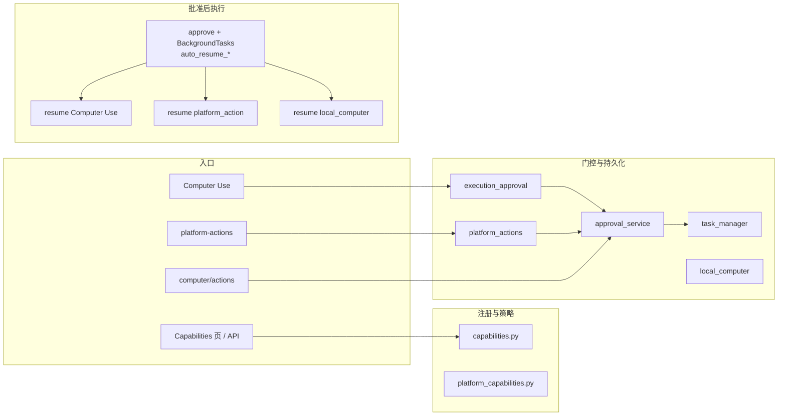

**核心后端模块（节选）**

| 职责              | 路径                                    | 说明                                                                                        |
| ----------------- | --------------------------------------- | ------------------------------------------------------------------------------------------- |
| 能力注册表        | `backend/core/capabilities.py`          | `Capability`：风险等级、`requires_approval`、关联 tool 等                                   |
| 平台矩阵          | `backend/core/platform_capabilities.py` | 各平台 `PlatformProfile` / `PlatformAction`（飞书、Discord、半自动 IM 等）                  |
| 审批              | `backend/services/approval_service.py`  | 创建/批准/拒绝/过期；`args_preview` 脱敏；`batch_updates` / `requests` 等大数组在预览中摘要 |
| 任务              | `backend/utils/task_manager.py`         | `storage/tasks/` JSON 持久化                                                                |
| API 组装          | `backend/core/super_agent_api.py`       | capabilities / tasks / approvals 响应；批准后与任务 metadata 联动                           |
| Computer Use 门控 | `backend/core/execution_approval.py`    | 步骤映射能力、创建审批（轻量、易测）                                                        |
| 平台动作          | `backend/core/platform_actions.py`      | `request_platform_action`；`resume_approved_platform_action`（失败则任务 `failed`）         |
| 本地电脑          | `backend/core/local_computer.py`        | 目录沙箱、读写删与 Shell（白名单+审批）、回滚快照与审计                                     |
| 桌面元数据        | `backend/core/desktop_actions.py`       | 屏幕/键鼠/窗口等画像与计划 API（本机 native 桥接为 planned）                                |
| 多媒体流水线      | `backend/core/media_pipeline.py`        | 多步状态机、闸口审批、可选落历史/知识库                                                     |
| 研究产物          | `backend/core/research_artifact.py`     | 研究条目/摘要规范化与合并                                                                   |
| 陪伴状态          | `backend/core/companion_state.py`       | `storage/companion/state.json`；调度器可 `companion_nudge`                                  |

**持久化位置（节选）**

| 数据         | 目录或文件                             |
| ------------ | -------------------------------------- |
| 审批         | `storage/approvals/approvals.json`     |
| 任务         | `storage/tasks/*.json`                 |
| 本地动作审计 | `storage/computer/local_actions.jsonl` |
| 文件回滚快照 | `storage/computer/rollback/`           |
| 伙伴状态     | `storage/companion/state.json`         |

**与连接器协同（示例：飞书）** `backend/tools/connectors/feishu.py`：`read_docs`（`raw_content`、可选 `include_blocks` / `blocks_page_token`）；`write_docs`（新建/追加、`batch_updates` 或原生 `requests` → docx `batch_update`）。

**前端**：`web/app/settings/capabilities/` — 能力矩阵、待审批、任务、本地审计摘要；`args_preview` 折叠与 JSON 截断；批准时可勾选「批准后后台自动继续」，对应 `POST /approvals/{id}/approve` 的 `auto_resume_computer_use` / `auto_resume_platform_action` / `auto_resume_local_computer`（与审批 `metadata.source` 匹配时由 `BackgroundTasks` 调度）。

**实施清单与已知约束**：`docs/SUPER_AGENT_TODO.md`。

---

## 四（续）、新增子系统架构

### 4.7 媒体生产流水线

`backend/core/media_pipeline.py` 提供八步状态机，将脚本、分镜、图片、视频、配音、字幕、混剪、发布串联为可恢复任务：

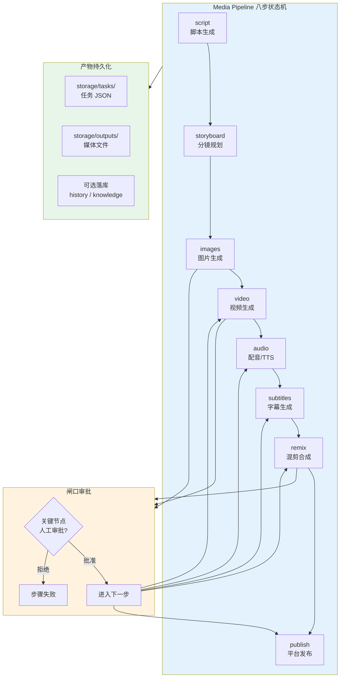

每个步骤写入任务进度、trace 事件、产物路径和失败原因；关键节点支持 `POST /media-pipeline/{id}/gate` 人工审批。

**长视频默认参数**：`POST /tools/video/long` 默认 `duration_sec = 30`（原为 60），风格 `cinematic`，用户明确表达长度时才传入自定义秒数（范围 30–120）。

### 4.8 研究链路

`backend/core/research_artifact.py` 统一联网检索结果格式，支撑从搜索到知识沉淀的闭环：

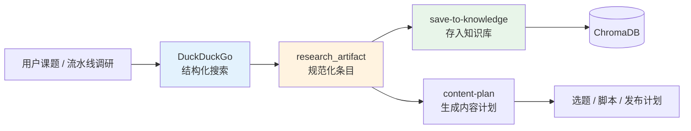

- `POST /research/web-search`：结构化搜索并返回 `summary_preview` + `items_preview`
- `POST /research/save-to-knowledge`：将研究结论转 Markdown 并入 RAG
- `POST /research/content-plan`：从研究 artifact 生成选题、脚本方向、发布计划

### 4.9 进化学习与数据管道

`backend/services/learning_data_pipeline.py` 统一接收 chat_turn、agent_trace、tool_call、feedback_signal、skill_usage 等事件，为自我学习提供数据底座：

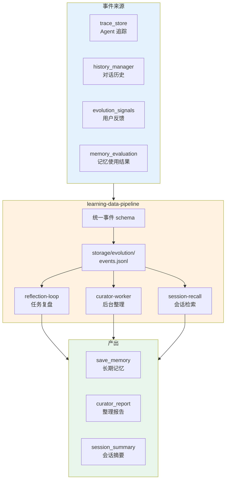

- **reflection-loop**：trace finalize 后触发轻量复盘，摘要写入记忆；只增加 companion XP，不再将复盘摘要写入伙伴档案 `recent_feedback`（避免档案页出现无关长文/链接）
- **curator-worker**：idle / interval 触发，读取事件与候选记忆，输出整理建议（默认 dry-run）
- **session-recall**：FTS/索引检索历史会话，返回聚焦摘要而非全文注入

### 4.10 记忆协调器

`backend/services/memory_coordinator.py` 提供记忆生命周期管理，避免工具层直接依赖底层向量存储：

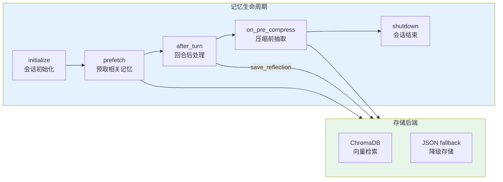

**约束**：prefetch 只注入短摘要与来源，使用固定 fence `<memory-context>` 标记；流式输出不泄漏 fence 原文。

**记忆命中可视化**：`backend/services/memory_evaluation.py` 新增 `list_memory_hit_records`，为每个 recall 记录关联记忆内容与媒体引用：

| 字段 | 说明 |
|------|------|
| `memory.content` | 当前记忆内容（若记忆仍在库中） |
| `memory_snapshot` | prefetch 时刻的快照（记忆被删除时用于降级展示） |
| `memory.missing` | 标记记忆是否已从当前库中移除 |
| `memory.media_refs` | 关联的媒体引用（封面图、缩略图等） |

前端 `MemoryPanel.tsx` 提供「Memories / Hits」双视图：Memories 展示记忆库列表，Hits 展示 recall 轨迹（查询语句、命中排名、记忆内容、媒体引用）。** Hits 视图支持 missing + snapshot_available 状态提示，便于排查记忆失效或存储切换场景。**

### 4.11 平台连接器矩阵

`backend/core/platform_capabilities.py` 定义各平台的接入方式、动作风险与审批策略：

| 平台 | 接入方式 | 读类动作 | 写类动作 | 审批策略 |
|------|----------|----------|----------|----------|
| 飞书 | 官方 API / Webhook | 读文档/日历/Base | 发消息/写文档/创建日程 | 写类默认审批 |
| Discord | Bot REST | 读频道/消息 | 发消息/管理频道 | 管理频道需审批 |
| 微信/QQ/钉钉 | SemiAutoIM | — | 返回操作手册 | 不直接执行 |

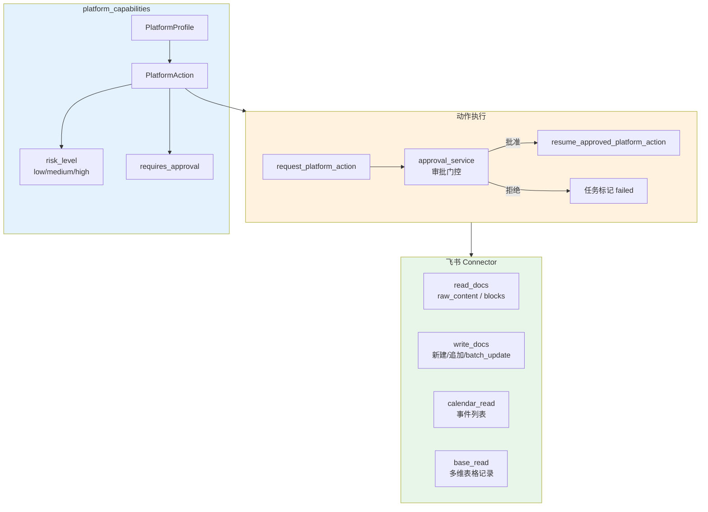

### 4.12 专业助手 Labs

除媒体与内容创作 Agent 外，系统新增一组面向垂直业务场景的**专业助手 Labs Agent**。每个 Agent 都有独立前端页面、后端 Recipe/Analysis 模块和专属 Service，形成"页面 → Agent → Recipe → Service → 外部 API/工具"的闭环：

```mermaid
flowchart TB
    subgraph Frontend["前端 Labs 页面"]
        P1[/product-manager/]
        P2[/legal-advisor/]
        P3[/ad-campaign/]
        P4[/business-partnership/]
        P5[/procurement-assistant/]
        P6[/game-art/]
        P7[/game-design/]
        P8[/programmer/]
    end

    subgraph Agents["专业助手 Agent"]
        A1[product_manager_agent]
        A2[legal_agent]
        A3[ad_campaign_agent]
        A4[business_partnership_agent]
        A5[procurement_agent]
        A6[game_art_agent]
        A7[game_design_agent]
        A8[programmer_agent]
    end

    subgraph Core["core/ Recipe & Analysis"]
        R1[product_manager_recipes.py]
        R2[legal_analysis.py · legal_recipes.py]
        R3[ad_campaign_analysis.py · ad_campaign_recipes.py]
        R4[business_partnership_analysis.py · business_partnership_recipes.py]
        R5[procurement_analysis.py · procurement_recipes.py]
        R6[game_art_analysis.py · game_art_recipes.py]
        R7[game_design_analysis.py · game_design_recipes.py]
        R8[programmer_recipes.py · programmer_command_policy.py]
    end

    subgraph Services["services/"]
        S1[product_manager_service.py]
        S2[legal_service.py]
        S3[ad_campaign_service.py]
        S4[business_partnership_service.py]
        S5[procurement_service.py]
        S6[game_art_service.py]
        S7[game_design_service.py]
        S8[programmer_service.py]
    end

    Frontend --> Agents
    Agents --> Core
    Core --> Services
    Services -->|调用| LLM[LLM / 搜索 / 工具]

    style Frontend fill:#E3F2FD
    style Agents fill:#E8F5E9
    style Core fill:#FFF3E0
    style Services fill:#F3E5F5
```

**Agent 与前端/后端的对应关系**

| agent_id | 前端页面 | core/ 模块 | services/ 模块 |
|----------|----------|------------|----------------|
| `product_manager_agent` | `/product-manager/` | `product_manager_recipes.py`, `product_analysis.py` | `product_manager_service.py` |
| `legal_agent` | `/legal-advisor/` | `legal_analysis.py`, `legal_recipes.py` | `legal_service.py` |
| `ad_campaign_agent` | `/ad-campaign/` | `ad_campaign_analysis.py`, `ad_campaign_recipes.py` | `ad_campaign_service.py` |
| `business_partnership_agent` | `/business-partnership/` | `business_partnership_analysis.py`, `business_partnership_recipes.py` | `business_partnership_service.py` |
| `procurement_agent` | `/procurement-assistant/` | `procurement_analysis.py`, `procurement_recipes.py` | `procurement_service.py` |
| `game_art_agent` | `/game-art/` | `game_art_analysis.py`, `game_art_recipes.py` | `game_art_service.py` |
| `game_design_agent` | `/game-design/` | `game_design_analysis.py`, `game_design_recipes.py` | `game_design_service.py` |
| `programmer_agent` | `/programmer/` | `programmer_recipes.py`, `programmer_command_policy.py` | `programmer_service.py` |

### 4.13 工作流引擎与客服系统

`backend/core/workflow_engine.py` + `workflow_schema.py` 提供可视化工作流支撑：`web/app/workflows/` 可创建、编辑、执行多 Agent 协作流程，节点支持条件分支、循环、子图调用与审批闸口。

`backend/services/customer_service_*.py` 提供 AI 客服能力：

| 模块 | 职责 |
|------|------|
| `customer_service_engine.py` | 客服对话引擎与意图分发 |
| `customer_service_retrieval.py` | 基于 RAG 的 FAQ/知识检索 |
| `customer_service_store.py` | 客服会话与工单存储 |
| `customer_service_workspace.py` | 客服工作区状态管理 |

---

## 五、数据流

### 5.1 典型请求：生成视频并发布

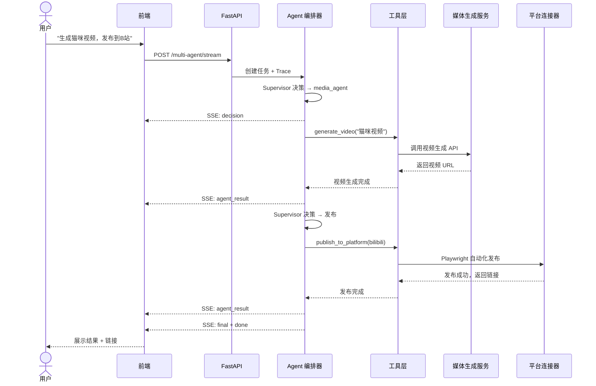

**media_url 自动推断**：`/multi-agent/stream` 在返回 SSE 事件时，若 `agent_result` / `final` 的 content/response 中包含媒体路径（Markdown 图片 ``、本地 `/media/` 或 `/storage/outputs/` 路径、外链），后端自动提取并注入 `media_url` 字段，前端无需二次解析即可直接渲染视频/图片。

### 5.2 多模态请求：上传图片并分析

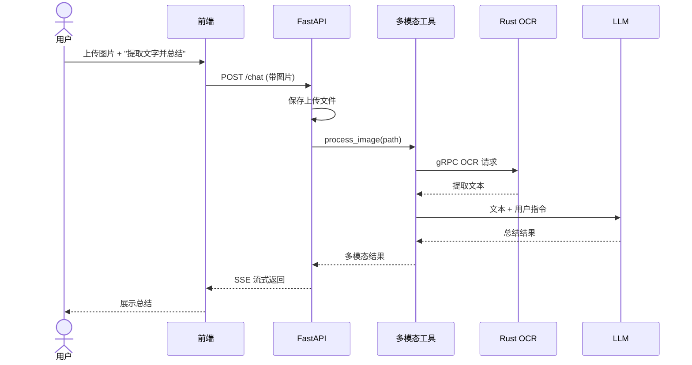

---

### 5.3 运行时架构四层

对应 Hermes 对齐中的 `arch-doc-runtime`，将运行时抽象为四个协作平面：

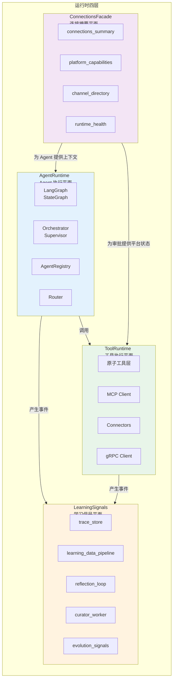

| 平面 | 职责 | 关键模块 |
|------|------|----------|
| **AgentRuntime** | 多 Agent 编排、路由、状态管理 | `orchestrator.py`、`router.py`、`registry.py` |
| **ToolRuntime** | 原子工具、MCP、连接器、微服务调用 | `tools/*`、`mcp_client.py`、`grpc_client.py` |
| **LearningSignals** | 事件采集、复盘、curator、会话召回 | `learning_data_pipeline.py`、`reflection_loop.py`、`curator_worker` |
| **ConnectionsFacade** | 连接摘要、平台能力矩阵、Channel 目录 | `connections_summary.py`、`platform_capabilities.py` |

---

## 六、部署架构

### 6.1 本地开发

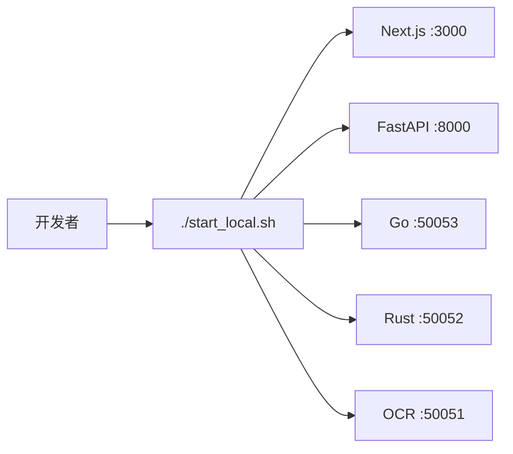

### 6.2 Docker Compose 生产部署

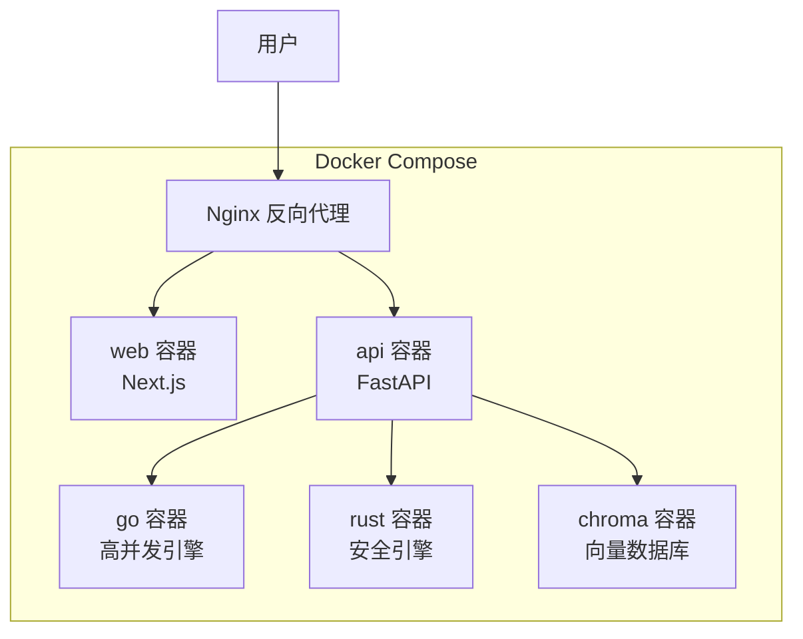

---

## 七、目录结构速查

```
ai-media-agent/
├── backend/                    # Python FastAPI 主服务
│   ├── main.py                 # API 入口（含 capabilities / approvals / tasks / platform-actions 等）
│   ├── agents/                 # LangGraph Agent（含 base/ 基类，已注册 23 个 Agent）
│   ├── core/                   # LLM、能力注册、审批门控、平台动作、流水线、研究、陪伴、桌面画像、工作流、专业助手 Recipe …
│   ├── tools/                  # 原子工具层（含 connectors/ 飞书、Discord 等）
│   ├── services/               # Scheduler、审批、Computer、MCP、gRPC Client、进化学习、Native Desktop、客服、工作流、专业助手 Service …
│   ├── routers/                # auth_router、users_router
│   ├── utils/                  # rag_manager、chroma、trace_store、task_manager、auth …
│   ├── admin/                  # 管理后台
│   ├── assets/                 # 静态资源
│   ├── memory_storage/         # 内存存储运行时数据
│   ├── tests/                  # 后端单元测试
│   └── generated/              # protobuf 生成的 Python 代码
│
├── web/                        # Next.js 16 前端
│   ├── app/                    # App Router 页面（37+ 页面）
│   │   ├── page.tsx            # 主对话
│   │   ├── workbench/          # 工作台
│   │   ├── create/             # 创作中心
│   │   ├── media/              # 媒体生成
│   │   ├── labs/               # 专业助手实验室
│   │   ├── product-manager/    # 产品经理助手
│   │   ├── legal-advisor/      # 法务顾问
│   │   ├── ad-campaign/        # 广告投放
│   │   ├── business-partnership/ # 商务合作
│   │   ├── procurement-assistant/ # 采购助手
│   │   ├── game-art/           # 游戏美术
│   │   ├── game-design/        # 游戏设计
│   │   ├── programmer/         # 编程助手
│   │   ├── system-assistant/   # 系统维护
│   │   ├── desktop-operator/   # 桌面操作
│   │   ├── customer-service/   # AI 客服
│   │   ├── workflows/          # 可视化工作流
│   │   └── settings/context/   # My context（图谱 + Memory）
│   ├── components/             # React 组件（含 MarkdownSummaryPreview）
│   ├── contexts/               # React Context（Prefs、Auth 占位等）
│   ├── hooks/                  # 自定义 Hooks
│   ├── lib/                    # 工具库（含 i18n）
│   ├── messages/               # 国际化文案（zh.json / en.json）
│   └── types/                  # TypeScript 类型定义
│
├── backend_massive_concurrent/ # Go 高并发引擎 (gRPC :50053)
│   ├── cmd/server/             # 入口
│   ├── internal/directory/     # 目录检索服务
│   ├── generated/              # protobuf 生成的 Go 代码
│   └── docs/DESIGN.md          # Go 引擎架构设计
│
├── backend_safety/             # Rust 安全引擎 (gRPC :50052)
│   ├── src/                    # 源码（grpc / parser / generated）
│   └── docs/DESIGN.md          # Rust 引擎架构设计
│
├── backend_block_chain/        # 区块链相关后端（独立模块）
├── proto/                      # Protocol Buffers 定义
├── scripts/                    # 脚本工具
├── services/                   # 独立服务 (OCR :50051)
├── storage/                    # 运行时数据 (gitignore)
├── tests/                      # 集成测试
├── docs/                       # 技术文档
└── start_local.sh              # 一键启动脚本
```

---

## 八、相关文档

| 文档                                         | 说明                                              |
| -------------------------------------------- | ------------------------------------------------- |
| `README.md`                                  | 项目主文档与快速开始                              |
| `AGENTS.md`                                  | Agent 协作指南与开发规范                          |
| `docs/AGENT_ROUTING_DIAGRAMS.md`             | 路由与协作流程图（Mermaid）                       |
| `docs/AGENT_ROUTING_COLLABORATION.md`        | Agent 路由协作详细说明                            |
| `docs/DOCUMENT_PARSING_FLOW.md`              | 文档上传解析流程（Python/Rust）                   |
| `docs/MEMORY_SYSTEM.md`                      | 记忆系统实现、图文记录、命中审计与自学习闭环      |
| `docs/SELF_LEARNING_SYSTEM.md`               | 自学习系统实现、任务复盘、反馈信号与 curator 报告 |
| `docs/COMPUTER_SERVICE.md`                   | My Computer 本地索引文档                          |
| `docs/SUPER_AGENT_TODO.md`                   | 超级 Agent / 安全执行面实施进度与验证命令         |
| `docs/PLATFORM_CONNECTION_IMPLEMENTATION.md` | 平台连接（OAuth / 扫码 / 插件）实现说明           |
| `docs/MCP_CLIENT.md`                         | MCP 协议客户端文档                                |
| `docs/PROJECT_INTRO.md`                      | 管理层版项目介绍                                  |
| `docs/DEVELOPMENT_GUIDE.md`                  | 开发者快速上手指南（启动 / 测试 / 调试 / Canvas） |
| `docs/CANVAS_OVERVIEW.md`                    | Cursor Canvas 工作区速览（彩色图、双路径、维护）  |
| `docs/PLATFORM_CONNECTION_GUIDE.md`          | 平台连接用户指南（OAuth / 扫码 / 插件）           |
| `docs/HERMES_ALIGNMENT_TODO.md`              | Hermes 范式对齐实施清单                           |
| `docs/API_REFERENCE.md`                      | 后端 API 接口参考手册（167+ 端点）                |
| `docs/SECURITY_ARCHITECTURE.md`              | 安全架构：审批、沙箱、SSRF、加密与审计            |
| `docs/STORAGE_ARCHITECTURE.md`               | 存储架构：文件系统、SQLite、ChromaDB、JSONL       |
| `docs/FRONTEND_ARCHITECTURE.md`              | 前端架构：Next.js 16、主题系统、组件分层          |
| `docs/TESTING_GUIDE.md`                      | 测试分层：行为测试、集成测试、Mock 策略           |
| `docs/OBSERVABILITY.md`                      | 可观测性：日志、Trace、监控、告警与排障           |
| `DOCKER_DEPLOY_GUIDE.md`                     | Docker 生产部署指南（含 HTTPS/Nginx）             |
| `backend_massive_concurrent/docs/DESIGN.md`  | Go 引擎架构设计                                   |
| `backend_safety/docs/DESIGN.md`              | Rust 引擎架构设计                                 |
| `docs/LABS_PRODUCT_MANAGER.md`               | 产品经理助手（Recipe 化生成 PRD/路线图/用户故事） |
| `docs/LABS_LEGAL_ADVISOR.md`                 | 法务顾问助手（合同审查/法规解读/合规体检）        |
| `docs/LABS_AD_CAMPAIGN.md`                   | 广告投放助手（策略/创意/定向/复盘）               |
| `docs/LABS_BUSINESS_PARTNERSHIP.md`          | 商务合作助手（outreach/方案/Pipeline）            |
| `docs/LABS_PROCUREMENT.md`                   | 采购助手（RFQ/比价/供应商评估）                   |
| `docs/LABS_GAME_ART.md`                      | 游戏美术助手（风格指南/Brief/情绪板）             |
| `docs/LABS_GAME_DESIGN.md`                   | 游戏设计助手（概念案/系统设计/数值框架）          |
| `docs/LABS_PROGRAMMER.md`                    | 编程助手（环境/运维/代码分析）                    |
| `docs/LABS_SYSTEM_ASSISTANT.md`              | 系统维护助手（安装/修复/文件整理）                |
| `docs/LABS_DESKTOP_OPERATOR.md`              | 桌面操作助手（本机 CLI/GUI 自动化）               |
| `docs/LABS_CUSTOMER_SERVICE.md`              | AI 客服助手（RAG 检索/会话/工单）                 |
| `docs/LABS_WORKFLOWS.md`                     | 可视化工作流（多 Agent 编排引擎）                 |
| `docs/LABS_FINANCIAL_NEWS.md`                | 金融资讯日报（摘要/海报/短视频）                  |
| `docs/LABS_CLAUDE_CODE.md`                   | Claude Code 工作区（代码聊天/资源管理器）         |
| `docs/LABS_MEAL.md`                          | 内部餐费/考勤工具（飞书多维表格对接）             |

---

_文档版本：2026-06-14 · 架构 V4.2（补齐 22 个 Agent、37+ 前端页面、专业助手 Labs、15 个 Labs 独立文档；同步 AGENTS.md / AGENT_ROUTING_DIAGRAMS.md）_
