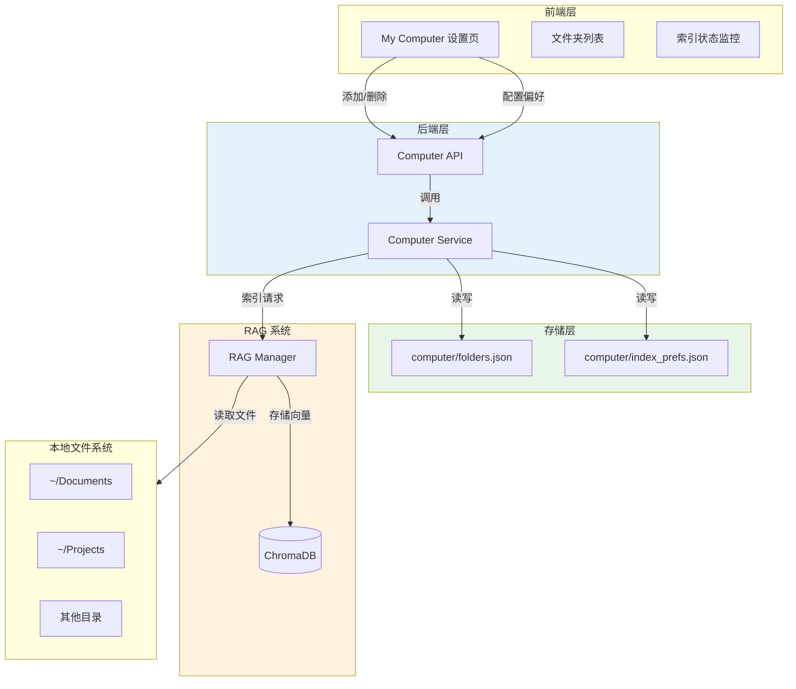
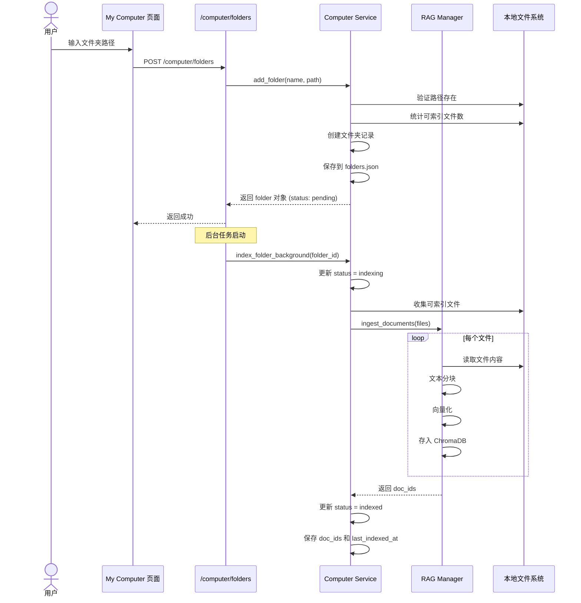
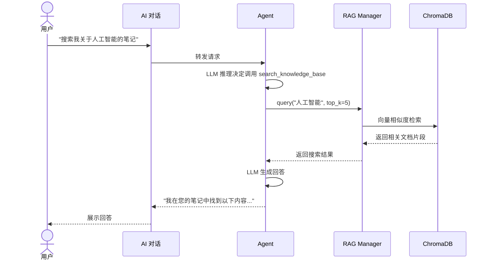
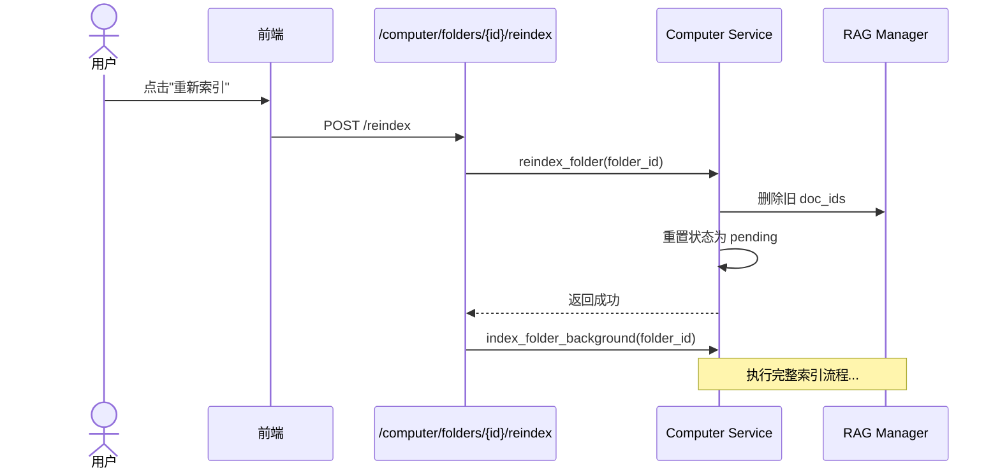

# My Computer 服务

> My Computer 功能允许 AI Agent 索引和搜索用户本地文件夹内容，将个人文件库转化为可检索的知识库。

---

## 一、功能概述

My Computer 服务让 AI 能够：

1. **索引本地文件夹** - 自动遍历并索引指定目录的文件
2. **语义搜索** - 通过 RAG 技术搜索文件内容
3. **隐私保护** - 所有数据本地存储，不上传云端
4. **增量更新** - 支持重新索引，保持数据同步

### 支持的文件类型

| 类型 | 扩展名 |
|------|--------|
| 文本文件 | `.txt`, `.md` |
| 文档 | `.pdf`, `.docx`, `.doc` |
| 数据文件 | `.json`, `.csv` |

---

## 二、架构设计



---

## 三、核心组件

### 3.1 Computer Service (`services/computer_service.py`)

```python
# 文件夹管理
def add_folder(name: str, path: str) -> Dict[str, Any]
def remove_folder(folder_id: str) -> Dict[str, Any]
def get_folders() -> List[Dict]

# 索引管理
def index_folder_background(folder_id: str) -> None
def reindex_folder(folder_id: str) -> Dict[str, Any]

# 状态查询
def get_status() -> Dict[str, Any]  # 磁盘使用、索引大小

# 偏好设置
def get_index_prefs() -> Dict[str, Any]
def save_index_prefs(prefs: Dict) -> Dict[str, Any]
```

### 3.2 配置存储

**文件夹配置**: `storage/computer/folders.json`

```json
[
  {
    "id": "uuid-1234",
    "name": "工作文档",
    "path": "/Users/xxx/Documents/Work",
    "file_count": 156,
    "added_at": "2026-01-15T10:30:00",
    "last_indexed_at": "2026-01-15T10:35:22",
    "status": "indexed",
    "doc_ids": ["doc-1", "doc-2", ...],
    "error_msg": null
  }
]
```

**索引偏好**: `storage/computer/index_prefs.json`

```json
{
  "storageLimitGiB": 24,
  "maxFileMiB": 32
}
```

---

## 四、工作流程

### 4.1 添加文件夹并索引



### 4.2 搜索文件内容



### 4.3 重新索引



---

## 五、API 端点

| 端点 | 方法 | 描述 |
|------|------|------|
| `/computer/status` | GET | 获取磁盘和索引使用状态 |
| `/computer/folders` | GET | 获取所有注册的文件夹 |
| `/computer/folders` | POST | 添加新文件夹 |
| `/computer/folders/{id}` | DELETE | 删除文件夹并清理索引 |
| `/computer/folders/{id}/reindex` | POST | 重新索引文件夹 |
| `/computer/index-prefs` | GET | 获取索引偏好设置 |
| `/computer/index-prefs` | PUT | 更新索引偏好设置 |

---

## 六、前端界面

Settings → My Computer 页面提供：

1. **存储概览**
   - 磁盘总容量、已用、剩余
   - RAG 索引占用大小

2. **文件夹管理**
   - 添加文件夹（路径选择）
   - 查看已添加文件夹列表
   - 显示每个文件夹的文件数和索引状态

3. **索引控制**
   - 重新索引按钮
   - 删除文件夹（同时清理索引）

4. **偏好设置**
   - 索引存储上限 (storageLimitGiB)
   - 单文件大小限制 (maxFileMiB)

---

## 七、与 RAG 系统集成

My Computer 复用现有的 RAG 基础设施：

```python
# computer_service.py 调用 rag_manager
from utils.rag_manager import get_rag_manager

def index_folder_background(folder_id: str) -> None:
    # ... 收集文件 ...

    rm = get_rag_manager()
    result = rm.ingest_documents(files)

    # 保存返回的 doc_ids 用于后续清理
    doc_ids = [d["id"] for d in result.get("documents", [])]
```

### 数据隔离

- My Computer 的文件索引与其他知识库共用 ChromaDB
- 通过 doc_ids 追踪每个文件夹的文档，便于删除时清理

---

## 八、使用示例

### 8.1 添加文件夹

```bash
curl -X POST http://localhost:8000/computer/folders \
  -H "Content-Type: application/json" \
  -d '{
    "name": "我的笔记",
    "path": "/Users/xxx/Documents/Notes"
  }'
```

响应：
```json
{
  "success": true,
  "folder": {
    "id": "uuid-1234",
    "name": "我的笔记",
    "path": "/Users/xxx/Documents/Notes",
    "file_count": 42,
    "status": "pending"
  }
}
```

### 8.2 查询状态

```bash
curl http://localhost:8000/computer/status
```

响应：
```json
{
  "disk": {
    "totalGiB": 512.0,
    "freeGiB": 128.5,
    "usedGiB": 383.5
  },
  "index": {
    "usedMiB": 156.3,
    "limitGiB": 24
  }
}
```

---

## 九、注意事项

1. **隐私安全**
   - 所有文件内容只在本地处理
   - 向量索引存储在本地 ChromaDB
   - 不会上传到任何云服务

2. **性能考虑**
   - 大文件索引可能耗时较长
   - 默认单文件大小限制 32MB
   - 后台索引不阻塞主流程

3. **文件变更**
   - 目前需要手动触发重新索引
   - 未来版本计划支持自动监听文件变更

---

## 十、故障排查

| 问题 | 解决方案 |
|------|----------|
| 索引失败 | 检查文件权限、磁盘空间 |
| 搜索无结果 | 确认文件类型支持、已索引完成 |
| 内存不足 | 减小 maxFileMiB 配置 |
| 路径不存在 | 检查文件夹路径是否正确 |
