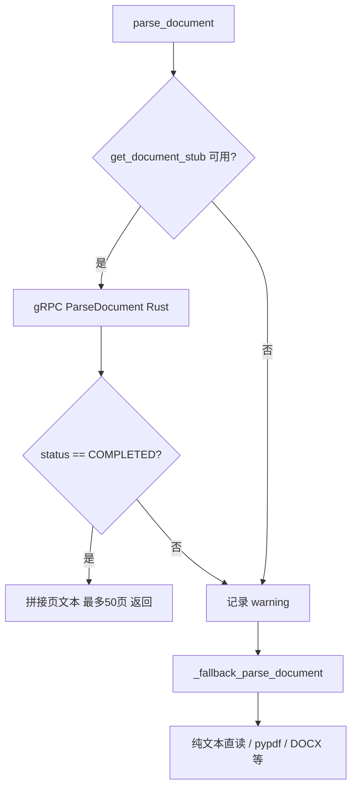

# 文档解析流程说明

本文描述用户在对话或分析场景中上传 **PDF / DOCX / TXT 等文档**时，从前端到 Rust 解析服务（及降级路径）的完整链路，便于排障与扩展。

---

## 一、涉及组件与端口

| 组件 | 代码路径 | 默认地址 | 作用 |
|------|-----------|-----------|------|
| Next.js 代理 | `web/app/api/multimodal/analyze/route.ts`、`web/app/api/multimodal/chat/route.ts` | — | 将表单转发到 Python 后端 |
| FastAPI | `backend/main.py`：`/multimodal/analyze`、`/multimodal/chat` | `BACKEND_URL`（多为 `http://localhost:8000`） | 落盘临时文件、按类型调用工具 |
| 文档解析工具 | `backend/tools/multimodal_tools.py`：`parse_document` | — | **优先** gRPC 调用 Rust；失败则本地降级 |
| gRPC 客户端 | `backend/services/grpc_client.py` | — | 连接 Parser（Rust），不可用则 stub 为 `None` |
| Rust Parser（backend_safety） | `backend_safety` 编译产物 `parser-service` | `PARSER_SERVICE_ADDR`，默认 **`localhost:50052`** | `DocumentService/ParseDocument` |
| Go Directory（backend_massive_concurrent） | `directory-service` | `DIRECTORY_SERVICE_ADDR`，默认 **`localhost:50053`** | **单文件文档解析不会调用**；用于目录索引等能力 |

环境变量（节选）：

- `PARSER_SERVICE_ADDR`：Rust 文档/视频解析 gRPC 地址（与 OCR 的 `50051` 区分）。
- `DIRECTORY_SERVICE_ADDR`：Go 目录服务 gRPC 地址。

---

## 二、用户可见的两条入口

### 1. 单文件分析（非流式）

- **前端**：`POST /api/multimodal/analyze`（multipart：`file`、`task_type`、`options`）
- **后端**：`POST /multimodal/analyze`

当 `task_type=auto` 且文件被归类为 **document** 时，实际执行 `task_type=parse`，调用：

```text
parse_document.invoke({"file_path": <storage/temp 下路径>, "extract_tables": <options 或默认 true>})
```

响应为 JSON：`task_type`、`file_name`、`category`、`result`（长文本）。

### 2. 带附件的多模态对话（SSE 流式）

- **前端**：例如首页对话里上传文件后走 `POST /api/multimodal/chat`（multipart：`message`、`files[]`、`session_id`）
- **后端**：`POST /multimodal/chat`

对每个上传文件：

1. 按 MIME / 扩展名归类（`_multimodal_file_category`）。
2. **document** 类型：`parse_document.invoke({"file_path": ..., "extract_tables": True})`（此处固定开启表格抽取）。
3. 将各文件提取结果拼成 `context_block`，与用户问题组成 `full_message`。
4. 使用当前 LLM 配置 **`get_chat_llm`** 做 **流式** 回复（SSE：`data: {"content": "..."}`，结束 `data: [DONE]`）。

> 说明：接口注释中若仍写有「转发 multi-agent」类表述，以当前实现为准——文档对话路径为 **提取文本 + 单轮 LLM 流式**，避免 Planning Graph 把「图片/视频」类意图误判为生成任务。

---

## 三、`parse_document` 内部逻辑（核心）

实现位置：`backend/tools/multimodal_tools.py`。



1. **路径解析**：相对路径会落到项目 `storage/` 下解析（具体见 `_resolve_path`）。
2. **Rust 路径**：`DocumentRequest(file_path, extract_tables, request_id=doc_<stem>)` → `stub.ParseDocument`，超时默认 60s。
3. **降级路径**：gRPC 不可用、连接失败或返回非完成状态时，使用 `_fallback_parse_document`（纯文本快速读、`pypdf`、DOCX 等），避免对话整体失败。

---

## 四、如何确认 Rust 是否接到请求

1. **Rust 侧日志**（若按 `start_local.sh` 一类脚本启动）：  
   `logs/parser.log`  
   成功时可见类似：`ParseDocument req_id=doc_<文件名>`、`ParseDocument done ... pages=... latency=...`。

2. **Python 侧**：logger 名为 `multimodal_tools` / `grpc_client`，关键字包括：  
   `parse_document: gRPC OK`、`gRPC failed, falling back`、`Parser service not available`。

若 Parser 未启动或端口不通，会看到 **stub not available** 或异常栈，随后进入 **本地 fallback**，此时 **`parser.log` 不会出现 ParseDocument 业务日志**。

---

## 五、与 Go Directory 服务的关系

上传 **单个文档** 做解析时，**只会走 `parse_document` → Rust（或 Python 降级）**，**不会**调用 `backend_massive_concurrent` 的 Directory gRPC。

Go 目录服务在 **`index_directory`** 等工具链中使用（例如本地目录索引、与「My Computer」相关场景），与「用户上传一个 PDF/DOCX 做解析」是不同产品路径。

---

## 六、临时文件与容量

- 上传文件写入：**`storage/temp/`**（符合项目规范，不使用系统 `/tmp`）。
- 类型与大小上限由 `backend/main.py` 中 `_SIZE_LIMITS` 等与 `category` 绑定逻辑约束；超限会在上下文里写入跳过说明而非静默丢弃。

---

## 七、相关代码索引

| 说明 | 路径 |
|------|------|
| 多模态分析与对话 API | `backend/main.py`（`/multimodal/analyze`、`/multimodal/chat`） |
| 文档解析工具与降级 | `backend/tools/multimodal_tools.py` |
| gRPC 地址与 stub | `backend/services/grpc_client.py` |
| Proto 生成的 Document Stub | `backend/generated/mediaagent/document_pb2_grpc.py` |
| Next 代理 | `web/app/api/multimodal/analyze/route.ts`、`web/app/api/multimodal/chat/route.ts` |
| Rust 服务实现 | `backend_safety/src/`（parser gRPC） |

如需把本流程画进总架构图，可在 `docs/ARCHITECTURE_OVERVIEW.md` 的多模态小节增加指向本文的链接。
