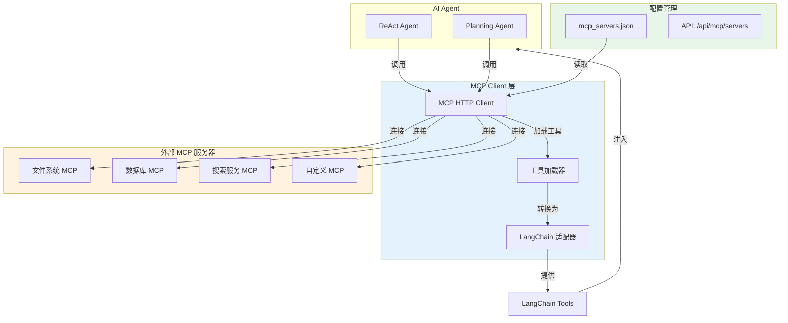
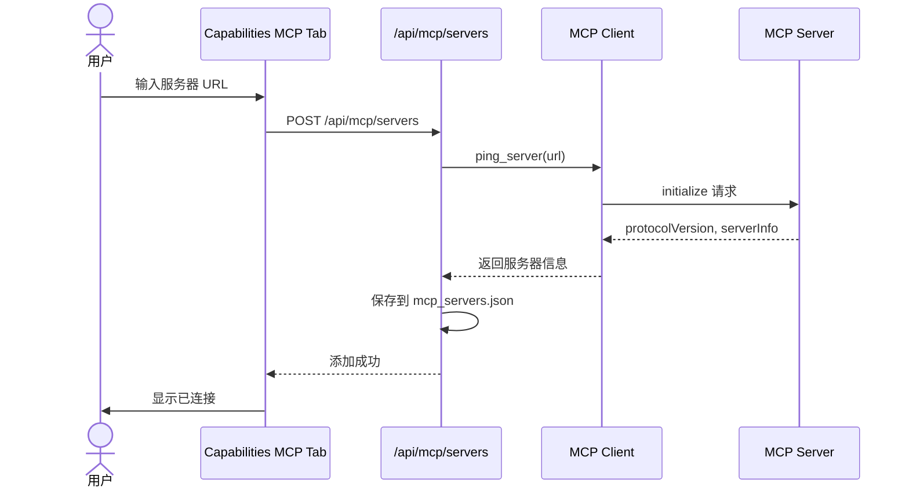
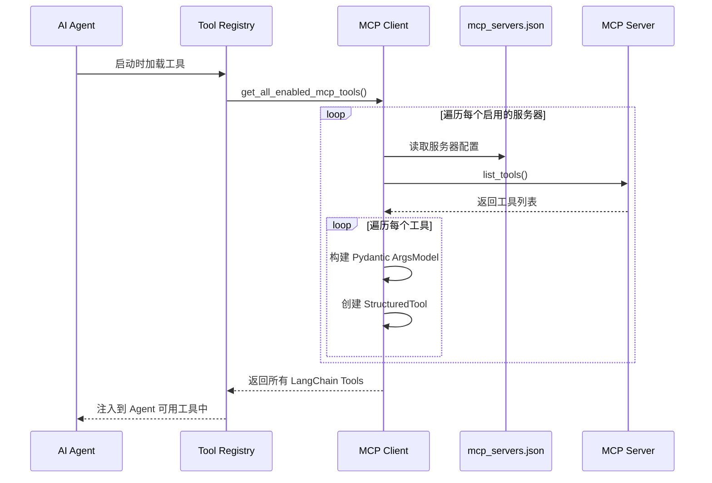
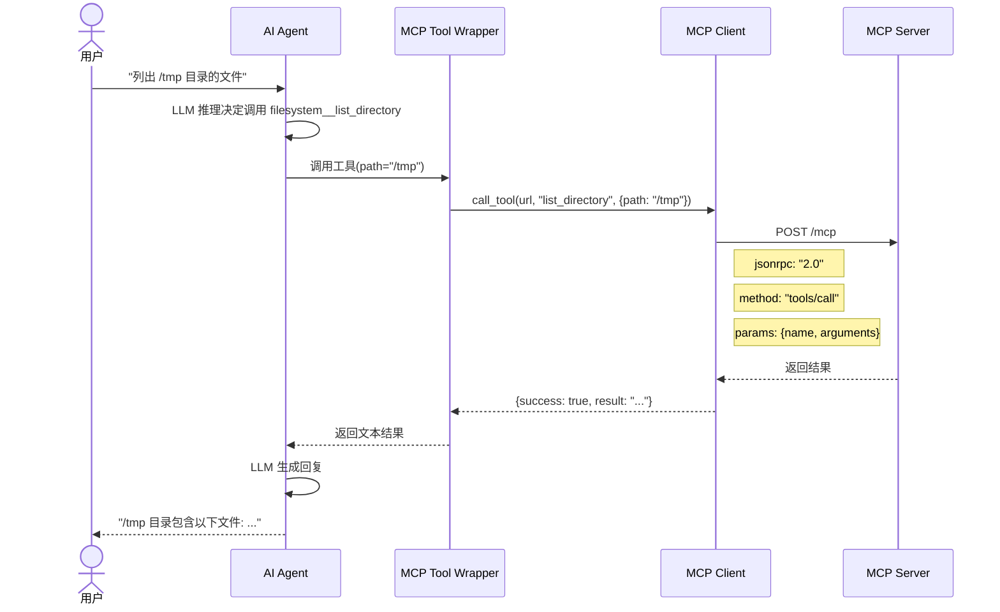

# MCP (Model Context Protocol) 客户端

> MCP 是一种开放协议，用于标准化 AI 模型与外部数据源、工具之间的集成。本文档介绍 AI Media Agent 中的 MCP 客户端实现。

---

## 一、什么是 MCP

**Model Context Protocol (MCP)** 是 Anthropic 推出的开放标准协议，旨在让 AI 助手能够安全地访问和操作外部数据源和工具。

### MCP 的核心概念

| 概念 | 说明 |
|------|------|
| **Server** | 提供工具和资源的 MCP 服务器 |
| **Client** | 连接 MCP 服务器并调用工具的客户端 |
| **Tool** | 可执行的功能（如文件操作、API 调用） |
| **Resource** | 可被访问的数据源 |

### 支持的传输方式

- **HTTP** (Streamable HTTP) - 本文档实现的传输方式
- **SSE** (Server-Sent Events) - 向后兼容支持

---

## 二、架构设计



---

## 三、核心组件

### 3.1 MCP HTTP Client (`services/mcp_client.py`)

主要功能：

```python
# 1. 服务器探测
ping_server(url: str) -> Dict[str, Any]
# 返回: protocol_version, server_name, capabilities, session_id

# 2. 获取工具列表
list_tools(url: str, session_id: str) -> Dict[str, Any]
# 返回: tools[], count

# 3. 调用工具
call_tool(url: str, tool_name: str, args: dict) -> Dict[str, Any]
# 返回: success, result, raw

# 4. LangChain 适配
get_mcp_langchain_tools(url: str, server_id: str) -> List[StructuredTool]
# 返回: 可直接注入 Agent 的 LangChain 工具列表

# 5. 批量加载所有启用服务器的工具
get_all_enabled_mcp_tools() -> List[StructuredTool]
```

### 3.2 配置管理

存储位置: `storage/mcp_servers.json`

```json
{
  "servers": [
    {
      "id": "filesystem",
      "name": "文件系统 MCP",
      "url": "http://localhost:3001/mcp",
      "description": "本地文件操作",
      "enabled": true
    },
    {
      "id": "database",
      "name": "数据库 MCP",
      "url": "http://localhost:3002/mcp",
      "description": "数据库查询",
      "enabled": false
    }
  ]
}
```

---

## 四、工作流程

### 4.1 服务器添加流程



### 4.2 工具加载流程



### 4.3 工具调用流程



---

## 五、API 端点

| 端点 | 方法 | 描述 |
|------|------|------|
| `/api/mcp/servers` | GET | 获取所有 MCP 服务器列表 |
| `/api/mcp/servers` | POST | 添加/更新 MCP 服务器 |
| `/api/mcp/servers/{id}` | PATCH | 更新服务器配置（启用/禁用） |
| `/api/mcp/servers/{id}` | DELETE | 删除 MCP 服务器 |
| `/api/mcp/servers/{id}/ping` | POST | 探测服务器连接状态 |
| `/api/mcp/servers/{id}/tools` | GET | 获取服务器工具列表 |

---

## 六、LangChain 适配器

MCP 工具自动转换为 LangChain `StructuredTool`：

```python
# 示例: MCP 工具定义
{
    "name": "read_file",
    "description": "读取文件内容",
    "inputSchema": {
        "type": "object",
        "properties": {
            "path": {"type": "string", "description": "文件路径"},
            "encoding": {"type": "string", "description": "编码格式"}
        },
        "required": ["path"]
    }
}

# 转换为 LangChain StructuredTool
class filesystem__read_file__args(BaseModel):
    path: str = Field(..., description="文件路径")
    encoding: Optional[str] = Field(None, description="编码格式")

def filesystem__read_file(path: str, encoding: Optional[str] = None) -> str:
    result = call_tool(url, "read_file", {"path": path, "encoding": encoding})
    return result["result"] if result.get("success") else f"[MCP Error] {result.get('error')}"

tool = StructuredTool.from_function(
    func=filesystem__read_file,
    name="filesystem__read_file",
    description="[MCP:filesystem] 读取文件内容",
    args_schema=filesystem__read_file__args
)
```

---

## 七、前端界面

Capabilities 页面的 MCP Tab 提供以下功能：

1. **服务器列表** - 显示所有配置的 MCP 服务器
2. **添加服务器** - 输入 URL 自动探测并添加
3. **连接测试** - Ping 测试服务器连通性
4. **工具查看** - 查看每个服务器提供的工具列表
5. **启用/禁用** - 开关控制服务器是否参与工具加载

---

## 八、配置示例

### 8.1 添加本地文件系统 MCP

```bash
# 前端界面操作
1. 进入 Settings → Capabilities → MCP
2. 点击 "添加服务器"
3. 输入名称: "本地文件系统"
4. 输入 URL: "http://localhost:3001/mcp"
5. 点击 "保存并测试"
```

### 8.2 使用环境变量配置

```python
# 在 Agent 启动时自动加载
from services.mcp_client import get_all_enabled_mcp_tools

# 获取所有启用的 MCP 工具
mcp_tools = get_all_enabled_mcp_tools()

# 注入到 Agent
agent = get_media_base_agent(
    api_key=api_key,
    extra_tools=mcp_tools  # MCP 工具作为额外工具传入
)
```

---

## 九、故障排查

### 常见问题

| 问题 | 原因 | 解决方案 |
|------|------|----------|
| 连接失败 | 服务器未启动 | 检查 MCP 服务器是否运行 |
| 工具加载失败 | 服务器返回错误 | 查看服务器日志 |
| 调用超时 | 网络延迟 | 调整 CALL_TIMEOUT 配置 |
| 协议不兼容 | 版本不匹配 | 检查 MCP 服务器协议版本 |

### 日志调试

```python
# 开启 MCP 客户端日志
import logging
logging.getLogger("mcp_client").setLevel(logging.DEBUG)

# 查看工具加载情况
logger.info(f"[MCP] Loaded {len(tools)} tools from {server_id}")
```

---

## 十、参考链接

- [Model Context Protocol 规范](https://spec.modelcontextprotocol.io/)
- [MCP Python SDK](https://github.com/modelcontextprotocol/python-sdk)
- [Anthropic MCP 公告](https://www.anthropic.com/news/model-context-protocol)
