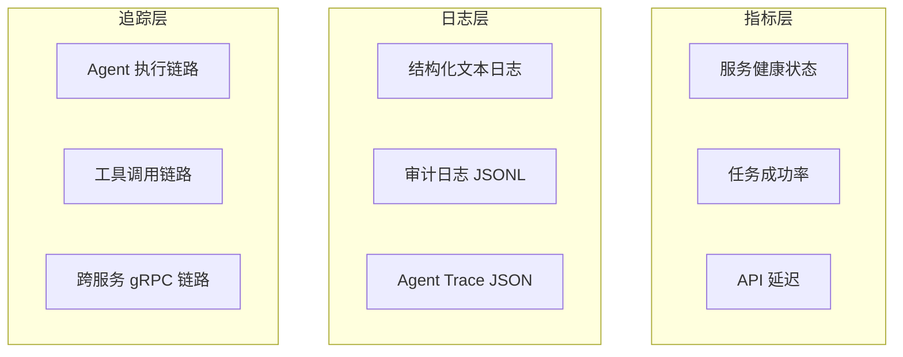

# AI Media Agent — 可观测性文档

> 日志体系、执行追踪、健康监控、告警与排障指南。

---

## 一、可观测性三层



---

## 二、日志体系

### 2.1 日志文件分布

| 日志文件 | 路径 | 内容 | 轮转策略 |
|----------|------|------|----------|
| 启动总日志 | `logs/start.log` | `start_local.sh` 输出 | 手动清理 |
| 后端主日志 | `logs/backend.log` | FastAPI 运行日志 | 10MB × 5 |
| 调试日志 | `logs/backend_debug.log` | 详细调试 | 10MB × 5 |
| Agent 日志 | `logs/agent.log` | Agent 执行摘要 | 10MB × 5 |
| OCR 服务 | `logs/ocr.log` | OCR gRPC 服务 | 10MB × 5 |
| 解析服务 | `logs/parser.log` | Rust Parser | 10MB × 5 |
| 目录服务 | `logs/directory.log` | Go Directory | 10MB × 5 |
| Cloudflare 隧道 | `logs/cloudflared.log` | 公网隧道 | 手动清理 |

### 2.2 Logger 配置

`backend/utils/logger.py` 提供统一日志：

```python
from utils.logger import setup_logger

logger = setup_logger("module_name")
logger.info("普通信息")
logger.warning("警告")
logger.error("错误")
```

**常用 Logger 名称：**

| 名称 | 用途 |
|------|------|
| `server` | FastAPI 主服务 |
| `multimodal_tools` | 多模态处理 |
| `grpc_client` | gRPC 微服务调用 |
| `mcp_client` | MCP 协议客户端 |
| `approval_service` | 审批服务 |
| `computer_service` | My Computer 索引 |
| `memory_coordinator` | 记忆协调器 |
| `media_pipeline` | 媒体流水线 |
| `local_computer` | 本地电脑动作 |
| `reflection_loop` | 任务复盘 |
| `learning_data_pipeline` | 学习数据管道 |

### 2.3 日志格式

```
2026-05-10 14:30:00,123 - server - INFO - 请求处理完成
```

文件输出包含完整模块名，控制台输出简化。

---

## 三、实时日志查看

### 3.1 开发环境

```bash
# 后端实时日志
tail -f logs/backend.log

# 启动总控
tail -f logs/start.log

# 所有日志（多窗口或 tmux）
tail -f logs/*.log

# 过滤特定模块
tail -f logs/backend.log | grep "approval_service"
```

### 3.2 生产环境

```bash
# Docker Compose 查看
docker compose logs -f backend
docker compose logs -f --tail=100 ocr_service

# 指定时间范围
docker compose logs -f backend | grep "2026-05-10 14:"
```

---

## 四、Agent 执行追踪（Trace）

### 4.1 Trace 结构

`storage/traces/{trace_id}.json`：

```json
{
  "trace_id": "uuid",
  "session_id": "uuid",
  "created_at": "2026-05-10T14:00:00Z",
  "events": [
    {
      "timestamp": "...",
      "type": "decision|tool_call|tool_result|error|final",
      "agent_id": "media_agent",
      "content": "..."
    }
  ],
  "metadata": {
    "task_id": "...",
    "memory_hits": 3
  }
}
```

### 4.2 Trace API

```
GET /multi-agent/traces          # 列表
GET /multi-agent/traces/{trace_id} # 详情
```

### 4.3 媒体流水线 Trace

`media_pipeline_step` 事件追加到 trace：

```json
{
  "type": "media_pipeline_step",
  "step": "images",
  "status": "completed|waiting_approval|failed",
  "progress": 0.375,
  "artifact_hint": {"image_urls": [...]},
  "error": "..."
}
```

---

## 五、健康检查

### 5.1 HTTP 健康端点

```bash
curl http://localhost:8000/health

# 预期响应
{"status": "ok"}
```

### 5.2 gRPC 服务健康

```bash
# OCR (:50051)
python -c "import grpc; ch=grpc.insecure_channel('localhost:50051'); grpc.channel_ready_future(ch).result(timeout=5)"

# Rust Parser (:50052)
nc -z localhost 50052

# Go Directory (:50053)
nc -z localhost 50053
```

### 5.3 Docker Healthcheck

```yaml
healthcheck:
  test: ["CMD", "curl", "-f", "http://localhost:8000/health"]
  interval: 30s
  timeout: 10s
  retries: 3
```

---

## 六、监控指标建议

### 6.1 业务指标

| 指标 | 来源 | 计算方式 |
|------|------|----------|
| 任务成功率 | `storage/tasks/*.json` | `success / total` |
| 平均审批耗时 | `storage/approvals/approvals.json` | `resolved_at - created_at` |
| 媒体生成耗时 | Trace 事件 | `tool_result.timestamp - tool_call.timestamp` |
| 记忆命中率 | `evolution/memory-usage` | `useful / total` |

### 6.2 系统指标

| 指标 | 采集方式 |
|------|----------|
| API QPS / 延迟 | Nginx 日志 / FastAPI 中间件 |
| 内存使用 | `docker stats` / `ps aux` |
| 磁盘使用 | `df -h` |
| gRPC 调用成功率 | `grpc_client` 日志统计 |

---

## 七、告警规则建议

### 7.1 关键告警

| 条件 | 级别 | 动作 |
|------|------|------|
| `/health` 连续 3 次失败 | critical | 重启容器 / 通知 |
| gRPC 服务不可达超过 60s | warning | 降级到 Python fallback |
| 磁盘使用率 > 85% | warning | 清理 temp / 扩容 |
| 审批队列堆积 > 50 | info | 检查前端审批面板 |
| 任务失败率 > 20% | warning | 检查平台连接状态 |

### 7.2 日志异常检测

```bash
# 扫描最近错误
grep -i "error\|exception\|failed" logs/backend.log | tail -n 20

# 扫描敏感操作
 grep "shell_command\|file_write\|file_delete" logs/agent.log
```

---

## 八、排障速查表

| 现象 | 诊断 | 解决 |
|------|------|------|
| 后端启动后立刻退出 | `tail logs/backend.log` | 检查依赖、环境变量、端口冲突 |
| 端口 8000/3000 被占用 | `lsof -ti:8000,3000` | `kill -9` 或换端口 |
| gRPC 调用降级 | 日志出现 `falling back` | 检查 Rust/Go 服务是否启动 |
| 前端无法播放媒体 | `/media/xxx.mp4` 404 | 确认走 `/api/media/{filename}` 代理 |
| SSE 长视频流中断 | UND_ERR_BODY_TIMEOUT | 已改用原生 http.request，`maxDuration=800` |
| 记忆写入失败 | 检查 ChromaDB | 自动降级 JSON，检查 `storage/memory/` |
| 审批通过后未恢复 | `storage/tasks/` 状态 | 确认 `auto_resume_*` 参数或手动 Resume |
| MCP 服务器连接失败 | `POST /api/mcp/servers/{id}/ping` | 检查 MCP 服务器 URL 与网络 |
| Playwright 浏览器缺失 | 首次启动报错 | `python -m playwright install chromium` |

---

## 九、链路追踪可视化

### 9.1 典型请求链路

```
用户 → Next.js :3000 → FastAPI :8000 → Agent → Tool → 外部服务
                              ↓
                         gRPC → Go :50053 / Rust :50052
                              ↓
                         Trace → storage/traces/{id}.json
```

### 9.2 调试某次对话

```bash
# 1. 找到 session_id 或 trace_id
# 2. 查看完整 trace
cat storage/traces/{trace_id}.json | python -m json.tool

# 3. 查看关联任务
cat storage/tasks/{task_id}.json | python -m json.tool

# 4. 查看审批记录
cat storage/approvals/approvals.json | python -c "import json,sys; d=json.load(sys.stdin); print(json.dumps(d.get('${APPROVAL_ID}'), indent=2, ensure_ascii=False))"
```

---

_文档版本：2026-05-10_
