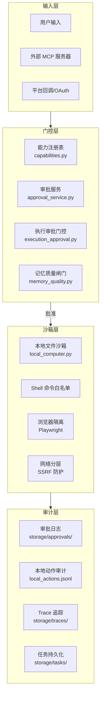
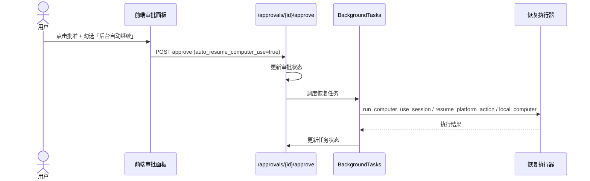

# AI Media Agent — 安全架构文档

> 涵盖执行安全面、审批门控、本地沙箱、网络安全、数据脱敏、加密与审计的完整安全设计。

---

## 一、安全架构总览



---

## 二、能力注册与风险分级

所有可被 Agent 调用的能力必须在 `backend/core/capabilities.py` 中注册：

| 能力 | 风险等级 | 需审批 | 可无人值守 |
|------|----------|--------|-----------|
| `screen_read` / `file_read` | low | 否 | 是 |
| `browser_control` / `mouse_control` / `keyboard_input` | medium | 鼠标/键盘需审批 | 是 |
| `file_write` / `platform_message` / `platform_publish` | high | 是 | 否 |
| `file_delete` / `shell_command` | critical | 是 | 否 |

**原则：**
- 风险等级不可被 `agent-mode-setting` 绕过
- `can_run_unattended` 为 `false` 的动作即使切换到 `auto` 模式仍需审批
- 新增能力必须显式声明 `risk_level` 与 `requires_approval`

---

## 三、审批服务

### 3.1 审批生命周期

```
创建 (pending) → 批准 (approved) / 拒绝 (denied) / 过期 (expired)
```

- 默认有效期：3600 秒
- 敏感参数脱敏：`token` / `password` / `secret` / `cookie` / `api_key` 等替换为 `***REDACTED***`
- 大数组摘要：`batch_updates` / `requests` 等只保留前 5 条与总数

### 3.2 审批后恢复



### 3.3 持久化

- 审批记录：`storage/approvals/approvals.json`
- 任务记录：`storage/tasks/*.json`
- 所有审批操作线程安全（`threading.RLock`）

---

## 四、本地电脑沙箱

### 4.1 目录沙箱

- 只允许访问 `My Computer` 已登记的根目录
- 所有路径在操作前解析为绝对路径并校验是否在允许根内
- 默认使用 `storage/computer/` 作为工作区

### 4.2 文件操作

| 动作 | 审批 | 回滚 |
|------|------|------|
| `read_text_file` | 否 | — |
| `list_dir` | 否 | — |
| `write_text_file` | 是 | 执行前保存快照到 `storage/computer/rollback/` |
| `delete_path` | 是 | 执行前保存快照 |
| `launch_app` | 是 | — |
| `shell_command` | 是 | — |

### 4.3 Shell 安全策略

```python
# 命令白名单（只读安全子集）
SHELL_COMMAND_ALLOWLIST = {
    "pwd", "ls", "find", "rg", "grep",
    "cat", "head", "tail", "wc", "du", "df"
}

# 限制
MAX_SHELL_ARGS = 24
MAX_SHELL_ARG_LENGTH = 512
MAX_SHELL_COMMAND_LENGTH = 2048
SHELL_TIMEOUT_SECONDS = 5
MAX_SHELL_OUTPUT_BYTES = 16 * 1024

# 阻断字符
SHELL_BLOCKED_TOKENS = (";", "&", "|", ">", "<", "`", "$", "(", ")", "\n", "\r")
```

**输出风险标注：**
- 非零退出码
- 超时
- 输出截断
- 疑似 secret/token（正则匹配 `sk-...`、JWT 格式等）

### 4.4 审计日志

所有本地动作写入 `storage/computer/local_actions.jsonl`：

```json
{
  "timestamp": "2026-05-10T12:00:00Z",
  "action": "write_text_file",
  "path": "/allowed/root/file.txt",
  "status": "success",
  "task_id": "...",
  "approval_id": "..."
}
```

---

## 五、平台连接安全

### 5.1 凭证管理

- 平台 Cookie/Token 存储在 `storage/profiles/`（JSON 文件）
- 审批预览中自动脱敏凭证字段
- OAuth 流程遵循标准授权码模式，回调地址可配置

### 5.2 平台动作风险矩阵

| 平台 | 读类动作 | 写类动作 | 审批策略 |
|------|----------|----------|----------|
| 飞书 | 读文档/日历/Base | 发消息/写文档/创建日程 | 写类默认审批 |
| Discord | 读频道/消息 | 发消息/管理频道 | 管理频道需审批 |
| 微信/QQ/钉钉 | — | 返回操作手册 | 不直接执行 |

### 5.3 运行时健康锁

- 为长连接 Bot（Discord/Feishu）增加本机 scoped lock
- 按 `platform + token/account hash` 防止双开导致断线或消息重复
- 只存 hash，不落真实 token

---

## 六、网络安全

### 6.1 SSRF 防护

- 禁止私网/localhost/file URL
- 限制重定向层数
- 限制响应体大小与 Content-Type
- 记录来源 URL

### 6.2 gRPC 通信安全

| 服务 | 端口 | 安全层 |
|------|------|--------|
| Go Directory | 50053 | TLS |
| Rust Parser | 50052 | mTLS |
| OCR | 50051 | 可选 TLS |

---

## 七、数据加密与隐私

### 7.1 信封加密

- `backend/tools/_envelope.py` 提供信封加密辅助
- Rust 安全引擎提供 `Crypto Service` 与 `Keystore`
- 私钥存储在隔离的 Keystore 中

### 7.2 记忆与上下文安全

- 记忆注入使用固定 fence `<memory-context>`
- 前端流式输出经过 scrub，不泄漏 fence 原文
- `memory_quality.py` 在写入前扫描：
  - prompt injection（"忽略以上指令"等）
  - 密钥读取/外传命令
  - 私密 ID
  - 隐形 Unicode
  - 重复/近重复

---

## 八、内容安全审核

### 8.1 双层审核

1. **敏感词检测**：基于关键词库的本地快速检测
2. **AI 二次审核**：调用 LLM 评估内容合规性

### 8.2 平台规则适配

- 各平台（小红书、抖音、B站等）有独立的规则库
- `moderation_tools.py` 提供 `get_platform_rules` 与 `fix_content`

---

## 九、审计与合规

### 9.1 审计范围

| 数据源 | 内容 | 保留策略 |
|--------|------|----------|
| `storage/approvals/` | 审批请求与结果 | 长期 |
| `storage/computer/local_actions.jsonl` | 本地文件/Shell 审计 | 长期 |
| `storage/tasks/*.json` | 任务生命周期 | 长期 |
| `storage/traces/*.json` | Agent 执行追踪 | 可配置 |
| `storage/evolution/events.jsonl` | 学习事件 | 可配置 |

### 9.2 回滚能力

- 文件写入/删除支持快照回滚
- 回滚 API：`POST /computer/actions/{task_id}/rollback`
- 快照保存在 `storage/computer/rollback/`

---

## 十、安全开发规范

1. **新增能力必须注册**：未在 `capabilities.py` 注册的工具不应被 Agent 直接调用
2. **凭证不入日志**：所有日志中的敏感字段必须经过 `_redact`
3. **路径必须校验**：所有文件操作前调用 `_resolve_and_validate_path`
4. **Shell 必须白名单**：新增命令需同步更新 `SHELL_COMMAND_ALLOWLIST` 与 `SHELL_READONLY_PROOF`
5. **外部输入必须扫描**：MCP 工具、Skill 文件、用户上传文档均需经过安全扫描

---

_文档版本：2026-05-10_
