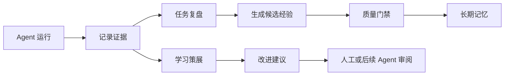
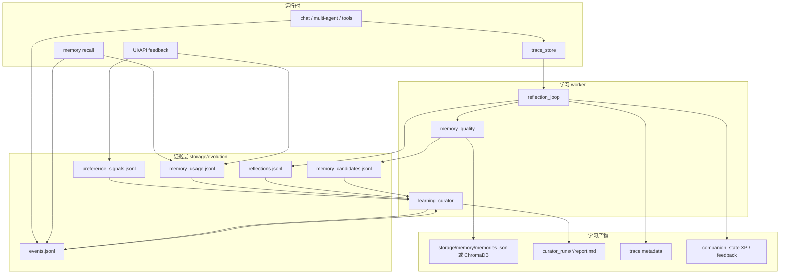
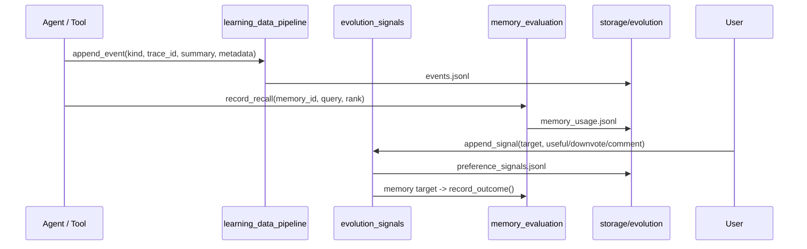
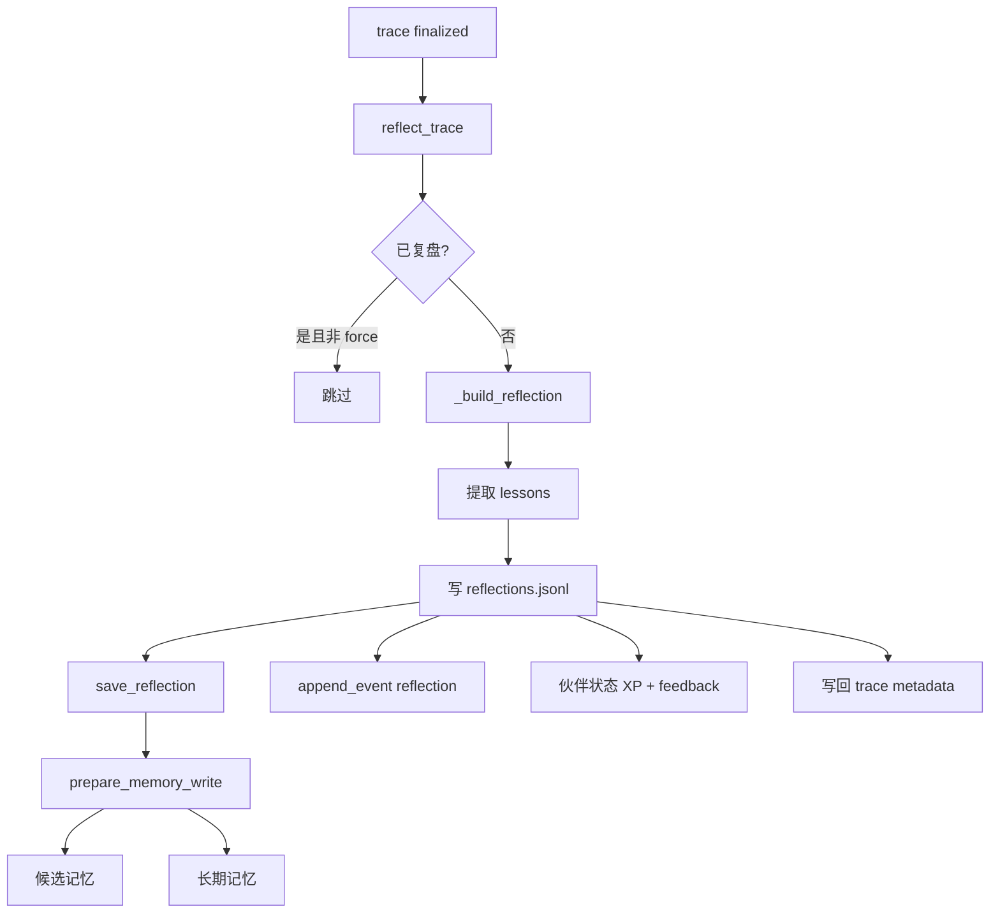
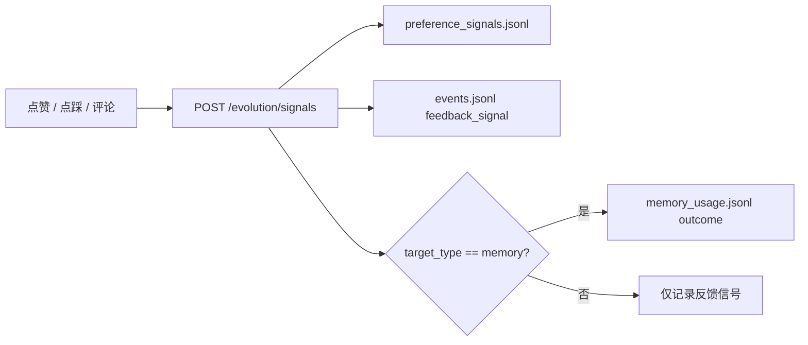
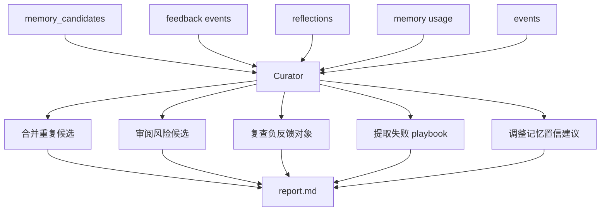
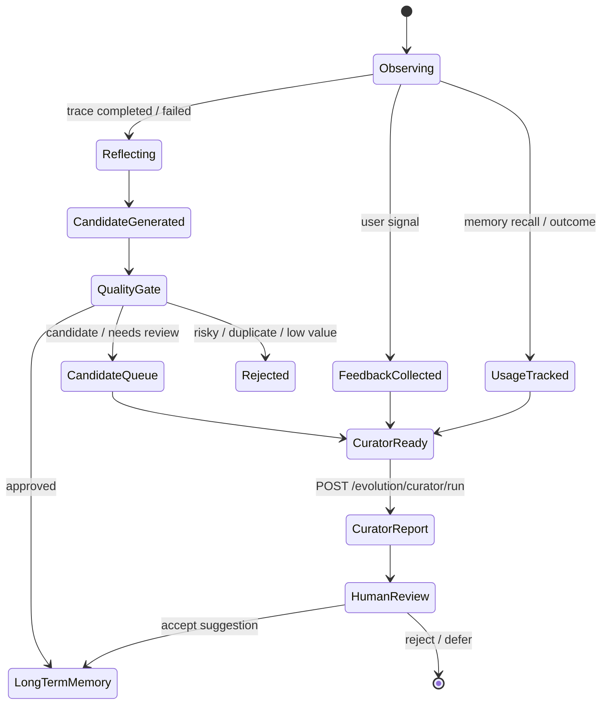
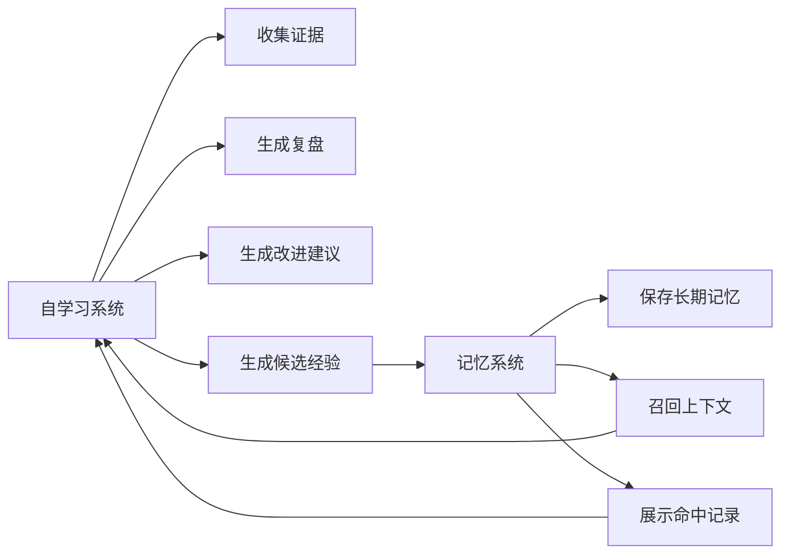

# 自学习系统实现文档

> 更新时间：2026-05-05  
> 范围：运行数据采集、反馈信号、任务复盘、记忆候选、学习策展、可审计进化闭环。

---

## 1. 定位

自学习系统负责把 Agent 的运行过程变成可复盘、可筛选、可沉淀的经验。它不直接让模型“偷偷改自己”，而是采用可审计的工程闭环：先记录证据，再生成候选，再由质量门禁和 curator 给出建议，最后进入长期记忆或改进队列。



核心原则：

| 原则       | 说明                                                             |
| ---------- | ---------------------------------------------------------------- |
| 可审计     | 所有学习来源都写入 JSONL 或 run report，可追溯到 trace / session |
| 低风险     | 默认 dry-run，先给建议，不自动大规模修改长期资产                 |
| 有质量门禁 | 记忆候选进入长期库前经过重复检测、风险检测和分层 metadata 补全   |
| 与记忆解耦 | 自学习负责产生经验和建议，记忆系统负责存储、召回和展示           |
| 可解释     | curator 输出为什么建议合并、降权、提升或复查                     |

---

## 2. 总体架构图



核心代码位置：

| 模块                                                                                        | 责任                                               |
| ------------------------------------------------------------------------------------------- | -------------------------------------------------- |
| [backend/services/learning_data_pipeline.py](../backend/services/learning_data_pipeline.py) | 统一学习事件流，写入 `events.jsonl`                |
| [backend/services/evolution_signals.py](../backend/services/evolution_signals.py)           | 用户反馈和偏好信号，联动 memory outcome            |
| [backend/services/memory_evaluation.py](../backend/services/memory_evaluation.py)           | 记忆 recall / outcome 统计，供 curator 评估        |
| [backend/services/reflection_loop.py](../backend/services/reflection_loop.py)               | trace 完成后复盘，生成 reflection 和记忆候选       |
| [backend/services/learning_curator.py](../backend/services/learning_curator.py)             | 汇总证据并生成 dry-run 改进报告                    |
| [backend/services/memory_quality.py](../backend/services/memory_quality.py)                 | 候选经验进入长期记忆前的质量门禁                   |
| [backend/main.py](../backend/main.py)                                                       | 提供 `/evolution/*` API，并在 trace 完成后触发复盘 |

---

## 3. 证据采集层

自学习的第一步是记录事实，不急着总结。



统一事件类型：

| kind                        | 含义                        |
| --------------------------- | --------------------------- |
| `chat_turn`                 | 一轮用户输入/Agent 输出摘要 |
| `agent_trace`               | Agent 编排或任务 trace 摘要 |
| `tool_call` / `tool_result` | 工具调用和结果              |
| `memory_candidate`          | 候选记忆生成                |
| `memory_write`              | 长期记忆写入成功            |
| `memory_recall`             | 记忆被召回                  |
| `reflection`                | 任务复盘完成                |
| `curator_run`               | 学习策展运行完成            |
| `feedback_signal`           | 用户或系统反馈              |
| `skill_usage`               | 技能使用记录                |
| `publish_result`            | 发布结果                    |

关键文件：

| 文件                                         | 内容                                      |
| -------------------------------------------- | ----------------------------------------- |
| `storage/evolution/events.jsonl`             | 统一事件流                                |
| `storage/evolution/preference_signals.jsonl` | 点赞、点踩、评论、useful、rejected 等信号 |
| `storage/evolution/memory_usage.jsonl`       | 记忆 recall / outcome 使用记录            |

---

## 4. 任务复盘循环

当 trace 完成或失败后，后端会调用 `_record_trace_reflection(trace_id)`，再进入 `reflection_loop.reflect_trace()`。



复盘会提取这些信号：

| 来源                             | 生成的经验                                   |
| -------------------------------- | -------------------------------------------- |
| `trace.status == failed`         | 失败任务需要保留错误原因                     |
| `memory_hit_count > 0`           | 本次任务使用了多少长期记忆，后续可追踪有效性 |
| `completed_agents`               | 哪些 Agent 参与了本次任务                    |
| `final_response / error / input` | 任务摘要和可检索上下文                       |

复盘产物示例：

```json
{
  "trace_id": "...",
  "trace_status": "completed",
  "summary": "生成了小红书脚本",
  "lessons": [
    "本次任务使用了 2 条长期记忆，可继续跟踪这些记忆是否真的有帮助。"
  ],
  "memory_content": "任务复盘：状态=completed；用户输入=...；结果摘要=...；经验=...",
  "memory_hit_count": 2
}
```

---

## 5. 反馈信号与 outcome

用户对记忆、trace、输出或任意对象的反馈通过 `/evolution/signals` 写入。若目标是 `memory`，系统会额外写一条 memory outcome。



支持信号：

| signal                                  | 作用                                        |
| --------------------------------------- | ------------------------------------------- |
| `upvote` / `thumbs_up` / `useful`       | 正向反馈，可提升记忆置信度或保留优先级      |
| `downvote` / `thumbs_down` / `rejected` | 负向反馈，可触发降权、复查或 stale 标记建议 |
| `comment`                               | 文字反馈，供人工或后续 Agent 审阅           |

---

## 6. Learning Curator

`learning_curator` 是一个 dry-run 学习整理 worker。它扫描候选记忆、反馈、复盘和记忆使用记录，生成审阅报告。



建议类型：

| kind                              | 说明                                            |
| --------------------------------- | ----------------------------------------------- |
| `merge_memory_candidates`         | 多条候选记忆内容重复，建议合并                  |
| `review_risky_memory_candidate`   | 候选存在风险标记或已被拒绝，建议审阅或重写      |
| `review_negative_feedback_target` | 某个对象收到负反馈，建议复查                    |
| `extract_failure_playbook`        | 从失败 trace 提取可复用排障经验                 |
| `decrease_memory_confidence`      | 记忆负向 outcome 多于正向，建议降权或标记 stale |
| `increase_memory_confidence`      | 记忆多次获得正向 outcome，建议提高置信度        |
| `review_unconfirmed_memory_usage` | 记忆多次召回但没有正负反馈，建议收集反馈        |

报告位置：

```text
storage/evolution/curator_runs/<run_id>/run.json
storage/evolution/curator_runs/<run_id>/report.md
```

---

## 7. 自学习闭环状态机



---

## 8. API 与体验路径

| API                                      | 用途                           |
| ---------------------------------------- | ------------------------------ |
| `POST /evolution/events`                 | 手动记录学习事件               |
| `GET /evolution/events`                  | 查看学习事件流                 |
| `POST /evolution/signals`                | 写入反馈信号                   |
| `GET /evolution/signals`                 | 查询反馈信号                   |
| `POST /evolution/reflections/{trace_id}` | 手动触发某条 trace 复盘        |
| `GET /evolution/reflections`             | 查看复盘记录                   |
| `POST /evolution/curator/run`            | 运行学习策展，默认 dry-run     |
| `GET /evolution/curator/runs`            | 列出 curator 运行历史          |
| `GET /evolution/curator/runs/{run_id}`   | 查看 curator 运行详情和 report |
| `GET /evolution/memory-usage`            | 查看记忆 recall / outcome 统计 |
| `GET /evolution/memory-usage/hits`       | 查看带正文快照的记忆命中记录   |

快速体验：

```bash
# 1. 查看最近学习事件
curl -s 'http://localhost:8000/evolution/events?limit=10'

# 2. 对某条记忆给正反馈
curl -s -X POST http://localhost:8000/evolution/signals \
  -H 'Content-Type: application/json' \
  -d '{
    "target_type": "memory",
    "target_id": "<memory_id>",
    "signal": "useful",
    "comment": "这条偏好命中准确",
    "source": "user"
  }'

# 3. 运行学习策展 dry-run
curl -s -X POST http://localhost:8000/evolution/curator/run \
  -H 'Content-Type: application/json' \
  -d '{"dry_run": true, "limit": 200}'

# 4. 查看最近 curator runs
curl -s 'http://localhost:8000/evolution/curator/runs?limit=5'
```

---

## 9. 与记忆系统的关系



边界说明：

| 系统       | 负责                                         | 不负责                        |
| ---------- | -------------------------------------------- | ----------------------------- |
| 自学习系统 | 事件采集、反馈、复盘、curator 建议、候选经验 | 直接把所有观察自动写进 prompt |
| 记忆系统   | 长期存储、召回、命中快照、图文展示           | 判断所有经验是否一定正确      |

详细记忆实现见：[docs/MEMORY_SYSTEM.md](MEMORY_SYSTEM.md)。

---

## 10. 开发约定

| 约定                                  | 原因                                               |
| ------------------------------------- | -------------------------------------------------- |
| 新增学习事件必须注册到 `VALID_KINDS`  | 防止事件类型漂移，便于统计                         |
| trace 复盘必须幂等                    | 同一 trace 默认只生成一条 reflection，避免重复学习 |
| curator 默认 dry-run                  | 学习建议先审计，不直接大规模改长期资产             |
| 测试必须 patch evolution 文件路径     | 防止测试数据污染真实学习日志                       |
| 负反馈不等于立刻删除                  | 先进入 curator 建议，再由人或受控流程确认          |
| 复盘记忆要通过 `prepare_memory_write` | 统一走质量门禁和候选流程                           |

---

## 11. 回归测试

重点测试位于 [tests/test_super_agent_foundation.py](../tests/test_super_agent_foundation.py)：

| 测试                                                       | 覆盖点                                   |
| ---------------------------------------------------------- | ---------------------------------------- |
| `test_learning_event_pipeline_records_and_filters_events`  | 学习事件能写入并按 kind / trace 过滤     |
| `test_evolution_signals_record_feedback_and_summary`       | 反馈信号能记录并汇总                     |
| `test_reflection_loop_records_trace_and_candidates_memory` | trace 复盘、候选记忆、事件记录、幂等跳过 |
| `test_learning_curator_generates_dry_run_report`           | curator 能扫描证据并输出建议报告         |
| `test_memory_evaluation_records_recall_and_signal_outcome` | memory recall 和 outcome 能进入评估闭环  |

运行：

```bash
PYTHONPATH=/Users/tutu/Documents/agent/backend \
/Users/tutu/Documents/agent/.venv/bin/python \
  -m unittest tests.test_super_agent_foundation.TestHermesAlignmentSelfLearning
```
