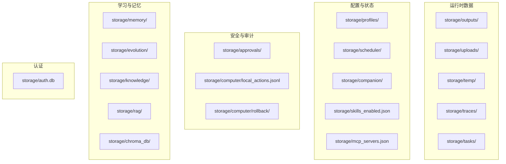
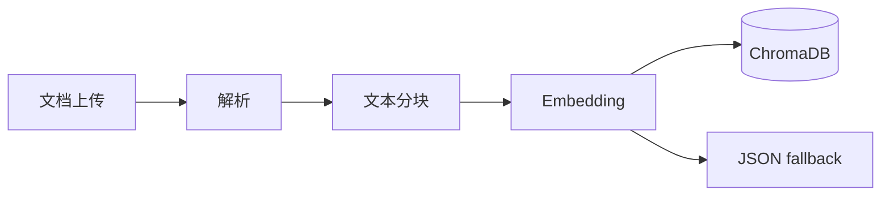

# AI Media Agent — 存储架构文档

> 涵盖所有持久化层的设计：文件系统、SQLite、ChromaDB、JSON 配置与向量索引的分层策略。

---

## 一、存储分层总览



---

## 二、文件系统存储

### 2.1 媒体与产物

| 目录 | 用途 | 生命周期 |
|------|------|----------|
| `storage/outputs/` | AI 生成的图片、视频、音频 | 长期，用户手动清理 |
| `storage/uploads/` | 用户上传的原始文件 | 长期 |
| `storage/temp/` | 临时转换文件、下载缓存 | 短期，可定时清理 |

**命名规范：**
- 生成文件：`{timestamp}_{uuid}_{suffix}.{ext}`
- 避免用户可控文件名直接作为磁盘路径

### 2.2 Trace 追踪

- 路径：`storage/traces/{trace_id}.json`
- 内容：Agent 执行全链路事件（决策、工具调用、结果、错误）
- 大工具结果只存 artifact 引用，不塞进 trace 主文件

### 2.3 任务持久化

- 路径：`storage/tasks/{task_id}.json`
- 内容：任务状态、进度、metadata、关联审批 ID
- 支持媒体流水线、Computer Use、本地动作、平台动作等多种任务类型

---

## 三、JSON 配置存储

### 3.1 审批记录

- 路径：`storage/approvals/approvals.json`
- 格式：对象映射 `{approval_id: request_object}`
- 线程安全：通过 `threading.RLock` 保护

### 3.2 平台账号

- 路径：`storage/profiles/{platform_id}.json`
- 内容：Cookie、Token、连接状态、平台专属配置
- 敏感字段在内存中使用时注意不泄漏到日志

### 3.3 定时任务

- 路径：`storage/scheduler/jobs.json`
- 内容：APScheduler 任务序列化
- 执行日志：`storage/scheduler/logs.json`

### 3.4 伙伴状态

- 路径：`storage/companion/state.json`
- 内容：人格、偏好、情绪、成长 XP、宠物、最近反馈

### 3.5 技能开关

- 路径：`storage/skills_enabled.json`
- 内容：技能 ID → 启用/禁用映射

### 3.6 MCP 服务器

- 路径：`storage/mcp_servers.json`
- 内容：服务器列表（URL、名称、启用状态）

---

## 四、审计日志（JSON Lines）

### 4.1 本地动作审计

- 路径：`storage/computer/local_actions.jsonl`
- 格式：每行一个 JSON 对象
- 字段：`timestamp`, `action`, `path`, `status`, `task_id`, `approval_id`, `details`

### 4.2 进化学习事件

- 路径：`storage/evolution/events.jsonl`
- 内容：`chat_turn`, `agent_trace`, `tool_call`, `feedback_signal`, `skill_usage` 等
- Schema 预留：支持后续迁移到 SQLite + FTS5

### 4.3 教训与 Playbook

- 路径：`storage/evolution/lessons.jsonl`（P2 规划）
- 内容：审批拒绝 / 失败 / semi-auto 中断的结构化经验

---

## 五、SQLite 数据库

### 5.1 认证数据库

- 路径：`storage/auth.db`
- 用途：用户账号、OAuth 状态、会话
- 表：`users`, `oauth_states`, `sessions`

### 5.2 未来扩展（P3 候选）

- **会话与消息 FTS**：`session-sqlite-fts`
  - 表：`sessions`, `messages`, `events`
  - 索引：FTS5 + trigram 支持全文检索
  - 来源标签：web / cli / bot

---

## 六、向量数据库（ChromaDB）

### 6.1 知识库索引

- 路径：`storage/chroma_db/` 或 `storage/rag/`
- 用途：RAG 文档分块向量化存储
- 降級：ChromaDB 不可用时自动降级到 JSON 文件存储

### 6.2 记忆向量

- 路径：`storage/memory/`
- 用途：长期记忆的向量检索
- 协调器：`memory_coordinator.py` 封装底层存储，工具层不直接依赖 `vector_store.py`

### 6.3 索引构建流程



---

## 七、回滚快照

### 7.1 快照机制

- 路径：`storage/computer/rollback/{task_id}/`
- 触发：审批通过后的 `write_text_file` 或 `delete_path`
- 内容：原始文件副本或删除标记

### 7.2 回滚 API

```
POST /computer/actions/{task_id}/rollback
```

从快照恢复文件或撤销删除。

---

## 八、存储容量与清理策略

| 数据类型 | 建议保留期 | 清理方式 |
|----------|-----------|----------|
| 媒体输出 | 永久 | 用户手动 / 定时脚本 |
| 临时文件 | 7 天 | `rm -rf storage/temp/*` |
| Trace | 90 天 | 按时间归档 |
| 任务 | 完成 30 天后 | 软删除或归档 |
| 审计日志 | 1 年 | 滚动压缩 |
| 进化事件 | 永久 | 按容量滚动 |

---

## 九、备份与迁移

### 9.1 关键备份目录

```bash
# 完整状态备份
tar czvf backup-$(date +%Y%m%d).tar.gz \
  storage/profiles/ \
  storage/scheduler/ \
  storage/approvals/ \
  storage/tasks/ \
  storage/memory/ \
  storage/companion/ \
  storage/auth.db \
  storage/chroma_db/
```

### 9.2 Docker 卷映射

```yaml
volumes:
  - ./storage:/app/../storage
  - ./logs:/app/../logs
```

生产环境建议使用命名卷或外部存储（NAS/S3）替代绑定挂载。

---

## 十、存储开发规范

1. **所有路径基于 PROJECT_ROOT**：禁止写死绝对路径
2. **目录自动创建**：使用 `mkdir(parents=True, exist_ok=True)`
3. **并发安全**：JSON 文件写操作使用 `threading.RLock`
4. **大文件不落内存**：媒体文件、PDF 等使用流式处理
5. **敏感数据不入版本控制**：`storage/` 已在 `.gitignore` 中

---

_文档版本：2026-05-10_
