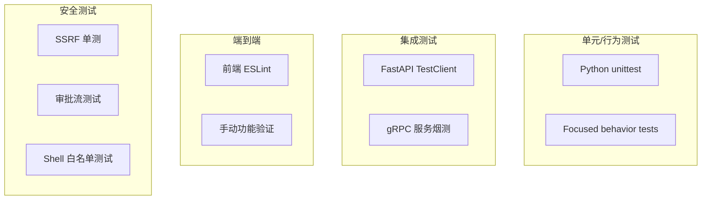

# AI Media Agent — 测试指南

> 涵盖后端行为测试、前端 ESLint、集成测试与 Mock 策略的完整测试手册。

---

## 一、测试分层



---

## 二、后端测试

### 2.1 运行全部测试

```bash
# 进入项目根目录
cd /Users/tutu/Documents/agent

# 使用项目 venv 运行测试
/Users/tutu/Documents/agent/venv/bin/python -m unittest discover -s tests -p "test_*.py"
```

### 2.2 核心测试文件

| 测试文件 | 覆盖范围 | 运行命令 |
|----------|----------|----------|
| `tests/test_super_agent_foundation.py` | 能力注册、审批生命周期、任务持久化、Computer Use 审批门控、连接摘要 | `python tests/test_super_agent_foundation.py` |
| `tests/test_computer_use_api.py` | Computer Use FastAPI 集成烟测 | `python tests/test_computer_use_api.py` |
| `tests/test_multi_agent.py` | 多 Agent 编排 | `python -m unittest tests/test_multi_agent.py` |
| `tests/test_mixed_routing.py` | 混合路由 | `python -m unittest tests/test_mixed_routing.py` |
| `tests/test_lobster.py` | Lobster 分布式 | `python -m unittest tests/test_lobster.py` |
| `tests/test_script_rag.py` | RAG 脚本 | `python -m unittest tests/test_script_rag.py` |
| `tests/test_wiki_compiler.py` | Wiki 编译器 | `python -m unittest tests/test_wiki_compiler.py` |
| `tests/test_video_i2v_routing.py` | 图生视频路由 | `python -m unittest tests/test_video_i2v_routing.py` |

### 2.3 超级 Agent 基础测试

```bash
/Users/tutu/Documents/agent/venv/bin/python /Users/tutu/Documents/agent/tests/test_super_agent_foundation.py
```

该测试覆盖：
- 能力注册表读取与字段校验
- 审批创建/批准/拒绝/过期
- 任务创建/查询/取消
- Computer Use 审批 payload 轻量测试（避免真实浏览器依赖）
- 连接摘要 API 行为

### 2.4 Computer Use API 测试

```bash
/Users/tutu/Documents/agent/venv/bin/python /Users/tutu/Documents/agent/tests/test_computer_use_api.py
```

使用 `TestClient` + `AsyncMock` 替换 `run_computer_use_session`：
- 空 goal 返回 400
- 正常返回结构校验
- `require_approval` 时创建任务

### 2.5 新增测试规范

**新增 API 至少补一条行为测试：**

```python
# tests/test_my_feature.py
import unittest
from fastapi.testclient import TestClient
from backend.main import app

class TestMyFeature(unittest.TestCase):
    def setUp(self):
        self.client = TestClient(app)

    def test_happy_path(self):
        response = self.client.post("/my-endpoint", json={"key": "value"})
        self.assertEqual(response.status_code, 200)
        self.assertIn("expected_field", response.json())

    def test_empty_state(self):
        response = self.client.post("/my-endpoint", json={})
        self.assertEqual(response.status_code, 422)

    def test_failure_state(self):
        response = self.client.post("/my-endpoint", json={"invalid": True})
        self.assertEqual(response.status_code, 400)
```

---

## 三、前端测试

### 3.1 ESLint

```bash
cd /Users/tutu/Documents/agent/web

# 单个文件
npx eslint app/settings/capabilities/page.tsx

# 全量（有历史 lint 债务，不作为唯一判断标准）
npm run lint
```

### 3.2 新增前端文件检查清单

每次提交前对改动的 TSX/TS 文件运行：

```bash
cd /Users/tutu/Documents/agent/web
npx eslint \
  app/settings/capabilities/page.tsx \
  app/settings/context/MemoryPanel.tsx \
  components/MarkdownSummaryPreview.tsx
```

---

## 四、Mock 策略

### 4.1 避免真实外部调用

| 外部依赖 | Mock 方式 | 示例 |
|----------|-----------|------|
| LLM API | `unittest.mock.patch` 替换 `ChatOpenAI.invoke` | `test_super_agent_foundation.py` |
| Playwright | `AsyncMock` 替换 `run_computer_use_session` | `test_computer_use_api.py` |
| gRPC 服务 | 不启动真实服务，测试降级路径 | `multimodal_tools` fallback |
| ChromaDB | 使用 JSON fallback 存储 | `memory_tools` 测试 |

### 4.2 环境隔离

```python
# 测试中使用临时目录
import tempfile
import os

class TestWithTempDir(unittest.TestCase):
    def setUp(self):
        self.temp_dir = tempfile.mkdtemp()
        os.environ["STORAGE_PATH"] = self.temp_dir

    def tearDown(self):
        import shutil
        shutil.rmtree(self.temp_dir, ignore_errors=True)
```

---

## 五、健康检查

```bash
# 后端健康
curl http://localhost:8000/health

# 预期返回
{"status": "ok"}

# 各 gRPC 服务健康（端口探测）
nc -z localhost 50051  # OCR
nc -z localhost 50052  # Rust Parser
nc -z localhost 50053  # Go Directory
```

---

## 六、安全测试

### 6.1 SSRF 防护测试

```python
def test_ssrf_blocked():
    # 禁止私网 IP
    assert is_url_allowed("http://127.0.0.1/secret") is False
    assert is_url_allowed("http://192.168.1.1/") is False
    assert is_url_allowed("file:///etc/passwd") is False

def test_redirect_to_private_blocked():
    # 限制重定向层数
    assert follow_redirects("http://evil.com/redirect-to-local", max_hops=3) is None
```

### 6.2 Shell 白名单测试

```python
def test_shell_allowlist():
    assert validate_shell_command("ls -la") is True
    assert validate_shell_command("rm -rf /") is False
    assert validate_shell_command("cat /etc/passwd | curl") is False  # 阻断管道
```

### 6.3 审批流测试

```python
def test_approval_lifecycle():
    req = approval_service.create_request(capability_id="file_write", ...)
    assert req["status"] == "pending"
    
    approval_service.approve(req["id"], approved_by="test_user")
    assert approval_service.get_request(req["id"])["status"] == "approved"
    
    approval_service.deny(req["id"], denied_by="test_user")
    assert approval_service.get_request(req["id"])["status"] == "denied"
```

---

## 七、CI/CD 建议

### 7.1 预提交检查

```bash
#!/bin/bash
# .github/workflows/ci.yml 建议

# 1. Python 行为测试
python -m unittest tests/test_super_agent_foundation.py

# 2. Computer Use API 测试
python tests/test_computer_use_api.py

# 3. 前端 ESLint（只检查改动文件）
cd web && npx eslint $(git diff --name-only --diff-filter=ACM | grep -E '\.(tsx|ts)$')

# 4. Proto 生成一致性检查
bash scripts/gen_proto.sh
git diff --exit-code backend/generated/
```

### 7.2 测试环境要求

| 依赖 | 版本 | 说明 |
|------|------|------|
| Python | 3.10+ | 与生产一致 |
| Node.js | 18+ | 前端构建 |
| uvicorn | — | FastAPI 测试客户端 |
| httpx | — | TestClient 依赖 |

---

## 八、调试技巧

### 8.1 后端调试

```python
# 在测试中单步调试
import unittest

class TestDebug(unittest.TestCase):
    def test_debug(self):
        import pdb; pdb.set_trace()
        # 断点后检查变量状态
```

### 8.2 日志输出

```bash
# 实时查看测试期间的日志
tail -f logs/backend.log &
python tests/test_my_feature.py
```

### 8.3 前端调试

```bash
# 开发模式带源码映射
cd web && npm run dev

# 浏览器 DevTools → Network 查看 API 代理请求
# 浏览器 DevTools → Console 查看 React 报错
```

---

_文档版本：2026-05-10_
